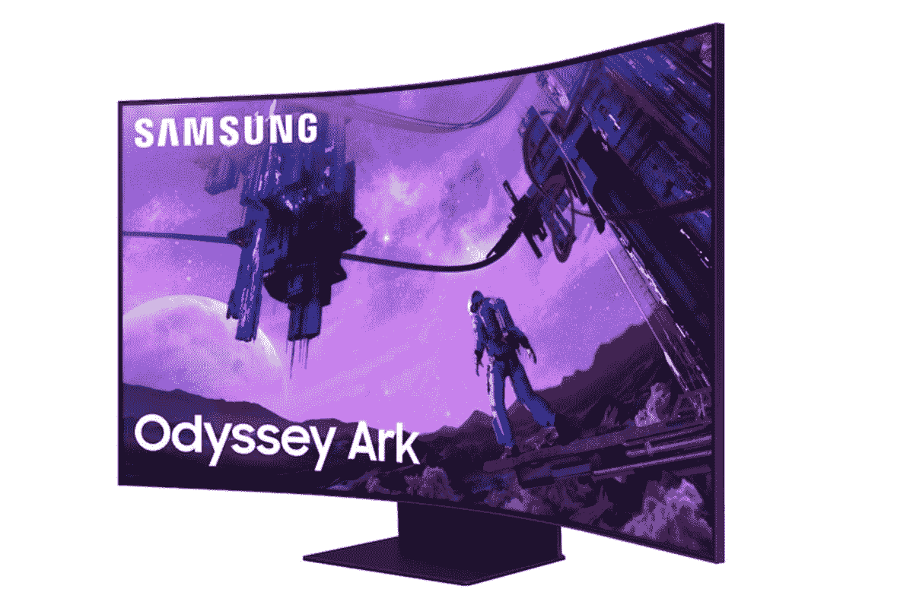

# 三星的 Odyssey Ark 55 英寸游戏显示器降价 1000 美元，降至历史最低价格

> 原文：<https://www.xda-developers.com/samsungs-55-inch-odyssey-ark-1000-off/>

 <picture></picture> 

Samsung 55-inch Odyssey Ark 4K UHD Quantum Curved Gaming Screen

##### 三星奥德赛方舟 55 英寸 4K 量子曲面游戏显示器

三星的奥德赛方舟显示器与众不同。它装有一个巨大的 55 英寸迷你 LED 面板，可以旋转到凉爽的垂直驾驶舱模式

[55 寸三星奥德赛方舟](https://www.xda-developers.com/samsung-odyssey-ark-now-avaialble-to-buy/)是显示器的猛兽。几个月前，这款显示器首次亮相零售，定价高达 3499.99 美元。如果你想要一台，但价格太高，你很幸运，因为显示器最近得到了一个慷慨的折扣，比零售价低 1000 美元。

三星 Odyssey Ark 55 英寸现在降至 2499.99 美元，虽然这并不便宜，但它确实提供了独特的体验，最终可能成为你的完美显示器。该监视器具有分辨率为 3，840 x 2，160 的 4K 显示器。它有 1000R 的曲率，可以减少眼睛疲劳，创造更身临其境的体验。它还具有 1 毫秒的响应时间，165 赫兹的刷新率，并支持 AMD FreeSync Premium Pro。

当然，由于使用了支持 HDR 的三星量子矩阵迷你 LED 技术，图像质量相当好。这种显示器具有防眩光和防反射特性，即使在最亮的条件下，使用起来也应该是一种享受。

该显示器有四个嵌入式扬声器和两个中央超重低音扬声器，由于三星的 Sound Dome 技术，可以提供身临其境的声音，该技术支持杜比全景声和人工智能声音放大器。尽管体积庞大，但该显示器可以旋转，并可在水平和垂直位置使用。

作为三星的最新产品，它还支持 Gaming Hub，让用户可以在集成的菜单系统中访问不同的游戏流媒体服务。在很大程度上，这是一款令人惊叹的显示器，其尺寸和功能无与伦比。

但它并不便宜，即使是以目前的促销价格。当然，如果你正在寻找更便宜和更小的东西，我们的[显示器综述](https://www.xda-developers.com/best-monitors/)中有许多其他令人惊讶的选项，这些选项具有目前可用的一些最佳选项。