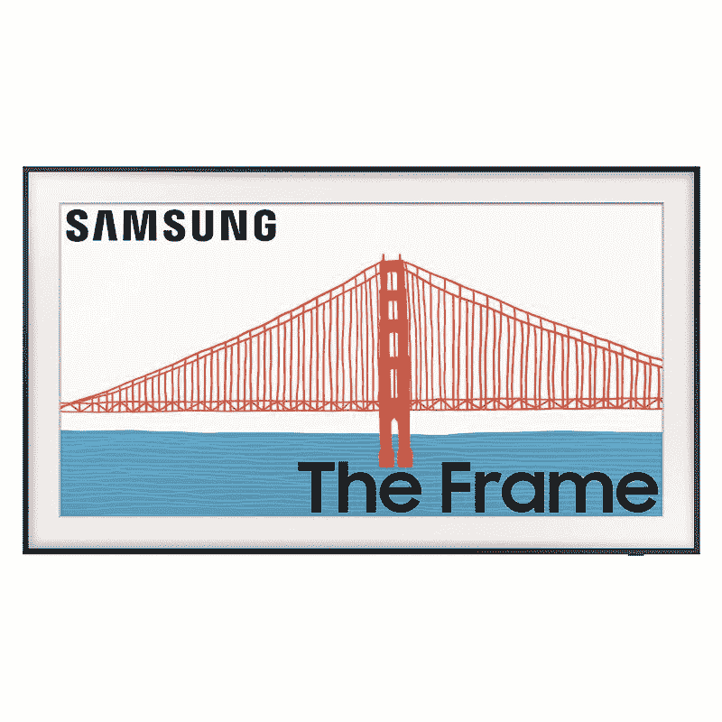

# 三星的框架电视在亚马逊上的 Prime Day 折扣很大

> 原文：<https://www.xda-developers.com/samsungs-frame-tv-is-heavily-discounted-on-amazon-for-prime-day/>

三星的框架电视非常适合那些不想弄乱客厅氛围和装饰的人。这种特殊的智能电视迅速流行起来，因为它在不使用时很好地将自己伪装成一件艺术品。框架电视有几种不同的尺寸可供购买，目前几乎所有型号都有折扣价。由于亚马逊 Prime Day(T1)促销，你现在可以在 55 英寸的框架电视上节省多达 300 美元。

三星 Frame TV 的 55 英寸 4K QLED 版本目前售价为 1198 美元，低于其原价 1498 美元。你可以选择米色、白色、棕色或柚木边框，这取决于你对客厅的审美。你至少可以节省 300 美元，因为这是我们今年见过的这款电视的最低价格。

这款电视的 2022 型号配有磨砂显示屏，以消除眩光，使面板上显示的视觉效果和艺术作品看起来像画布。框架电视有许多不同的尺寸可供购买，从 32 英寸到巨大的 85 英寸不等。所有型号都具有 4K 分辨率，但只有 55 英寸及以上型号支持 120Hz 的游戏。电视齐平地安装在墙上，机身和墙壁之间没有任何空间。所有电视端口都单独位于一个分离式盒子上，通过一根细电缆连接到框架电视。

## 2021 款也打折了

如果你不介意忍受光滑的面板，那么你也可以考虑购买 2021 型号的框架电视。这一款也有许多不同的尺寸可供购买，所有这些都是正在进行的亚马逊 Prime Day 销售的一部分。我们建议选择 2021 款的 55 英寸型号，因为你现在可以节省 418 美元。它从通常的 1398 美元降到了 980 美元。除了哑光面板，2021 款没有错过任何其他特别的功能。这两款电视具有相同的功能，包括内置的 Alexa 支持和可定制的挡板，使它们看起来像艺术品。

*   <picture></picture>

    三星的框架电视(2021 款)

    ##### 三星的框架 55 英寸 4K QLED 电视(2021)

    2021 款的框架电视也同样令人印象深刻。它的显示屏缺乏哑光处理，但你可以获得所有其他的铃铛和哨子，包括可定制的挡板，Alexa 支持等等。

当我们讨论看起来像艺术品的产品时，亚马逊自己的 [Echo Show 15](https://www.xda-developers.com/amazon-echo-show-15-prime-day-deal/) 也由于黄金日销售而以可观的价格出售。事实上，亚马逊现在有很多优惠，所以一定要关注 XDA 的推特账号来关注所有的优惠。