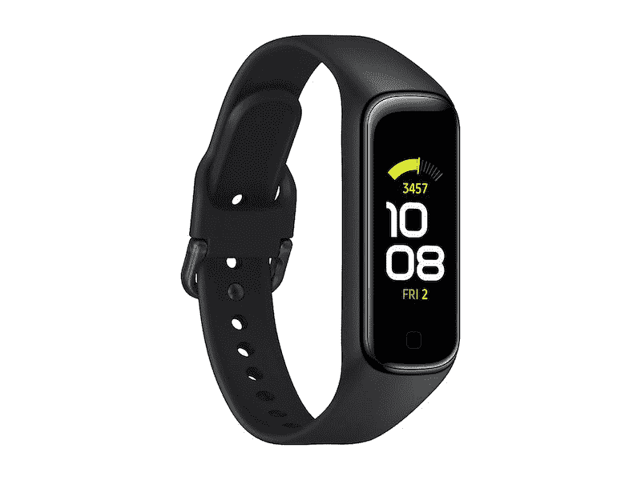
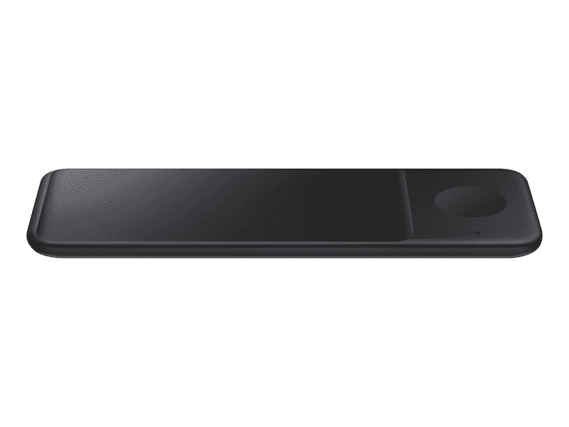

# 三星 Galaxy Fit 2 在三星商店售价 60 美元

> 原文：<https://www.xda-developers.com/samsungs-galaxy-fit-2-and-wireless-charger-pad-trio-are-now-available-to-buy/>

# 三星的 Galaxy Fit 2 和无线充电器 Pad Trio 现在可以购买

三星的新 Galaxy Fit 2——在 Unpacked 发布——现在可以在美国购买，旁边是无线充电器 Pad Trio！

[三星 Gear Sport 智能手表](https://www.xda-developers.com/samsung-gear-sport-smartwatch-woot-deal/)不是你的速度吗？如果你正在寻找一款简单的健身智能手表，它可以通过小尺寸跟踪你的所有锻炼，那么看看[三星 Galaxy Fit 2](https://shop-links.co/1723495796139841242) 就行了，现在已经可以购买了。

三星 Galaxy Fit 2 有黑色和猩红色两种颜色，是一款更小的智能手表，但仍然可以做你需要的一切来跟踪你的锻炼。动态跟踪允许 Galaxy Fit 2 自动检测和跟踪一些最常见的锻炼。你还可以跟踪你的睡眠和通知，这是一款可以游泳的智能手表。Galaxy Fit 2 无法跟踪你的心率，但仍然代表着 60 美元的价值！

对我来说，最好的部分是，这是*小*。我的手腕很小，大多数智能手表戴起来都很可笑。我过去找到的唯一适合我的智能手表是 [Fitbit Alta](https://www.amazon.com/Alta-Wireless-Activity-Wristband-Wristbands/dp/B08JJ65FD1?tag=xda-3i3cr52-20&ascsubtag=UUxdaUeUpU30277&asc_refurl=https%3A%2F%2Fwww.xda-developers.com%2Fsamsungs-galaxy-fit-2-and-wireless-charger-pad-trio-are-now-available-to-buy%2F&asc_campaign=Short-Term) ，但我发现 Fitbit 的软件和功能缺乏我想要的一切。三星 Galaxy Fit 2 也有类似的设计，但在健康跟踪和智能手机通知反应方面做得更多。如果你很难通过定期锻炼保持动力，我认为这是一款智能手表，它跨越了价格和功能之间的界限。

 <picture></picture> 

Samsung Galaxy Fit 2

寻找一款实惠的健身智能手表？售价 60 美元的 Galaxy Fit 2 是一款无刺激的健身追踪器，看起来很棒，几乎可以做任何事情。这款更小的智能手表可以动态跟踪你的锻炼情况，电池续航时间长达 15 天，并能够跟踪你的游泳情况，不会让你失望。

不过，这并不是三星商店唯一的新产品！该公司还推出了黑色和白色的无线充电板三重奏。顾名思义，你可以用它同时给多达三个设备无线充电，所以如果你有一部手机、一副耳塞和一只智能手表都需要充电，你就不再需要担心先给哪个设备充电了。充电器垫也有空间容纳两部手机，以防你和爱人分享宝贵的床头柜空间。90 美元似乎是一个很高的价格，但三星之前的无线充电垫非常可靠，这可能是目前最好的三次充电选择。

 <picture></picture> 

Samsung Wireless Charger Pad Trio

##### 三星无线充电器三重奏

一次为您的所有设备充电，没有任何麻烦。无线充电板 Trio 可同时容纳您的智能手机、耳塞和智能手表。现在你不再需要这么多电线缠绕在你的床头柜或工作区了！