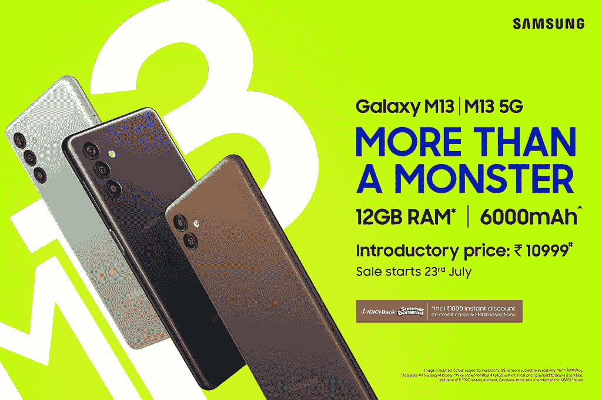

# 三星 Galaxy M13 5G 封装联发科的 Dimensity 700 芯片

> 原文：<https://www.xda-developers.com/samsungs-galaxy-m13-5g-launch/>

# 三星最新的 Galaxy M 系列设备以实惠的价格提供 5G 支持

三星最新的 Galaxy M 系列设备 Galaxy M13 5G 采用了联发科的 Dimensity 700 SoC。请继续阅读，了解更多信息。

回到 2019 年，三星在印度市场首次推出 Galaxy M 系列。这一系列产品通常包括价格适中的智能手机和一些高端功能。和 M 系列的最新进入者没有什么不同。新款 Galaxy M13 5G 是一款价格实惠的智能手机，内置联发科支持 5G 的 Dimensity 700 芯片，一块 6000 毫安时的大电池和 6.5 英寸 90Hz 液晶面板。它还提供 4G 版本，具有未指定的 SoC，相同的电池容量，以及略大的 6.6 英寸 FHD+显示屏。

三星正在为 Galaxy M13 5G 提供高达 6GB 的 RAM 和 128GB 的存储空间，您可以使用内置的 microSD 卡插槽将其扩展至 1TB。在相机方面，该设备配备了一个 50MP 主拍摄器，一个 5MP 超宽相机，以及一个背面的深度传感器。4G 版本也有类似的内存/存储配置，但它只有背面的双摄像头设置。两种型号的相机模块都类似于 [Galaxy S22 Ultra](https://www.xda-developers.com/samsung-galaxy-s22-ultra-review/) 的相机模块。

 <picture></picture> 

The Galaxy M13 duo don't actually feature 12GB of RAM. Samsung is using the "virtual RAM" figures to market the affordable devices.

三星的新闻稿省略了关于两款 Galaxy M13 型号的相当多的细节，所以我们还没有关于这些设备的所有细节。但我们确实知道，这两款机型都提供 15W 有线快速充电支持，并在包装盒中提供了 15W 充电砖。

就定价和可用性而言，Galaxy M13 5G 和 Galaxy M13 4G 将于 7 月 23 日开始在印度销售。这两款设备都将通过三星的网站亚马逊和精选的线下零售店提供两种 RAM/存储配置。查看以下部分，了解所有配置的定价详情。

*   三星 Galaxy M13 5G
    *   4GB + 64GB: ₹13,999(约 175 美元)
    *   6GB + 128GB: ₹15,999(约 200 美元)
*   三星 Galaxy M13
    *   4GB + 64GB: ₹11,999(约 150 美元)
    *   6GB + 128GB: ₹13,999(约 175 美元)

*你对三星最新的 Galaxy M 系列设备有什么看法？Galaxy M13 5G 和 Galaxy M13 值这个价吗？在下面的评论区分享你的想法。*