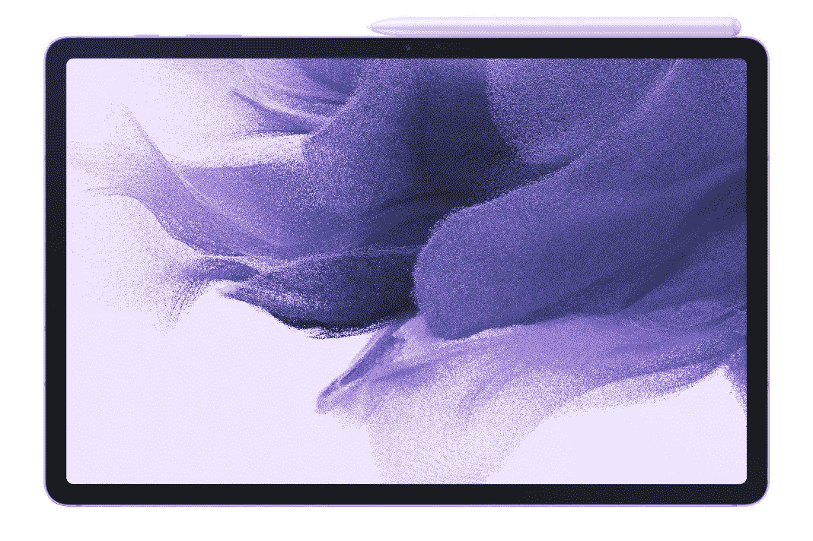

# 三星的 Galaxy Tab S7 FE，Tab S7，Tab S7+现在都在售

> 原文：<https://www.xda-developers.com/samsungs-galaxy-tab-s7-fe-tab-s7-and-tab-s7-are-all-on-sale-up-to-201-off/>

三星销售了大量 Android 平板电脑，但该公司目前有三个主要选择。Galaxy Tab S7 风扇版是最便宜的，如果你需要更大的马力，Tab S7 和 Tab S7+配有旗舰骁龙芯片组。三星开始了黑色星期五的早期销售，三款机型都有折扣 Tab S7 FE 现在是 430 美元(优惠 100 美元)，Tab S7 是 500 美元(优惠 150 美元)，Tab S7+是 650 美元(优惠 201 美元)。这些是我们在今年的标签系列中看到的一些最好的价格。

Galaxy Tab S7 FE 是一款 12.4 英寸的 Android 平板电脑，配有 2560×1600 LCD 屏幕，骁龙 750G 芯片组，4GB 内存，64GB 内部存储(外加一个 SD 卡插槽)，10,090mAh 电池，45W 快速充电支持(但盒子里的充电器仅达到 15W)，以及 S Pen 手写笔。这款平板电脑搭载的是 Android 11，一旦 Android 12 和 13 上市，它至少应该能接收到。

同时，普通的 **Galaxy Tab S7** 拥有 11 英寸 1600×2560 液晶屏，能够达到 120Hz，支持 HDR10。你还可以获得骁龙 865+芯片组、128GB 存储空间、6GB 内存、双后置摄像头(1300 万主摄像头、500 万超宽摄像头)、800 万前置摄像头和四个扬声器。在连接方面，你可以使用 UBS Type-C 3.2、Wi-Fi 6 和蓝牙 5.0。Tab S7 包含在三星承诺的“三代”支持中，而且它已经[更新到 Android 11](https://www.xda-developers.com/here-are-the-new-productivity-features-added-in-the-samsung-galaxy-tab-s7s-one-ui-3-1-update/) ，所以它至少应该得到 Android 12 和 13。

最后，高级 **Galaxy Tab S7+** 拥有高通骁龙 865+芯片组，12.4 英寸 2800×1752 AMOLED 120Hz 屏幕，6GB 内存，128GB 内部存储(带有 microSD 卡插槽，用于增加更多空间)，Wi-Fi 6 和蓝牙 5.0。高分辨率 AMOLED 屏幕非常适合观看电影和电视节目，尤其是四个扬声器环绕在边缘，提供出色的声音。标签 S7 也已经更新到 Android 11，一旦 Android 12 和 13 可用，它应该会得到它们。

我们已经在以下多家零售店将这三款平板电脑联系起来。基本配置是最划算的，但一些更高容量的版本也在出售。

 <picture></picture> 

Samsung Galaxy Tab S7 FE

##### 三星 Galaxy Tab S7 FE

这是一个低功耗的处理器，没有高刷新率的屏幕，但其余部分与 S7 和 S7+相似。

 <picture></picture> 

Samsung Galaxy Tab S7

##### 三星 Galaxy Tab S7

这是三星最好的 11 英寸平板电脑，配有骁龙 865+芯片组和 120 赫兹液晶显示屏。

 <picture></picture> 

Samsung Galaxy Tab S7

##### 三星 Galaxy Tab S7 Plus

这是三星最好的平板电脑，拥有 12.4 英寸的 AMOLED 大屏幕，S Pen 和骁龙 865+芯片。