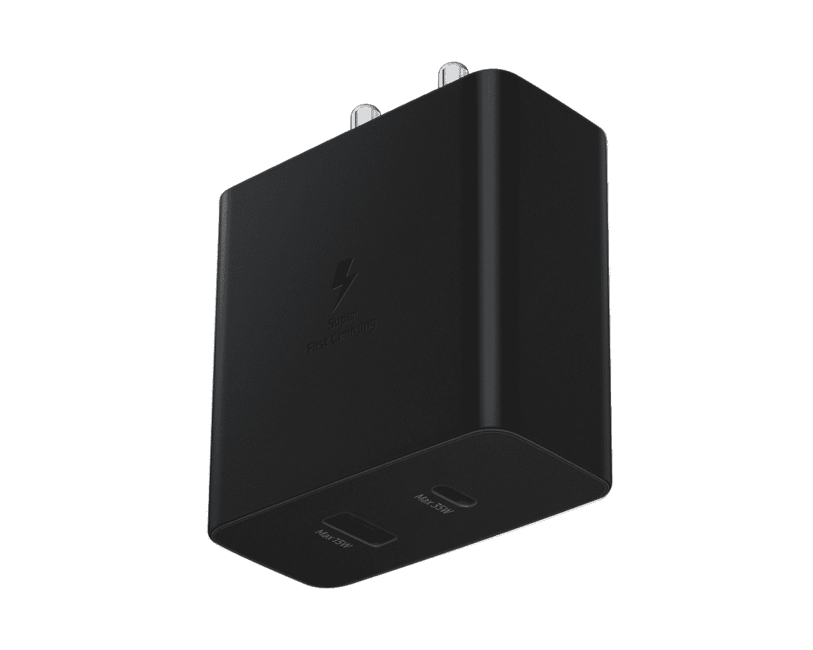

# 三星新推出的 35W 电源适配器 Duo 支持 USB-PD 和 PPS

> 原文：<https://www.xda-developers.com/samsungs-new-35w-power-adapter-duo-offers-usb-pd-pps-support/>

最长时间以来，三星一直随其设备发运 25W TA800 旅行适配器。尽管该公司确实在 Galaxy Note 10 系列中改用了 45W 的适配器，但此后推出的所有三星设备要么配备了相同的 25W 充电砖，要么根本没有。但是[最近的泄露表明](https://www.xda-developers.com/samsung-45w-65w-fast-chargers-launch-soon/)该公司可能最终会用即将到来的 [Galaxy S22 系列](https://www.xda-developers.com/samsung-galaxy-s22/)升级其快速充电游戏。虽然这可能是也可能不是，但三星现在已经在印度市场推出了一款新的 35W 电源适配器，提供 USB-PD 3.0 PPS 支持。

**[快充解释:最慢到最快的快充技术](https://www.xda-developers.com/how-does-fast-charging-work/#USB-PD_PPS_Programmable_Power_Supply)**

新款三星 35W 电源适配器 Duo 具有一个 USB Type-C 端口和一个全尺寸 USB Type-A 端口。USB Type-C 口支持 35W 快充，USB Type-A 口只支持最大 15W 输出。该充电器支持多种三星和非三星设备，包括平板电脑、笔记本电脑、无线充电器和智能手表。这款充电器已经在三星的网站上出售，价格为₹2,299.

 <picture></picture> 

Samsung 35W Power Adapter Duo

##### 三星 35W 电源适配器 Duo

三星 35W 电源适配器 Duo 可以以 35W 和 15W 同时为两台设备充电。单击下面的链接立即获得您的。

如果这听起来有点太夸张，那么你绝对应该看看我们的[最佳 USB-PD 充电器](https://www.xda-developers.com/best-usb-pd-fast-charger/)列表，看看有没有其他更好的选择。该列表包括 Anker、Sabrent、Spigen、Belkin 等品牌的快速充电器，应该能满足您的需求。它还包括几个 GaN 充电器，价格有点贵，但比三星的产品体积更小，充电速度更快。你可以看看我们的[最佳 USB 电缆清单](https://www.xda-developers.com/best-usb-cables/)，为你的新充电器购买一根耐用的电缆。

如前所述，三星还在开发两款新的快速充电器 65W 电源适配器 Trio (EP-T6530)和 45W 电源适配器(EP-T4510)。这些新充电器可能用于即将推出的三星 Galaxy S22 系列。然而，目前我们还没有看到任何支持这种推测的证据。