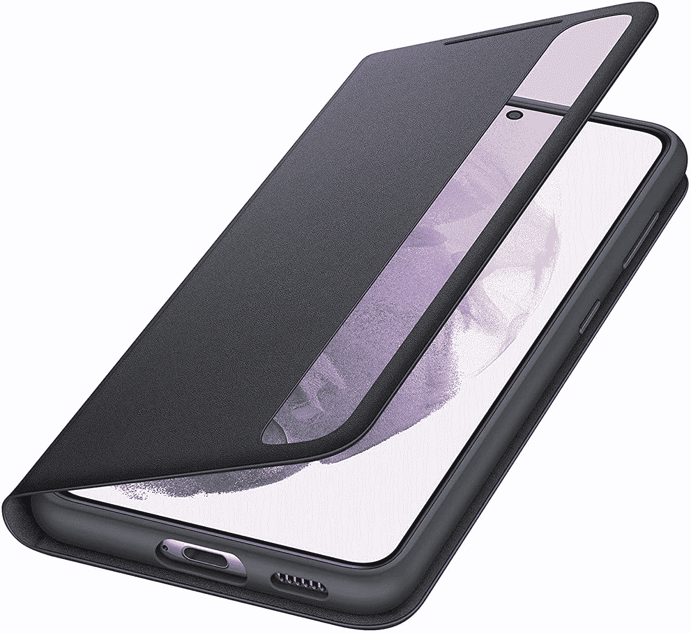

# 三星 Galaxy S21 系列的 S-View 翻盖现在仅售 37 美元

> 原文：<https://www.xda-developers.com/samsungs-s-view-flip-cover-for-the-galaxy-s21-series-is-now-just-37/>

# 三星 Galaxy S21 系列的 S-View 翻盖现在仅售 37 美元

三星的 S View 翻盖手机现在已经上市，它有一个小触摸屏窗口，方便音乐和通知的访问。

三星为自己的手机出售许多外壳，但可能最有趣的是 S-View 翻盖。这是一个典型的翻盖，在关闭时保护屏幕，但有一个小窗口显示当前时间，电池状态，音乐控制等。49.99 美元的典型价格有点贵，但现在三星将价格降至 36.99 美元，节省了 13 美元。

S-View 保护套有四种颜色可供选择:黑色、灰色、粉色和紫色。三星也有 S21 所有三种型号的尺寸(S21、S21+和 S21 Ultra)，所有选项似乎都是 36.99 美元的价格。这里的主要好处是外壳包裹着手机的正面，至少在不使用的时候是这样。虽然这种情况下确实比非封面案件增加了一点点的体积，但它不能容纳卡或其他任何东西，所以它不像钱包案件那么大。

 <picture></picture> 

Galaxy S21/S21+/S21 Ultra S-View Cover

##### 三星 S-View Galaxy S21 保护套

这款保护套有一个特殊的显示窗口，可以轻松访问音乐播放、通知等内容。

最有趣的功能是沿着边缘的小显示窗口，可以用来接听电话，控制音乐播放，检查时间和电池电量等。这些软件功能被内置到三星的 One UI 软件中，所以你不需要安装应用程序(或做任何其他事情)就可以工作。