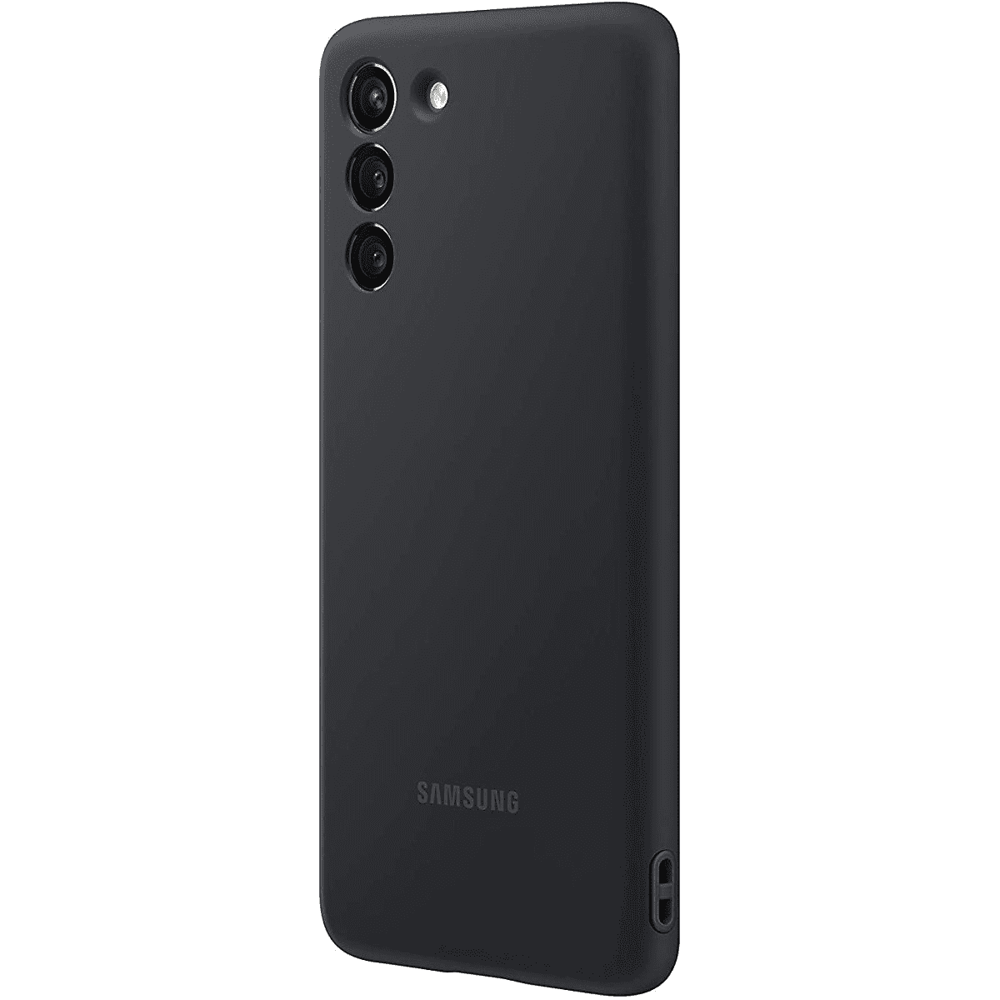

# 三星 Galaxy S21 的硅胶外壳现在以 21%的价格出售

> 原文：<https://www.xda-developers.com/samsungs-silicone-case-for-the-galaxy-s21-now-on-sale-for-21-off/>

# 三星 Galaxy S21 的硅胶外壳现在以 21%的价格出售

三星 Galaxy S21 的官方硅胶外壳现在售价为 23.60 美元，比之前的价格节省了 6.39 美元。

Galaxy S21 系列有成千上万个外壳，但三星也生产少数官方外壳。其中一个是硅胶外壳，这是 S21 的一个柔软触感的外壳，现在在亚马逊上售价 23.60 美元。这比之前 30 美元的价格低了 6.39 美元，即 21%。

这种情况下有四种颜色:黑色，灰色(这是更白比灰色，但无论如何)，粉红色和紫色。然而，只有黑色的盒子卖 23.60 美元——紫色和灰色多 40 美分，粉色的盒子只比正常的 30 美元价格低 2 美元。S21+和 S21 Ultra 的版本没有销售，只有最小的 Galaxy S21 的情况。

 <picture></picture> 

Galaxy S21 Silicone Cover

##### 三星硅胶 Galaxy S21 保护套

这是三星官方为 Galaxy S21 设计的硅胶保护套。这款保护套在亚马逊售价 23.60 美元，但如果卖完了(或者你只是不喜欢亚马逊)，百思买的黑色售价 25 美元。

我已经为 S21 使用了一些三星的官方保护套，硅胶保护套可能是我最喜欢的(还有[皮套](https://www.amazon.com/dp/B08P2CST8T/ref=twister_B08T3J8KRB?tag=xda-2q1d18r-20&ascsubtag=UUxdaUeUpU3327&asc_refurl=https%3A%2F%2Fwww.xda-developers.com%2Fsamsungs-silicone-case-for-the-galaxy-s21-now-on-sale-for-21-off%2F&asc_campaign=Short-Term))。触感柔软的质地是 grippy，侧面有孔可以系挂绳。然而，这款保护套在屏幕前部没有凸起的边框，所以如果你将 S21 面朝下放在地上，它不会提供太多保护。