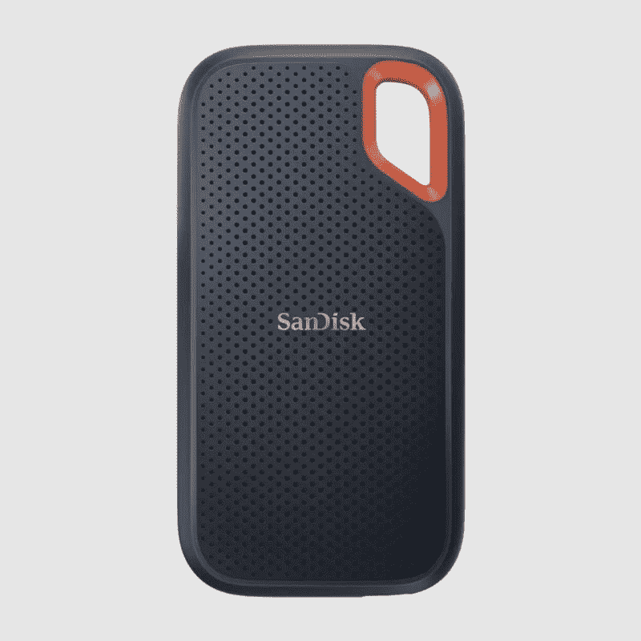
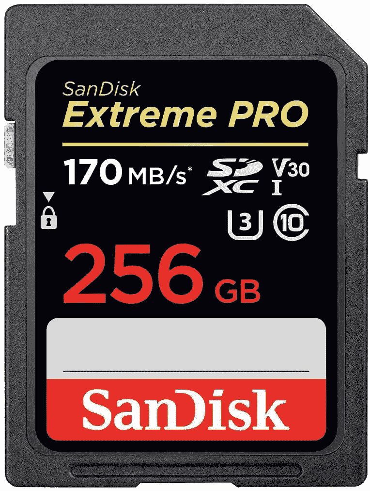
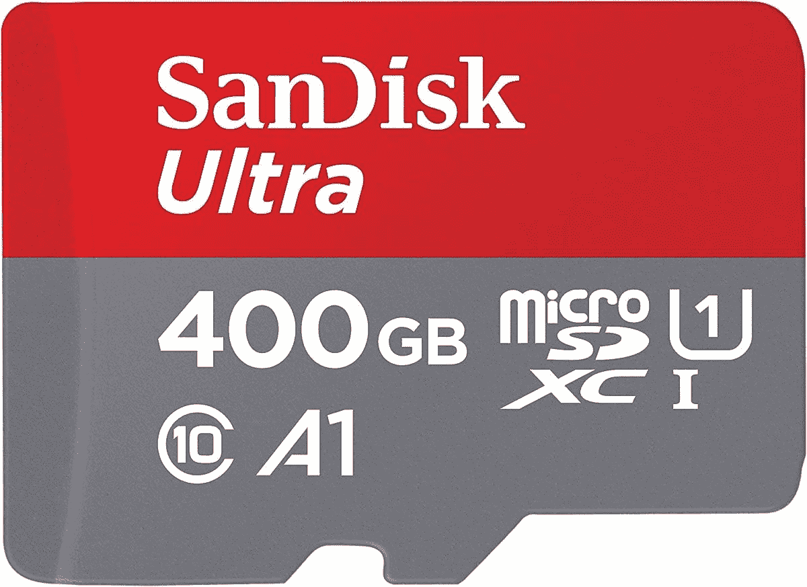

# SanDisk Extreme 2TB 固态硬盘现在只有 185 美元，而不是 460 美元

> 原文：<https://www.xda-developers.com/sandisk-storage-black-friday-deals/>

随着黑色星期五越来越近，没有比这更好的时间给自己买些新装备了。SanDisk 的一些存储产品已经加入了黑色星期五优惠活动的行列。

其中最大的交易肯定是 SanDisk Extreme 便携式固态硬盘，具体来说是 2TB 的容量。这款固态硬盘的最新型号支持高达 1，050MB/s 的速度(通过 USB 3.2 Gen 2)，为您提供非常快速的外部存储。此外，凭借 IP55 防水防尘和 2 米跌落保护的坚固设计，您可以将它带到任何地方。这种型号的官方零售价是 460 美元，但你现在只需 185 美元就能买到，对于这种产品来说，这是一笔非常划算的交易。

 <picture></picture> 

SanDisk Extreme v2 Portable SSD

##### SanDisk Extreme 便携式固态硬盘

SanDisk Extreme 便携式固态硬盘采用坚固耐用的设计，因此您可以将它带到任何地方，包括防水和防尘。它还支持高达 1，050MB/s 的速度，因此速度非常快。

如果你喜欢 SanDisk Extreme 的一切，但需要更快的速度，Extreme PRO 可能是你正在寻找的。这款机型保持了与标准 Extreme SSD 相同的坚固设计，但由于采用了 USB 3.2 Gen 2x2，它的传输速度有望达到 2，000 MB/s——只要你的电脑也支持它。除此之外，它还使用铝制机箱，该机箱还可以兼作散热器，以便在大量使用期间冷却固态硬盘，从而更长时间地保持最高性能。这种型号通常售价 510 美元，但现在，你只需 270 美元就能买到，几乎是半价。

 <picture></picture> 

SanDisk Extreme Pro SSD

##### SanDisk Extreme PRO 便携式固态硬盘

219.99 美元509.99 美元节省 290 美元

SanDisk Extreme PRO 采用了 Extreme 型号的坚固设计，并在支持的设备上为您提供近两倍的传输速度。此外，它还有一个铝制机箱，可以兼作散热器。

如果固态硬盘不是你的首选存储方法，SanDisk 在这个黑色星期五也有一些关于 SD 卡存储的优惠。当我们谈到专业存储的话题时，SanDisk Extreme PRO SDXC 卡可能会吸引专业摄影师和摄像师。它支持高达 90MB/s 的写入速度和高达 170MB/s 的传输速度，并且它还可以抵抗温度、冲击、水和 X 射线，因此在恶劣的情况下也不会让您失望。256GB 的型号通常售价 100 美元，但你现在只需 48 美元就能买到。

 <picture></picture> 

SanDisk Extreme PRO 256GB SDXC card ($52 off)

##### SanDisk Extreme Pro microSD 卡

这款专业级 SD 卡旨在适应恶劣条件，并为摄影师和摄像师提供高速性能。

该卡包含了高性能 SD 卡的所有分类:UHS-I、V30、U3 和 Class 10，因此这无疑是一款出色的产品。其他尺寸也有折扣，但 256GB 的卡是最划算的。

最后，如果你对更标准的存储感兴趣，SanDisk Ultra 400GB microSDXC 卡也有很大的折扣，从 70 美元降至 39 美元。这不是它第一次降到这个价格，但这仍然是我们见过的最低价格，这是一个在许多设备上扩展存储空间的好方法，包括任天堂 Switch 或你的智能手机。400GB 的空间足够存储一吨的文件，即使你主要在你的交换机上玩数字游戏，这也将能够一次存储很多游戏。它的读取速度高达 120MB/s，这是普通消费者可以在 SD 卡中找到的最佳性能之一。

 <picture></picture> 

SanDisk Ultra 400GB microSDXC card ($32 off)

##### SanDisk 超微卡

无论是为你的智能手机还是任天堂 Switch，这种 microSD 卡可以存储大量的文件和游戏，现在它是有史以来最低的价格之一。

寻找更多交易？查看我们的 hub，了解最优惠的[黑色星期五 PC 交易](https://www.xda-developers.com/best-black-friday-pc-gaming-deals/)，了解更多关于存储和其他 PC 外设的信息。你甚至可以在那里找到一些很棒的笔记本电脑。