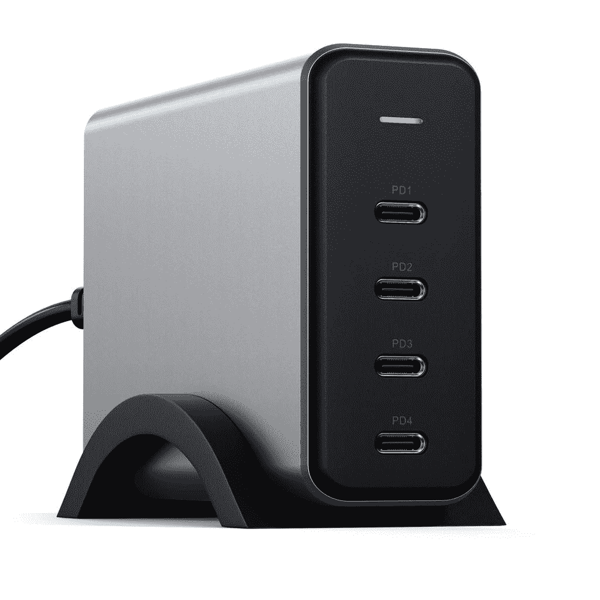

# Satechi 的新四口 USB 充电器可以达到 165W

> 原文：<https://www.xda-developers.com/satechi-four-port-charger-ces-2022/>

Satechi 为个人电脑和移动设备制造配件，从充电器到加密狗，其中大多数都具有优质的制造质量。在上周的 CES 2022 活动中，该公司展示了一款新的强大的 USB Type-C 充电器，带有四个高速端口。对于使用多种 USB 供电设备的人来说，这似乎是完美的充电器，但你还不能购买它。

[的新充电器](https://satechi.net/products/165w-usb-c-4-port-pd-gan-charger)(*via[The Verge](https://www.theverge.com/2022/1/7/22872565/satechi-gan-4-port-usb-c-165w-charger-desktop-stand-macbook)*)并不太大，尺寸为 3.93 x 1.22 x 2.8 英寸，但它配备了一个可选的垂直支架，以防止它在平坦的表面上滑动。像许多其他最近的 USB 墙壁适配器一样，它使用氮化镓(GaN)技术来支持快速充电，而没有庞大的笨重设计。总共有四个 USB Type-C 端口，外加一个小指示灯。

Satechi 表示，120 美元的充电器可以同时在所有端口上达到 165W，但每个设备的电量取决于连接的数量以及每个设备支持的速度。以下是官方规格页面中所有受支持的电源配置:

*   1 个 USB-C PD 连接-最高 100 瓦
*   2 个 USB-C PD 连接-最高 100 瓦/60 瓦
*   3 个 USB-C PD 连接- 60W/60W/45W 或 100W/30W/30W
*   4 个 USB-C PD 连接- 60W/45W/30W/30W

通过这种设置，你可以全速为 MacBook Pro M1(或大多数其他支持 USB 供电的笔记本电脑)充电，并为另一台设备预留 60W 的电量。您还可以同时为三台智能手机或平板电脑快速充电，同时拥有足够的电量来防止大多数超极本耗电(在 60W 连接下)。

如果能在充电器上看到至少一个 USB 型端口就好了，这可能会使它成为最终的旅行充电器——如果你有一个智能手表或其他由 A 型电缆供电的配件，你将需要[一个适配器](https://www.amazon.com/AmazonBasics-Type-C-Gen1-Female-Adapter/dp/B01GGKYXVE?tag=xda-7qpapu2-20&ascsubtag=UUxdaUeUpU7067&asc_refurl=https%3A%2F%2Fwww.xda-developers.com%2Fsatechi-four-port-charger-ces-2022%2F&asc_campaign=Short-Term)。Anker 向[出售一款类似的充电器](https://www.amazon.com/Anker-Charging-PowerPort-Intelligent-Allocation/dp/B07VSMK849?tag=xda-7qpapu2-20&ascsubtag=UUxdaUeUpU7067&asc_refurl=https%3A%2F%2Fwww.xda-developers.com%2Fsatechi-four-port-charger-ces-2022%2F&asc_campaign=Short-Term)，价格高出 10 美元，它有两个 USB Type-C 端口(一个连接的最大功率为 100W)和两个 USB Type-A 连接。

*The Verge* 报道称，该充电器可以预购，在结账时使用代码“CES20”可以享受 20%的折扣，但该页面现在已经恢复为只有一个“可用时发送电子邮件”按钮。

 <picture></picture> 

Satechi 165W USB-C 4-Port PD Charger

##### Satechi 165W USB-C 4 端口 PD 充电器

这款结实的 USB Type-C 充电器目前还不能购买，但你可以注册库存提醒。