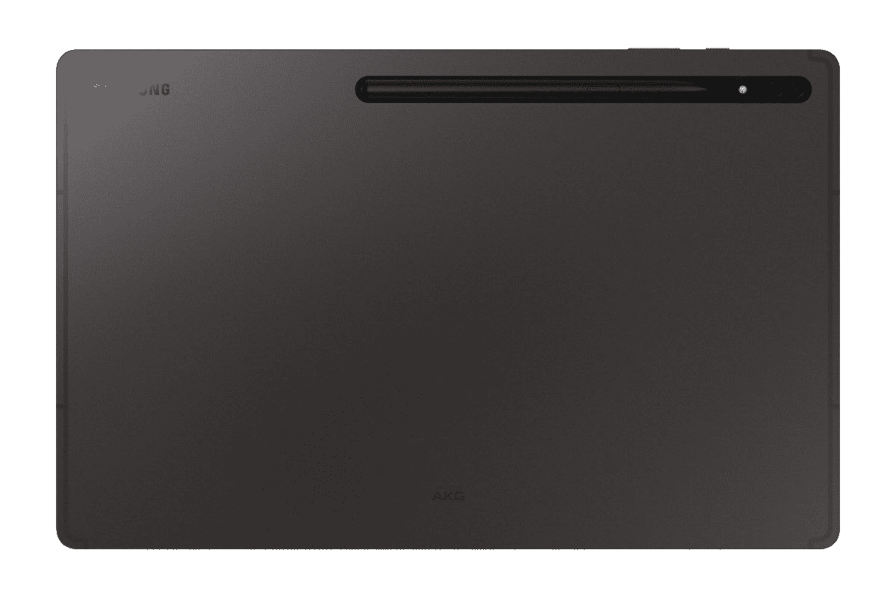

# 在夏季探索活动中购买三星产品，享受优惠

> 原文：<https://www.xda-developers.com/save-big-on-samsung-products-in-the-summer-discover-event/>

又到了那个时候了——三星推出了另一场销售活动，旨在帮助你进入或扩大他们的生态系统，从 [Galaxy S22 Ultra](https://www.xda-developers.com/samsung-galaxy-s22-ultra-review/) 和其他智能手机到[三星 Freestyle 便携式投影仪](https://www.xda-developers.com/samsung-the-freestyle-review/)，新显示器、家用电器甚至内存和存储设备都有一系列优惠。

如果你还没有购买 Galaxy S22 Ultra，现在绝对是一个好时机，因为你可以从 1TB 版本的手机中获得[150 美元，以及当你以旧换新手机时高达 1000 美元的即时信用。几个月后，Galaxy S22 Ultra 仍然是我的日常司机，这主要是因为这款相机太好了，它现在是最棒的智能手机相机之一。](https://shop-links.co/1777885680688593357?u1=62cf4173-5b74-40f7-a0fb-23dd2773ed2f)

当你购买 Galaxy S22 Ultra 时，你还可以买到一款 [Galaxy Watch 4](https://www.xda-developers.com/samsung-galaxy-watch-4-classic-review/) 。在这个夏季活动期间，你可以从 Galaxy Watch 4 的 LTE 版本或 Galaxy Watch 4 Classic 中获得[60 美元的优惠。](https://shop-links.co/1777886405011741983?u1=8382e81d-ece3-4fa6-a651-a393baf15644)

 <picture></picture> 

Samsung Galaxy S22  Ultra

Galaxy S22 Ultra 1TB 的增强以旧换新最高可节省 1，000 美元，还有 150 美元的即时折扣！现在是买一部最好的拍照手机的最佳时机！

 <picture></picture> 

Galaxy Tab S8 Ultra

立即获得最好的 Android 平板电脑之一，免费的 Galaxy Buds Pro，在三星获得 100 美元的即时信用，并获得高达 675 美元的增强以旧换新！

 <picture></picture> 

Samsung Galaxy Z Fold 3

##### 三星 Galaxy Z Fold 3

拥抱未来，节省 Galaxy Z Fold 3 高达 1，200 美元的以旧换新，即使是一部破裂的手机和一部免费的 Galaxy Watch 4！

完善新的 Galaxy 生态系统的完美方式是我非常喜欢的 [Galaxy Tab S8 Ultra](https://www.xda-developers.com/samsung-galaxy-tab-s8-ultra-review/) 。Galaxy Tab S8 系列的三款我都有，它们是目前[最好的 Android 平板电脑](https://www.xda-developers.com/best-android-tablets/)。在今年夏天的活动中，你可以通过以旧换新节省高达 675 美元[，还可以获得 100 美元的即时三星积分用于购买配件，并免费获得 Galaxy Buds Pro。](https://shop-links.co/1777886406203496118?u1=749610f7-34d0-49f4-8208-ed1177b339eb)

三星发现销售将持续一周，直到 6 月 26 日，每天都有新的交易和折扣。大多数交易只在那一天进行，但我最喜欢的一些为期一周的交易包括 [Galaxy Z Fold 3，它带有一个免费的 Galaxy Watch 4](https://shop-links.co/1777885681266519422?u1=1ed712e4-399f-4852-ac90-2059f6d828aa) 和高达 1200 美元的强化折价，包括有裂纹的设备。Galaxy Z Fold 3 是目前[最好的可折叠手机](https://www.xda-developers.com/best-foldable-phones/)，所以这是拥抱未来的大好时机！

如果你一直在拖延购买新的电器、手机、平板电脑、投影仪、显示器或大多数其他受欢迎的三星产品，现在是最好的时机！