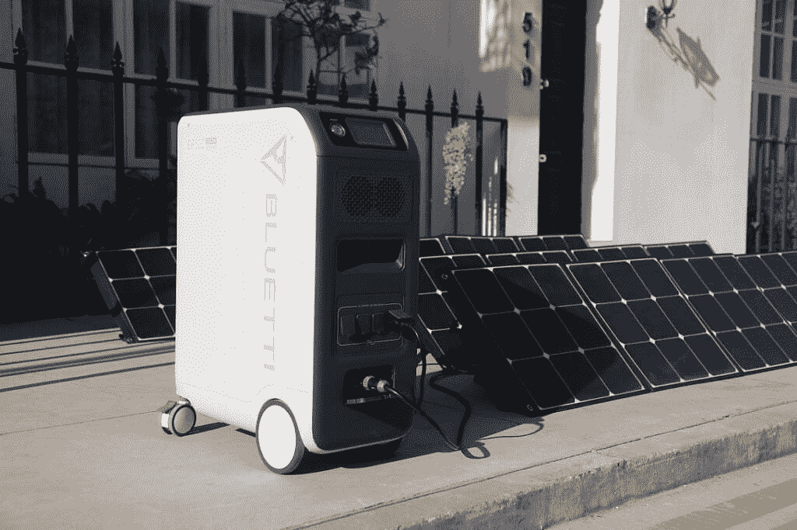
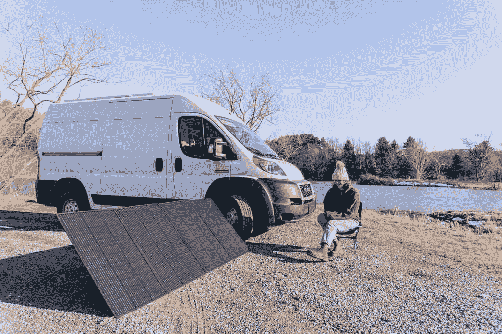

# BLUETTI 复活节大减价，省钱

> 原文：<https://www.xda-developers.com/save-huge-on-bluetti-easter-sale/>

复活节即将来临，这是家庭聚会或计划逃离城市，在野外放松身心的好时机。为了满足假期期间的这种离网电力需求，作为储能行业 10 多年来的创新先锋，BLUETTI 现在推出了限时复活节产品。向下滚动，了解更多关于促销产品的非凡阵容。

**销售日期:4/7/22 - 4/18/22**

虽然该设备没有内置电池，但 AC300 是 100%模块化的，最多可以连接四个 B300 电池组，达到 12，288Wh 的容量。3000W 纯正弦交流逆变器专为高负载设备的安全运行而设计。BLUETTI Fusion Box Pro 可以将两个这样的单元串联起来，甚至可以提升到巨大的 24，576Wh/ 6000W/ 24V，这肯定可以满足一天或更长时间的所有家庭用电需求。

## [AC 200 max](https://www.bluettipower.com/products/bluetti-ac200max-power-station-3-pv200)-全能动力怪兽

AC200MAX 是新发布的，很快成为 BLUETTI 商店中最受欢迎的型号之一。它具有 16 路输出，可同时运行多个器件。升级的 LifePO4 电池化学设计可提供 3500 次以上的生命周期，容量为原始容量的 80%。充电非常灵活，有七种不同的方式向电池提供电能。最大 1400 瓦的输入功率可让它在 2 小时内高效充满！

## [EP 500](https://www.bluettipower.com/products/ep500-2000w-5100wh-solar-generator)-无与伦比的后备电源

当考虑购买一个新的太阳能发电机作为应急电源时，EP500 应该是你的首选。在智能家庭面板的帮助下，由于无缝的 24/7 UPS 功能，它可以集成到家庭电网中。这可以让你随时为停电做好准备。通过蓝牙或 WiFi 连接，只需几个简单的步骤，您就可以从智能手机上完成远程控制、显示器和固件更新。

##  [EB55](https://www.bluettipower.com/products/bluetti-eb55-537wh-700w-portable-power-station) 和[EB70](https://www.bluettipower.com/products/bluetti-eb70-716wh-700w-portable-power-station)-打包打火机，继续行驶

这两个兄弟姐妹在便携性方面在最新的市场上极具竞争力。除了超轻之外，易于携带的手柄符合人体工程学，可以在从一个地方移动到另一个地方时省去很多麻烦。只需将 BLUETTI 太阳能电池板 PV120 或 PV200 连接起来，使其成为一种非凡的能源，只有在阳光照射下才能获得无尽的绿色能源。

##  [PV350](https://www.bluettipower.com/products/bluetti-pv350-solar-panel) 太阳能电池板——随时随地满载

PV350 太阳能电池板采用先进的层压技术制成，广泛兼容 BLUETTI AC200P、AC200MAX、AC300、AC300、EP500、EP500PRO、EB240、EB150 以及市场上大多数太阳能发电机。持久耐用的 ETFE 材料旨在承受日常刮擦和水溅。350 瓦单晶可以保证高达 23.4%的高转换率。一路上始终保持动力。

**其他 BLUETTI 复活节购物优惠:**

| 乘积模型 | 原价 | 春季大减价 | 折扣 |
| [AC200P](https://www.bluettipower.com/products/bluetti-ac200p-2000wh-2000w-portable-power-station) | $1,599 | $1,499 | $300 |
| [AB300+2*B300](https://www.bluettipower.com/products/ac300-2xb300) | $5,799 | $5,399 | $400 |
| [B300](https://www.bluettipower.com/products/b300) | $1,999 | $1,899 | $100 |
| [B230](https://www.bluettipower.com/products/b230-battery-pack) | $1,399 | $1,299 | $100 |
| [PV200](https://www.bluettipower.com/products/bluetti-pv200-200w-solar-panel) | $469 | $429 | $40 |

在[bluettipower.com](http://bluettipower.com)查看所有布鲁蒂复活节促销活动

*我们感谢 BLUETTI 赞助了这篇文章。我们的赞助商帮助我们支付与运行 XDA 相关的许多费用，包括服务器成本、全职开发人员、新闻撰稿人等等。虽然您可能会在门户内容旁边看到赞助内容(这些内容将始终被标记为赞助内容),但门户团队对这些帖子不承担任何责任。赞助内容、广告和 XDA 仓库完全由一个独立的团队管理。XDA 绝不会通过接受金钱来赞扬一家公司，或以任何方式改变我们的观点或看法，从而损害其新闻诚信。我们的意见不能被收买。*