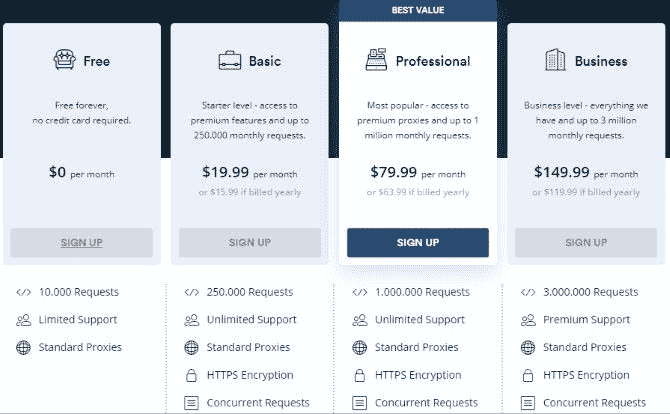

# 使用 Scrapestack API 从网站中收集有价值的数据

> 原文：<https://www.xda-developers.com/scrape-websites-for-valuable-data-with-the-scrapestack-api/>

在互联网上查找信息有很多好方法。尽管如此，还是有一些信息比较难找到，尤其是如果你在寻找非常具体的东西。网络抓取服务是一个很好的工具。 [Scrapestack](https://scrapestack.com/) 是一个 API，可以让你管理自己的网页抓取。

web scraper 是一种工具，它会访问网站并复制特定类型的数据。你不需要手动检查所有的东西，只需要给 scraper 数据，它就会完成所有的工作。Scrapestack 比免费的网站抓取工具更强大。它提供了更好的安全性、更高的可靠性和一流的服务器。

## 入门指南

开始使用 [Scrapestack](https://scrapestack.com/) 非常容易。首先，你需要设立一个账户。一旦你有一个帐户，你会得到一个 API 密钥。不出所料，这就是您将用来访问 API 的内容。然后，您可以使用目标 URL 从任何您想要的网站抓取数据。

```
 http: 
```

在上面的例子中，你将抓取微软的网站。您所需要做的就是将 API 键放在适当的位置，并在最后更改域。然后，您将获得没有 JavaScrip 和 CSS 样式的页面内容。

您可以将其他参数添加到该目标 URL 中，以进一步细化内容。

| `access_key` | **【必需】**指定您的唯一 API 访问密钥，以通过 API 进行身份验证。您的 API 访问密钥可以在您的帐户仪表板中找到。 |
| `url` | **【必需】**指定您要抓取的网页的 URL。 |
| `render_js` | [可选]根据是否在目标网页上呈现 JavaScript，设置为`0`(关闭，默认)或`1`(打开)。JavaScript 渲染是使用谷歌 Chrome 无头浏览器完成的。 |
| `keep_headers` | [可选]设置`0` (off，默认)或`1` (on)，这取决于是否将当前活动的 HTTP 头与 API 请求一起发送到目标 URL，并让 API 将这些头与 API 响应一起返回。 |
| `proxy_location` | [可选]指定您希望我们作为您的抓取 API 请求的代理地理位置的 2 个字母的国家代码。代理类型不同，支持的国家也不同，请参考[代理位置](https://scrapestack.com/documentation#proxy_locations)部分了解详情。 |
| `premium_proxy` | [可选]根据是否为您的抓取请求启用高级住宅代理，设置`0`(关，默认)或`1`(开)。请注意，一个高级代理 API 请求被计为 25 个 API 请求。 |

## 定价

[Scrapestack](https://scrapestack.com/) 有几个定价等级。免费层提供 10，000 个 API 请求、标准代理和有限支持。基本层增加了 250，000 个 API 请求、HTTPS 加密、并发请求和无限支持。基本费用每月 19.99 美元。提升到专业级可以获得 1，000，000 个请求，然后业务级可以达到 3，000，000 个请求。它们每月的价格分别为 79.99 美元和 149.99 美元。

###### *我们感谢 scrapestack 赞助这篇文章并提供内容。* *我们的赞助商帮助我们支付与运营 XDA 相关的许多 c**ost，包括服务器成本、全职开发人员、新闻撰稿人等等。虽然您可能会在门户内容旁边看到赞助内容(这些内容将始终被标记为赞助内容),但门户团队对这些帖子不承担任何责任。赞助内容、广告和 XDA 仓库完全由一个独立的团队管理。XDA 绝不会通过接受金钱来赞扬一家公司，或以任何方式改变我们的观点或看法，从而损害其新闻诚信。我们的意见不能被收买。*