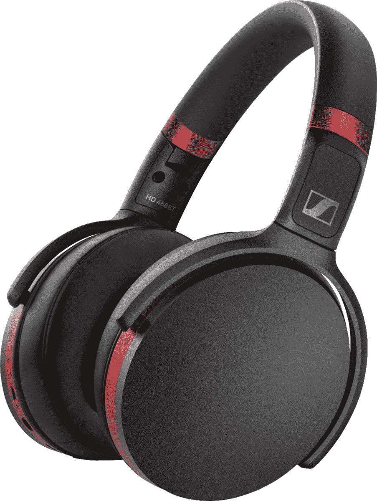

# 森海塞尔 458BT 耳机在百思买半价，仅售 100 美元

> 原文：<https://www.xda-developers.com/sennheiser-458bt-headphones-deal-best-buy/>

耳机似乎总是在打折，但这有一个很好的理由——每个人都在家工作，有时你需要淹没周围的噪音才能完成工作。但是所有的品牌和型号，所有的东西都在打折，真的很难决定买哪一双。索尼和 [Bose](https://www.amazon.com/Bose-QuietComfort-Wireless-Headphones-Cancelling/dp/B0756CYWWD?tag=xda-62lqk6u-20&ascsubtag=UUxdaUeUpU30294&asc_refurl=https%3A%2F%2Fwww.xda-developers.com%2Fsennheiser-458bt-headphones-deal-best-buy%2F&asc_campaign=Short-Term) 是值得信赖的品牌，但即使是打折销售，它们对普通用户来说仍然相当昂贵。但同时，你也不想太便宜，买一副连接蓝牙有问题或者没有主动降噪功能的劣质耳机。

对于那些寻找一副在价格和质量之间游走的中档耳机的人来说，[森海塞尔 458BT 耳机](https://shop-links.co/1721433051620953626)是一个可靠的选择。458BT 的提供 30 小时的电池寿命和主动噪音消除，所以你知道他们不会放弃，即使听了最长的几天。耳机还有一个麦克风和一个专用的语音助手按钮，所以你可以控制你的音乐，获得方向，或打电话，而不必摆弄你的智能手机。最重要的是，森海塞尔的智能控制应用程序可以控制你的音频混合恰到好处，包括一个专用的播客模式，使演讲内容更清晰，更容易听。

如果这一切听起来很棒，那么我有一些更好的消息告诉你——森海塞尔 458BT 耳机正在百思买出售！通常 200 美元，这些黑色和红色的耳机半价，所以你只需 100 美元就可以买到。

 <picture></picture> 

Sennheiser HD 458BT Wireless Noise Cancelling Headphones

##### 森海塞尔 HD 458BT

半价，森海塞尔 458BT 耳机不会错。凭借主动降噪、30 小时的电池续航时间和语音助手按钮，这些耳机可以满足你的一切需求，价格仅为 100 美元。

想找点不一样的吗？[其他森海塞尔产品也在百思买](https://shop-links.co/1724072215915310822)销售！举例来说，如果你正在寻找最高级的耳塞，那就看看便宜 30 美元的[Momentum true Wireless 2 耳塞](https://shop-links.co/1724072189333937931)吧。或者，只需 50 美元，你就可以买到 [CX 150BT 的](https://shop-links.co/1724072160882954778)，这是锻炼身体的绝佳选择。有大量的选择出售，无论你的需求是什么！