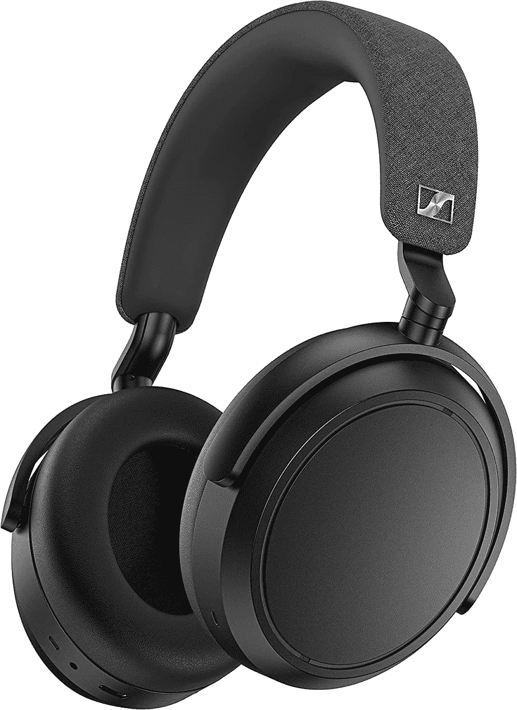

# 森海塞尔动量 4 无线评论:卓越的音质和无可挑剔的电池寿命

> 原文：<https://www.xda-developers.com/sennheiser-momentum-4-wireless-review/>

如果你正在寻找一副新的耳机，你无疑已经遇到了森海塞尔。该公司因其质量而备受尊敬，是通常会与索尼和 Bose 等公司竞争的顶级公司之一。森海塞尔的旗舰消费级耳机 Momentum 系列一直以其出色的音质和独特的设计而闻名。现在，森海塞尔 Momentum 4 无线耳机上市了，与竞争对手相比，它们有着惊人的冲击力。

森海塞尔 Momentum 4 无线耳机有几个技巧可以帮助他们从竞争中脱颖而出，但他们有一件事做得非常好，那就是音频。森海塞尔智能控制应用的功能远不如索尼的耳机连接应用丰富，即使是规格表上的附加功能列表也远远少于竞争对手提供的功能。

老实说，对于这些耳机来说，最糟糕的降级是它们扼杀了经典的 Momentum 耳机外观。以前，Momentum 耳机有金属引至杯状，这有助于它们脱颖而出。现在，这些看起来有点像索尼 WH-1000XM5 耳机-一个完整的全塑料构建，在头带和杯状物处有很多填料。他们有一个很好的构建质量，但这是一个明显的变化，使这些不那么突出。

简而言之，森海塞尔 Momentum 4 无线耳机是一副你可以依赖的耳机，拥有优质的音频，如果这是你的特权，那么你就不会错了。它们听起来很棒，电池续航时间很长(长达 60 小时！)，具有强大的噪音消除功能，长时间佩戴非常舒适。除非你想要大量的功能或者真正关心一个标志性的外观，否则选择这些功能是不会错的。

 <picture></picture> 

Sennheiser Momentum 4 Wireless

##### 森海塞尔动量 4 无线

森海塞尔 Momentum 4 Wireless 是一款出色的耳机，音质出色，ANC 良好，电池续航时间长达 60 小时。

## 森海塞尔动量 4 无线:规格和在盒中

| 

规范

 | 

森海塞尔动量 4 无线

 |
| --- | --- |
| **频率响应** | 6 赫兹至 22 千赫兹 |
| **司机** | 42 毫米驱动器 |
| **连接类型** | 

*   USB-C 加密狗
*   蓝牙 5.2 (SBC/AAC/aptX/aptX 自适应)
*   3.5 毫米

 |
| **耳垫** | 

*   流动针织织物
*   记忆泡沫

 |
| **麦克风频率响应** | 50 赫兹至 10 千赫兹 |
| **麦克风拾音模式** | 每侧 2 个话筒，波束成形降噪 |
| **THX 空间音频** | 在 Windows 10 64 位及更高版本上受支持 |
| **电池寿命和充电** | 

*   主动降噪功能最长可达 60 小时
*   两小时充满电，五分钟充电四小时游戏时间
*   700 毫安时

 |
| **重量** | 293g |
| **价格** | $350 |

盒子里有什么:

*   森海塞尔动量 4 无线
*   手提箱
*   飞机耳机插孔分离器
*   2.5 毫米至 3.5 毫米辅助电缆
*   USB-A 至 USB-C 电缆

***关于这次评审**:森海塞尔在 2022 年 8 月 13 日把森海塞尔 Momentum 4 发给我评审。我收到的第一双有硬件问题，我收到了修复这些问题的替代品。*

* * *

## 森海塞尔 Momentum 4 无线:设计与舒适

森海塞尔 Momentum 4 无线耳机标志着我们多年来熟悉和喜爱的森海塞尔 Momentum 外观有了很大的改变。将这些耳机与任何以前的 Momentum 耳机进行比较，你会发现巨大的差异。值得一提的是，这不一定是一件坏事，但这种变化已经让该公司的大量粉丝沉迷于这些耳机。我最大的批评是，它们不像以前的森海塞尔耳机或以前的索尼耳机那样折叠关闭。

如果你不是一个设计势利者(我真的不能说我是)，那么当谈到这些耳机时，你不会有太多抱怨。没有很大的夹紧力使它们长时间舒适，尽管如果你经常移动你的头，它们可能会变得有点松。他们在工作或骑自行车时很好，但这并不是说更剧烈的运动不会造成问题。

森海塞尔动量 4 无线是舒适的长时间佩戴

软垫耳垫很大很厚，我想如果你不喜欢它们，你可以通过第三方卖家换成更舒适的东西——我发现它们让我的耳朵很温暖。耳罩可以向各个方向旋转，非常灵活舒适，不听音乐时戴在脖子上也很舒服。耳罩这么大也意味着有很多触摸控制的空间。我受到的最大批评是，因为它们是完全旋转的，所以当我拿起它们时，我不能轻易地分辨出哪个耳罩是左的，哪个是右的。我通常需要检查。

总体来说，不是最独特的设计，但绝对实用。它们感觉很好，看起来也很好(只是没有以前那么经典了)，而且长时间穿着也很舒服。当然，耳机可能是一种时尚，但是大多数人*可能*购买耳机不仅仅是因为它们的外观。如果你是为了耳机的设计而购买耳机，那么有很多更好的选择。

* * *

## 森海塞尔动量 4 无线:声音和噪音消除

一副耳机的音质可能是整个考验中最重要的部分，我想这也是大多数人关心的。谢天谢地，这些耳机听起来令人难以置信，音频的清晰度给我留下了非常深刻的印象。我主要是在听[这个播放列表](https://open.spotify.com/playlist/4lvaUbBBMScvmoaQXQ9t7N?si=41c9ed0086474161)时查看了这些耳机，在谈论音频体验的不同方面时，我会参考其中的一些曲目。

首先，像*汽车座椅头枕*的*著名先知(明星)*这样的歌曲是一首很棒的歌曲，可以展示这些耳机的动态范围。他们不仅能处理音轨结束时的不和谐声音，还能完美地再现低音吉他和钢琴的前奏。特别是在歌曲的某些部分，我注意到右耳罩里有奇怪的噼啪声。这在其他歌曲中也很明显，尽管在森海塞尔发给我的新歌集中没有。对于其他曲目，如*literal Mind*by*Sprints*，这些耳机可以很好地跟上快节奏的噪音淹没，而不会混淆声音。

这是我用过的声音最好的耳机，声音清晰均衡，就像任何一副高端耳机一样

同样有趣的是，Remo Drive 的《你杀了我》在歌曲的结尾有一个人敲门的声音。我很惭愧地承认，戴着这些耳机，感觉足够真实，我已经两次上当，并立即摘下耳机检查我的前门。这些是我用过的最好听的耳机，声音清晰而平衡，任何一副高端耳机都应该如此。我甚至很乐意用它们来制作音乐，这是一个对所用耳机的准确性非常敏感的爱好。

这种高音质得益于包含一些不同的编解码器可供选择。你可以得到诸如 SBC 和 AAC 的标准，但是除此之外，你还可以得到[高通的 aptX 和 aptX Adaptive](https://www.xda-developers.com/how-to-check-and-change-bluetooth-codec-android/) 。我觉得有一个错过的机会，也包括 LDAC，但 aptX 自适应是很好的，如果他们的手机支持它，大多数人最终会使用。对于没有 aptX 支持的用户( [iPhone 用户](https://www.xda-developers.com/best-iphone/)，大多数 Windows 用户)，你将不得不依赖普通的老 AAC。

如果你想在电脑上使用这些耳机玩游戏，那么我强烈推荐使用附带的电缆。这是一个 2.5 毫米的电缆到耳机与 3.5 毫米插孔输出，听起来很棒...当耳机打开时。如果你在电脑上使用这些耳机，虽然它们在耳机关闭时可以工作，但音频却很糟糕。我经常在不戴耳机的情况下使用我的索尼 WH-1000XM3 耳机，它们听起来很好，但当关掉时，它们听起来很糟糕。把它们打开。你甚至可以在使用它们的同时给它们充电(尽管我有时会受到干扰)，或者直接用 USB-C 电缆插入它们，将它们用作一对 USB 耳机。

当谈到噪音消除，一般来说，森海塞尔从来没有在业务中是最好的，即使他们自己很好。这里没有什么不同，再说一次，这并不是说它不好，只是别人做得更好。这些耳机的降噪功能与索尼 WH-1000XM3 相当，仍然绰绰有余。在汽车、火车和飞机上，仍然足够安静，你可以以较低的音量听音乐。事实上，在飞机上，没有他们，甚至不听任何东西，真的很舒服。他们很擅长过滤我周围的声音，并把它消除掉，让我享受了一次愉快的飞机之旅。

最后，在麦克风上，我没有被听到或被人听到的问题。他们听起来很好，虽然它在外面的风中挣扎了一下。

* * *

## 森海塞尔动量 4 无线:控制

触摸控制是耳机的标准配置，尽管习惯起来有点挑剔。我发现我经常会不小心触发他们移动我的头发或抓我的耳朵，这是非常讨厌的。单次点击是暂停或播放，向前或向后滑动是向前或向后跳过，向上和向下是提高音量和降低音量。捏起来(就像你在手机屏幕上做的那样)会增加主动降噪，向外捏会增加透明度。

在我以前的一副耳机上，这些触摸控制经常不起作用，或者会令人难以置信地延迟。谢天谢地，我的新眼镜不是这样的，而且从那以后也有了一些固件更新，也解决了一些问题。

你必须记住的另一个控制是，要让这些耳机在不使用时自动关闭，你需要确保杯子在任何表面上都朝下。它们会在那个位置自动关闭，但只是在那个位置。如果你让它们朝上，电池会耗尽，我已经好几次艰难地发现这一点。60 小时的电池寿命相当不错，但如果你把它们错误地放在桌子上，它们仍然会在一夜之间耗尽。

这些耳机也有自动暂停和播放检测，我发现这有点过分了。如果我试图在耳机下挠耳朵，它们有时会在我不需要(也不想)的时候暂停一会儿。

总的来说，这些控件非常好并且易于使用，尽管你可能想要禁用/调整其中的一些来根据你的喜好调整它们。

* * *

## 森海塞尔动量 4 无线:智能控制应用程序和软件

智能控制应用程序以及驱动这些耳机的固件是最让他们失望的。应用程序运行缓慢，耳机本身也花了很多时间来适应。我原来的耳机在用它们听音乐时也会频繁断开连接，然后很快重新连接，不过新耳机也没有出现这种情况。

首先，应用程序本身只是...奇怪。当开箱后连接耳机时，安装固件更新需要 40 分钟。在那段时间里，我无法使用它们，而且感觉*异常地*渴望软件更新。那是在之后的*，尝试了几次才让应用程序识别耳机，因为它会“连接”上来，但没有向我显示任何额外的选项。你可以在上面的第一张截图中看到它的样子。*

这个应用程序只是做得很差，这是无可厚非的。如果我是通过蓝牙连接的，为什么应用程序会说需要重新连接？没有任何意义。不过值得庆幸的是，一旦你设置好了这些耳机，除了一些罕见的情况，你一般不需要再使用这个应用程序。当你在这里修改它们的时候，设置会改变，而且它会工作，问题是*首先要到达设置*。

我希望一个合适的 EQ 被实现。我一般不在乎制造商是否在他们的应用程序中实现了均衡器，因为如果我真的想的话，我可以使用 Wavelet 这样的应用程序来均衡我的音频输出。然而，森海塞尔包装的三波段 EQ(如上图)却差得可笑。这已经足够糟糕了，大多数关心音频质量的人都不会使用它，那么它的存在有什么意义呢？它完全缺乏精确性。我唯一能想到的是，我想低音头可能会喜欢它，但它至少应该是一个五波段均衡器-如果不是更多。

* * *

## 该不该买森海塞尔 Momentum 4 无线？

森海塞尔动量 4 无线是，除了软件问题，简直难以置信。音频质量是一流的，他们的主动降噪是伟大的，触摸控制是有意义的。此外，无数的连接选项给我留下了深刻的印象——用 3.5 毫米插孔有线，用 USB-C 电缆有线，或通过蓝牙无线，听起来都很棒。包含 aptX 编解码器对 Android 用户来说也很棒，尽管我再次感叹这些耳机缺乏 LDAC。

**您应该购买这些耳机，如果:**

*   你想要高质量的音频
*   您使用 Android 智能手机作为您的主要智能手机
*   您经常玩游戏，并且希望能够通过音频精确定位位置
*   你需要它们在一次充电后持续很长时间

**你不应该购买这些耳机，如果:**

*   你想象自己需要经常使用这个应用程序
*   你需要一副小巧的耳机

 <picture></picture> 

Sennheiser Momentum 4 Wireless

##### 森海塞尔动量 4 无线

森海塞尔 Momentum 4 Wireless 是一款出色的耳机，音质出色，ANC 良好，电池续航时间长达 60 小时。

最重要的是价格。这些耳机的售价为 350 美元，与当今市场上一些最好的消费耳机价格相同。它们比索尼 WH-1000XM5 便宜 50 美元，尽管声音不相上下。这些耳机听起来很棒，一旦你忽略了软件问题(在你第一次设置它们后，你不需要考虑这些)，我真的没有什么可以批评的。我的第一副耳机有硬件问题，但第二副除了用来控制耳机的应用程序之外，我没有什么可说的。

换句话说，如果你需要一副新的耳机，想拿起这些，你真的不会错。