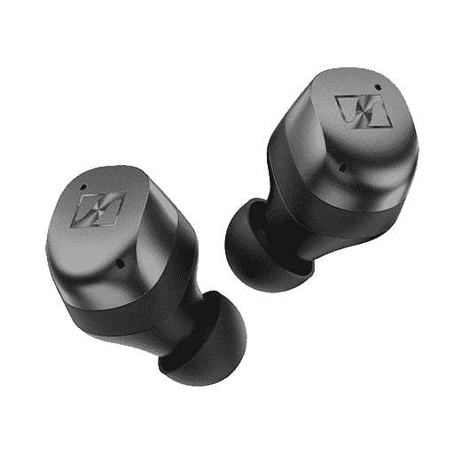

# 森海塞尔揭示了势头真无线 3 耳塞与 ANC

> 原文：<https://www.xda-developers.com/sennheiser-momentum-true-wireless-3-earbuds-release/>

几十年来，森海塞尔一直是音频行业的主要品牌，该公司提供真正的无线耳塞已经有一段时间了。Momentum True Wireless 3 是森海塞尔最新一代的无线耳塞，在功能上有一些改进，同样注重音频质量。

新的 Momentum True Wireless 3 与以前的型号一样，具有在德国制造的 7 毫米动态驱动器，森海塞尔说，它“产生了一种身临其境的立体声，低音深沉，中音自然，高音细腻。”还有一个智能控制应用程序，用于在音频预设之间切换和使用均衡器。支持标准 AAC 和 SBC 音频编解码器，以及高通 aptX Adaptive。自适应噪声消除也是可用的，它类似于常规的主动噪声消除(ANC)，但噪声消除的水平是根据您环境中的声音水平来调整的。

该保护套在前面有一个 USB Type-C 端口用于充电，以及无线充电支持——后者是 Momentum 系列的新功能。包装盒中包括几个硅胶耳塞头，用于适应不同的耳朵尺寸，耳塞的防水溅等级为 IPX4(不清楚外壳是否具有相同的 IPX4 等级)。森海塞尔说，耳塞一次充电可以持续七个小时。

不支持多点蓝牙，但这似乎是唯一缺少的主要功能。这款耳塞的一些早期评论已经发布，CNET 给出了 8.4/10 的评分。那篇评论提到音质和设计都很棒，但可能不适合耳朵小的人。

Momentum True 无线耳塞现在可以从森海塞尔的网站上预订，有三种颜色可供选择:黑色、白色和石墨色。无论你选择哪种颜色，你都要支付 249.95 美元。正式上市日期为 5 月 10 日。

 <picture></picture> 

Momentum True Wireless 3

##### 森海塞尔势头真无线 3

森海塞尔最新的真正的无线耳塞有定制的音频驱动程序，USB Type-C 和无线充电，以及 ANC。

**来源:** [森海塞尔](https://en-us.sennheiser.com/newsroom/inspired-by-sound)