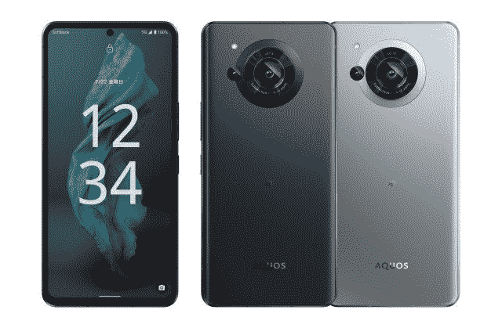

# 夏普 Aquos R7 评论:超利基日本手机与 1 英寸传感器

> 原文：<https://www.xda-developers.com/sharp-aquos-r7-review/>

日本夏普公司是一个百年品牌，以许多电子产品闻名于世，尤其是电视。虽然该公司也生产智能手机，但可以毫不夸张地说，它们是小众产品，迎合收藏家和爱好者，而不是主流。毕竟，夏普智能手机只在日本销售，即使在日本，根据多家研究公司的结果，截至 2022 年 5 月，夏普智能手机仍占 1.77%的市场份额。

但在 Android 领域，主流版本都变得非常好*和相似*，利基往往意味着有趣。事实上，夏普有生产非常有趣的手机的历史，有许多行业第一，但这些手机几乎不存在国际营销和存在，这意味着它们经常被忽视。

同样的命运可能会降临到夏普 Aquos R7 身上，这款手机配备了与小米在过去几周获得大量科技头条相同的摄像头硬件。

## 夏普 Aquos R7:定价和供货

夏普 Aquos R7 现已上市，但仅在日本销售。你可以以 189，360 英镑的价格直接购买，这相当于 1400 美元左右。感谢我的同事蒂米什·坎蒂萨诺在[的报道，我们知道日本的运营商正在提供 48 个月的分期付款计划。](https://www.xda-developers.com/sharp-aquos-r7-hands-on/)

手机可以进口。多亏了香港进口商[三一电子](https://www.facebook.com/Trinityelectronic/)，我才得以买到一台设备。考虑到这款手机的官方零售价有多贵，你可能要花 1700 多美元才能买到一部。因此...是的，这是一款小众手机。

 <picture></picture> 

Sharp Aquos R7

##### 夏普 Aquos R7

夏普的 Aquos R7 带来了一个 SonyIMX989 传感器，它有一个 1 英寸的传感器和 240Hz 的有机发光二极管显示屏

* * *

## 夏普 Aquos R7:规格

| 

规格

 | 

夏普 Aquos R7

 |
| --- | --- |
| **构建** | 

*   大猩猩玻璃 Victus 正面
*   铝制框架

 |
| **尺寸&重量** |  |
| **显示** | 

*   6.67 英寸专业 IGZO 有机发光二极管
*   2730 x 1260 像素
*   2000 尼特峰值亮度
*   240Hz 峰值刷新率
*   可变刷新率支持(1-240 赫兹)
*   2000 万:1 对比度
*   直接热轧制

 |
| **SoC** | 高通骁龙 8 代 1 |
| **闸板&存放** | 

*   12GB LPDDR5 内存+ 256GB UFS 3.1 存储

 |
| **电池&充电** | 

*   5000 毫安时
*   67W 有线快速充电支持
*   50W 无线快速充电支持
*   10W 反向无线充电支持
*   小米 Surge P1 充电芯片
*   小米浪涌 G1 电池管理芯片

 |
| **安全** | 高通 3D Sonic Max 显示屏下指纹传感器 |
| **后置摄像头** | 

*   47MP 1 英寸索尼 IMX989，f/1.9
*   七元件徕卡微透镜
*   深度传感器
*   LED 闪光灯

 |
| **前置摄像头** | 12MP 自拍 |
| **端口** | USB 类型-C |
| **音频** |  |
| **连通性** | 

*   5G(仅限日本)
*   无线网络 6
*   蓝牙 5.2

 |
| **软件** | 顶部覆盖夏普软件的 Android 12 |
| **其他特征** |  |

***关于这篇评论:**这篇评论是在测试了来自香港进口商 Trinity Electronics 的夏普 Aquos R7 之后写的。夏普和三一电子都没有参与这篇文章。*

* * *

## 夏普 Aquos R7:硬件和设计

在我看来，夏普 Aquos R7 最大的卖点是它的主摄像头:一个带有徕卡光学系统的 1 英寸索尼传感器。这听起来熟悉吗？这些都是[小米 12S Ultra 相机](https://www.xda-developers.com/xiaomi-12s-ultra-review/)的卖点，这款相机一直在科技媒体领域获得好评，包括 yours truly。

夏普 Aquos R7 是熟悉和新的奇怪组合

事实上，夏普的相机使用了完全相同的索尼 IMX989 传感器——小米表示，这是与索尼共同开发的，分摊了 1500 万美元的 R&D 账单。夏普也在使用这款相机的事实应该更有新闻价值，但正如我的同事 Timi Cantisano 上个月所写的那样，夏普有着让其他品牌在硬件创新方面大放异彩的历史。

摄像机如此特别，理应有它自己的部分，我们稍后会讲到。手机的其余部分是熟悉和陌生的奇怪混合。这款 6.67 英寸、2730 x 1260OLED 面板采用了夏普的 IGZO(铟、镓、锌、氧化物)技术，这意味着屏幕由超薄薄膜晶体管分层构成，漏电更低。它也以最高 240Hz 的频率刷新。是的——是任何现代安卓旗舰的两倍。

屏幕看起来肯定很棒，动画非常快速流畅，但如果我说我在顶级 Android 设备上注意到任何优于“典型”120Hz OLED 面板的地方，如 [Galaxy S22 Ultra](https://www.xda-developers.com/samsung-galaxy-s22-ultra-review/) 或[一加 10 Pro](https://www.xda-developers.com/oneplus-10-pro-review/) ，那我是在撒谎。事实上，在我看来，夏普的面板似乎没有 Galaxy S22 Ultra 的亮度高，尽管夏普宣传其“最大峰值亮度”为 2000 尼特还有一点薄边框，比其他 2022 年的安卓旗舰都厚。

但是屏幕完全是平的，这可能会受到很多读者的喜欢，它下面是高通的 3D Sonic Max 扫描仪，这是对传统光学显示扫描仪的一次升级，甚至只是一个典型的高通超声波扫描仪(就像 Galaxy S22 系列中使用的那种)。扫描区域更大，允许双指认证的选项，而且扫描速度也比其他扫描仪快一拍。

手机的侧面和背面由一块铝制外壳组成，这是对 2015 年左右智能手机的一个很好的回归，当时几乎所有高端手机都配有玻璃机身。

这款手机的侧面又宽又平，但与最近的 iPhone 不同，由于有倒角，边角并不锋利。这是一款握持舒适的手机，208 克的重量均匀分布。夏普倾向于在别人曲折的地方曲折，这一点在顶部也很明显，SIM 卡托盘就在那里，还有一个耳机插孔。

### SoC 和内存

手机内部是骁龙 8 Gen 1(不是更新的 8 Plus)，它配有 12GB 的内存和 256GB 的 UFS 3.1 存储(没有其他内存配置)。

* * *

## 夏普 Aquos R7:相机

我们去摄像机那。夏普 Aquos R7 手机两侧各有一个摄像头:前面提到的 1 英寸主摄像头和一个 12MP 前置自拍摄像头。对于旗舰产品来说，省略超宽或变焦摄影的辅助镜头是非常不寻常的，但我认为现在我们知道夏普手机是非传统产品。(你在模块左侧的那个较小的镜头只是一个 190 万像素的深度传感器，并不能真正算作一个真正的相机。

虽然夏普 Aquos R7 使用了相同的 IMX989 传感器，但夏普实际上使用了更小的镜头格式，(因此这就是为什么小米仍然能够声称其手机是“世界第一”，小米的主摄像头比夏普的 7P 镜头多了一层镜头(八层)。这两个镜头都是由徕卡设计的(显然)，但小米的镜头更新，专门为小米 12S Ultra 开发。

所以有一些硬件上的差异，当然，现在软件处理可能比硬件更重要。

我用夏普 Aquos R7 和小米 12S Ultra 一起拍了 60 多张照片，我可以说，当夏普一切顺利时，它的相机经常展示小米 12S Ultra 主相机的所有令人敬畏的优势:奶油状的散景，出色的进光能力，以及具有更深阴影的对比照片，这是徕卡的外观。

在上面的照片中，你可以看到夏普和小米都制作了非常好看的照片，颜色配置文件和散景程度相似。在第二组饮料和食物以及最后一组构建工具中，你可以看到夏普的照片展示了与小米照片相同的“深度”，随着我们从前景的物体移动到背景，焦点自然地逐渐减弱。具有较小图像传感器的照相机会产生较平的图像。

但夏普的相机时不时会出现失误，产生褪色的颜色，并且由于快门速度较慢，拍摄的照片略微模糊。在上面的第三组中，街道柱子和植物，夏普的颜色和清晰度比小米的要柔和。

转到低光照片，夏普 Aquos R7 将比小米 12S Ultra 早得多自动打开光模式。这解释了为什么第一套法国酒吧看起来如此不同。夏普的镜头通过夜间模式进行了人工增强，但结果是颜色过于温暖，看起来不自然。小米的照片看起来不仅更接近现实生活中的场景，它只是一个更令人愉悦的镜头。

第二组是一个虚拟的平局，两个相机都拍出了漂亮的照片，尽管我们可以看到小米的 HDR 在右边的框架中曝光大楼的灯光稍微好一点。在下面的另一组中，我们可以看到第一组以外的类似照片质量，其中夜间模式再次发挥了作用。我确实更喜欢夏普自拍中我的肤色，但照片在细节上明显更柔和。

夏普 Aquos R7 相机提供了奶油状的散景，出色的进光能力，以及具有较深阴影的对比照片，使徕卡看起来更好

总的来说，夏普的相机真的很好，拍出的照片景深浅，散景重，看起来更像是真正的相机照片。然而，快门速度明显比小米 12S Ultra 慢，并且没有超宽或变焦镜头意味着该系统整体上仍然有点欠缺。

* * *

## 夏普 Aquos R7:软件和性能

Aquos R7 运行 Android 12，上面是夏普的 Android 皮肤。从美学角度来说，Android 皮肤不会偏离 Android 外观太远，直到你进入菜单。这时你会看到这个卡通式的设置页面，它旨在教那些手机新手如何利用所有的软件功能。

夏普制作了整个卡通插图的这些特殊功能中的大多数只是相当常见的功能，如专用的游戏模式，或使用手指手势抓取屏幕截图。

你可以为特定的应用程序指定特定的刷新率，包括视频中的运动平滑，在我看来永远不应该使用。这款手机附带了一些膨胀软件应用，包括亚马逊 Prime 和运营商软银及其他日本公司的日语应用。主屏幕和通知面板看起来有点像 Pixel 的 Android 版本，有宽阔的椭圆形快捷切换按钮，屏幕底部有一个谷歌搜索栏，不能移除。

如上所述，动画非常流畅，但我很难看出 240 赫兹和 120 赫兹的区别。如果你想知道在 240 赫兹下使用手机是否会影响电池寿命，是的，绝对会。

* * *

## 夏普 Aquos R7:性能

尽管配备了 5，000 毫安时的电池，但在我的测试中，夏普 Aquos R7 的电池续航时间并不理想，每天只提供大约 4 到 4 个半小时的屏幕打开时间。如果我整天把手机拿出来，它可以在电池电量下降到 5%以下之前工作 10-11 个小时。更糟糕的是，夏普使用了更老的[骁龙 8 第 1 代](https://www.xda-developers.com/qualcomm-snapdragon-8-gen-1-benchmarks/) SoC，而不是更高效的[骁龙 8 加第 1 代](https://www.xda-developers.com/qualcomm-snapdragon-8-plus-gen-1-benchmarks/)，这已经成功给了像[华硕 Zenfone 9](https://www.xda-developers.com/asus-zenfone-9-review/) 和小米 12S 这样的超级电池续航时间。

包装也不包括充电器或充电电缆，由于几乎完全缺乏英文营销材料，我不知道夏普 Aquos R7 可以充电的官方瓦特数。使用我的 MacBook 的 96W USB-C 充电器，我能够在不到一个小时的时间内将 Aquos R7 从 0%充到 100%。

在常规的智能手机使用方面，夏普 Aquos R7 的表现绝对不错(除了电池续航能力一般)。应用程序启动时没有问题，立体声扬声器声音响亮而饱满，触觉效果甚至很稳定，不像去年的 Aquos R6 那样一团糟。因为这款手机只面向日本市场，我在香港测试手机时无法获得 5G 网络连接——我怀疑日本以外的任何读者也无法获得 5G 网络连接。

* * *

## 夏普 Aquos R7:该不该进口这款手机？

夏普 Aquos R7 是一款非常有趣的手机，它带来了一个出色的 1 英寸摄像头，仅通过纯粹的图像传感器大小，就将自己与市场上大多数手机摄像头区分开来。该显示器在技术上也很出色，即使你无法注意到它优于“较低”的 120Hz 面板的地方。

夏普似乎并不在乎在日本以外的市场销售其手机，也不太在乎整体销售数字

然而，与仅在中国销售的小米 12S Ultra 相比，夏普 Aquos R7 是一款非常小众的手机，大多数读者不应该考虑。即使你要进口，小米 12S Ultra 也是一个更好的选择，因为它的价格更低，处理器更好，整体相机系统更好。

但这无关紧要，不是吗？正如开头提到的，夏普似乎并不在乎在日本以外的市场推广其手机，也不太在乎整体销售数字。日本本质上是一个 iPhone 国家(iPhone 在该国拥有近 65%的市场份额，根据我个人的轶事经验，这个数字在东京要高得多)。即使是受人爱戴的本土巨头索尼的手机也是一个遥远的，遥远的第二名(10.8%的市场份额)。夏普在日本的市场份额为 1.77%(在其他地方实际上为零)，这确实让这款手机变得非常不起眼。

日本一直是一个古怪、独特的小玩意的国度，夏普 Aquos R7 比主流消费者应该考虑的实际手机更符合这个定义。