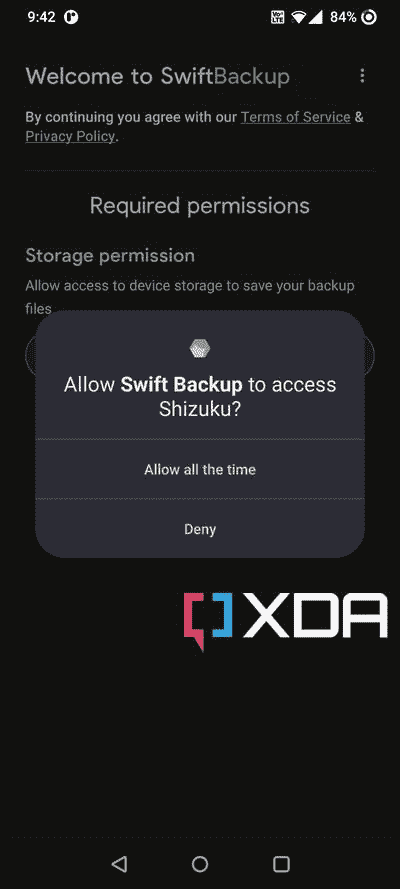

# 什么是滴，你能用它在你的 Android 设备上做什么？

> 原文：<https://www.xda-developers.com/shizuku/>

Android Debug Bridge，简称 ADB，是一个方便的开发工具，可以与您的手机进行接口，用于调试和测试。通过 ADB，开发者和高级用户可以访问 Android 内置的 Linux 命令行 shell，拥有比用户安装的应用程序更大的权限。值得注意的是，ADB shell 权限并不等同于超级用户权限，因此您可能仍然需要 [root 您的设备](https://www.xda-developers.com/root/)来完全控制操作系统。然而，根据您的修改需求，shell 访问足以授予或拒绝权限，更改系统设置值，以及做更多的事情。这就是**滴**应用发挥作用的地方。

**浏览这篇文章:**

* * *

## 什么是滴？

滴是一个极好的解决方案，可以处理 Android 修改世界中相当复杂的场景:允许第三方应用程序访问系统级应用程序编程接口(API)。这个想法是运行一个具有 shell 级别权限的专用进程，作为系统服务器和应用程序之间的代理。开发人员可以利用滴服务器组件来执行提升的操作，而不是依赖于在`su` shell 中运行命令。

简而言之，如果一个应用程序需要特殊权限，只能通过 ADB(或 root)授予，**你可以使用滴从你的 Android 设备授予权限**。

滴项目是开源的，由立夏(又名 [RikkaW](https://github.com/RikkaW) )、[harue](https://github.com/haruue)和其他几个开发者维护。

* * *

## 滴有什么特色？

*   最小的性能开销。
*   极快的执行速度(由 Android 的进程间通信机制“binder”提供支持)。
*   应用程序可以使用 Android 系统 API，代码添加量可以忽略不计。
*   在 Android 11 及更高版本上，你可以直接在你的设备上设置和启动滴。

* * *

## 如何下载滴？

如前所述，滴项目是开源的，因此你可以从官方的 GitHub 库[获取源代码后，看看代码库或者自己编译。](https://github.com/RikkaApps/Shizuku)

如果你正在寻找滴的预编译版本，你可以直接从谷歌 Play 商店上下载。开发者们还托管了几个镜像，使得下载 APK 官方版本更加容易。

* * *

## 我如何安装和配置滴？

滴的 Google Play 版本由 Android 自己的包管理器安装，并将继续由 Play Store 更新。如果你想选择 GitHub 的 APK 版本，那么你需要在你的 Android 设备上手动下载这个包。

尽管您可以在非 root 环境中使用滴，但拥有 root 访问权限可以极大地简化设置滴服务的过程。按照下面的指南学习如何用您选择的方法配置滴。

### 具有 root 访问权限

在以 root 权限安装滴之前，请确保您已经在目标设备上安装了最新版本的 Magisk(T2)。

1.  找到滴图标，点击它打开应用程序。
2.  在主屏幕上，转到名为*开始(对于根设备)*的部分。
3.  点击开始按钮启动该过程。
4.  按下 *Grant* 在被请求时给予 root 权限。
5.  如果一切顺利，滴服务将在几秒钟内在新屏幕上启动，然后在完成后自动关闭。
6.  滚动到顶部，验证滴的运行状态。它应该显示一个版本号，后跟“root”

默认情况下，滴服务在重启后不会自动启动。要更改行为，点击右上角的设置图标，然后找到*启动时启动(root)* 选项。一旦启用，滴服务将在您重新启动设备后执行，无需任何用户干预。

值得一提的是，项目的开发人员正在开发一个叫做 Sui 的高级前端。它最终会取代目前的滴应用程序。要尝试一下，从 GitHub repo 下载最新版本[。由于 Sui 被设计为一个](https://github.com/RikkaApps/Sui) [Magisk 模块](https://www.xda-developers.com/best-magisk-modules/)，你仍然需要 Magisk 来运行应用程序。

**[下载隋](https://github.com/RikkaApps/Sui/releases/latest)**

与普通的配套应用不同，Sui 没有提供典型的应用图标。要访问其界面，请执行以下操作之一:

*   (Android 8.0+，Sui 12.1+)从首页 app 长按系统设置，会找到 Sui 的快捷方式。
*   (Android 8.0+，Sui 12+)在系统设置中输入“开发者选项”，系统会要求你添加 Sui 的快捷方式。
*   在默认拨号器应用中输入`*#*#784784#*#*`。

虽然隋有自己的潜力，但这个项目的功能还没有完成。在从当前应用程序到 Sui 的迁移得到正式批准之前，建议使用主应用程序来配置的不同方面。

### 没有 root 访问权限

从 Android 11 开始，谷歌在 Android 的开发者选项中加入了无线调试功能。它可用于在没有 root 访问权限的情况下在目标设备上配置滴服务。

1.  找到滴图标，点击它打开应用程序。
2.  在主屏幕上，转到名为*通过无线调试启动*的部分。
3.  轻触*配对*按钮，然后按下*开发者选项*。接下来，向下滚动，直到找到无线调试选项。打开它。
4.  勾选*总是允许在此网络上*框，然后按*允许*启用该功能。
5.  点击*无线调试*菜单。接下来，选择名为*的选项，将设备与配对代码*配对。
6.  现在，将唯一的 6 位数字 Wi-Fi 配对代码输入滴配对代码通知文本框。
    *   你也可以在状态栏上向下滑动到滴通知，然后点击*输入配对代码*，并按下右边的发送按钮进行确认。
7.  在此阶段，如果配对代码正确，您应该会看到一条*配对成功*消息。
8.  返回滴应用程序主屏幕。
    *   在此之前，您可能需要扫开配对成功通知。
9.  找到*通过无线调试开始*部分，点击开始按钮启用服务。
10.  滴服务现在会自动在一个新的屏幕上启动，然后在完成后自动关闭。
11.  滚动回顶部，验证滴的运行状态。它应该显示一个版本号，后跟“adb”

请记住，您需要再次启用“无线调试”选项，并在重新启动目标设备后重新启动滴。

也可以通过有线亚行接入来调用滴服务。这对于旧版本的 Android 或者一些 OEM Android 皮肤来说特别有用，在这些地方无线调试并不容易。然而，作为先决条件，你需要一台安装了 ADB 的 PC/Mac 以及 OEM Android 驱动。

1.  在继续之前，请确保目标设备可被您的 PC/Mac 上的 ADB 进程发现。
    *   在终端窗口中键入`adb devices`，然后按回车键。您应该会在“连接的设备列表”下看到一个唯一的设备标识符编号，让您知道它已连接并被 ADB 接口识别。
2.  在手机上至少打开一次滴应用程序。
3.  在 PC/Mac 的终端窗口执行以下命令:

    ```
     adb shell sh /sdcard/Android/data/moe.shizuku.privileged.api/start.sh 
    ```

4.  如果成功，您应该在几秒钟内在终端窗口上看到一个带有 0 状态的*退出。*
5.  在你的手机上，打开滴应用程序。然后滚动回顶部，验证滴的运行状态。它应该显示一个版本号，后跟“adb”

如果你完成了所有这些，你现在应该在你的 Android 设备上有一个工作的滴实例。

* * *

## 如何使用滴？

如果你熟悉 Magisk，那么滴也很相似。但是它不是管理 root 访问，而是管理 shell 访问。因此，如果您有一个工作的滴实例，然后尝试打开一个利用滴执行提升操作的应用程序，您应该会看到一个允许访问的提示。一旦您允许，滴将无缝地满足 API 访问要求。

下面你可以找到利用滴提升运营的热门应用的简短列表。这并不代表对上述应用程序的认可，也不是说其他人的工作应该被忽视。为了防止这篇文章变得太长，我们限制了链接的内容。

*   Repainter 为任何 Android 12(或更新版本)设备和 ROM 带来可定制的动态素材。
*   [App Ops](https://play.google.com/store/apps/details?id=rikka.appops) : App Ops 是一个细粒度的 App 权限管理器。
*   [SAI (split APKs 安装程序)](https://play.google.com/store/apps/details?id=com.aefyr.sai) : SAI 是一个高级的 APK 安装程序，支持 Split APK。
*   [Swift Backup](https://play.google.com/store/apps/details?id=org.swiftapps.swiftbackup) : Swift Backup 可以免费无 root 备份你的 apk，你的短信，你的通话记录，应用壁纸。
*   [SystemUI 调谐器](https://play.google.com/store/apps/details?id=com.zacharee1.systemuituner):Android 内置系统 UI 调谐器的功能丰富的替代品。

 <picture></picture> 

Swift backup requesting Shizuku access

在大多数情况下，应用程序会在初始设置阶段要求滴访问。一旦获得授权，它们将公开需要提升访问权限的功能。如果没有安装(或配置)滴，应用程序将自动选择具有有限功能集的回退模式。

还可以将滴与设备上的终端模拟器应用程序结合使用。这部分内容超出了本教程的范围，但是您可以通过点击应用程序主菜单上的“在终端应用程序中使用滴”选项来探索这一功能。

对于 Android 应用程序开发社区，您可以轻松利用滴的力量。为此，看看我们的讲解者和滴 API 回购[吧。](https://github.com/RikkaApps/Shizuku-API)

**[滴官网](https://shizuku.rikka.app/)**

* * *

## 结论

植根于你的 Android 设备会打开一个定制的世界，但这并不总是一个可行的选择。不幸的是，随着时间的推移，谷歌改进了篡改检测方法，剩下的空间越来越少。滴的应用程序在某种程度上填补了空白，这对于 Android 修改场景来说非常好。希望在不久的将来，我们会看到大量支持滴服务的应用和插件。