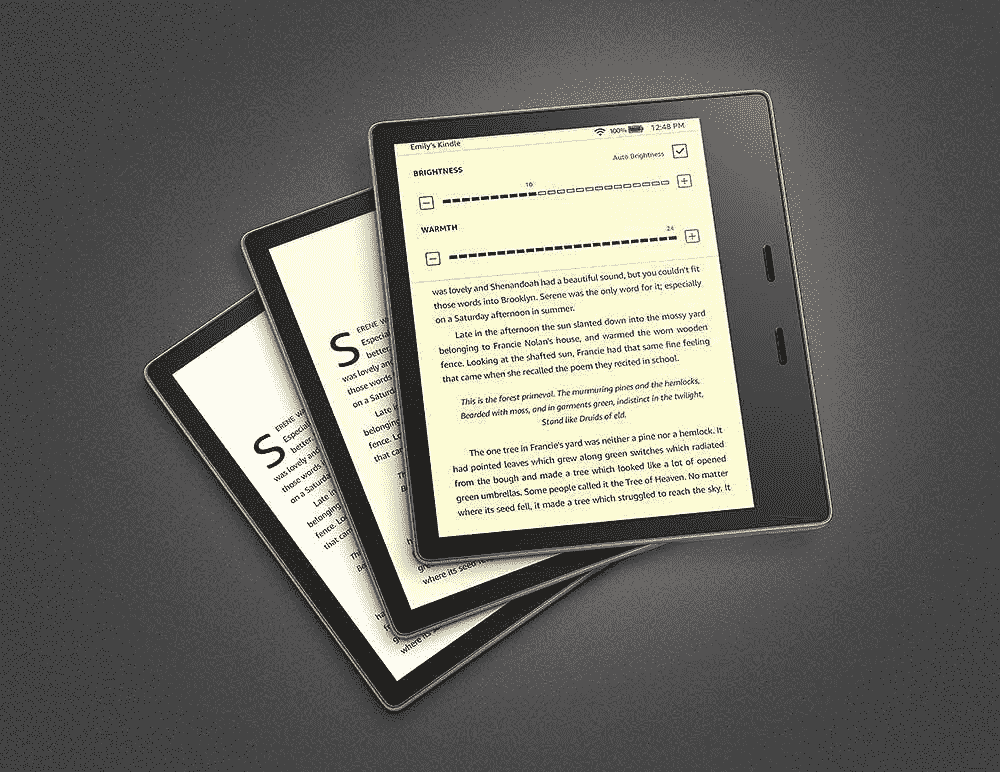

# 你应该买一个 Kindle 吗？买电子阅读器值得吗？

> 原文：<https://www.xda-developers.com/should-you-buy-a-kindle-ereader/>

如果你想在一屋子的读者中展开一场辩论，那么就问问他们是否使用 Kindle。不知何故，Kindle 已经成为一种极端分裂的技术，一方宣称它们是纸质书的终结，另一方则认为它们是一种有用的小工具，是图书馆中受欢迎的新成员。如果你目前对购买 Kindle 犹豫不决，那么希望这篇文章能帮助你决定电子阅读器是否适合你。

## 点燃还是不点燃——这是一个问题

在我们开始讨论支持和反对 Kindle 电子阅读器之前，我们只想提一下，拥有 Kindle 和阅读纸质书没有什么错。你没听错:你可以同时成为 Kindle 和纸质书的爱好者。对许多人来说，Kindle 是他们阅读清单的一部分，而不是纸质书的替代品。说了这么多，让我们来看看什么样的人可以从拥有 Kindle 中受益。

### 谁应该拥有 Kindle？

任何人都可以拥有 Kindle，但某些读者群体可以从投资中获得比其他人更多的好处。这里有一些读者。

1.  那些经常出差并且不想要额外行李重量的人。
2.  那些试图过一种更简约生活方式的人。
3.  那些需要为大学或学院读很多书，不想带着沉重的书到处跑的人。
4.  那些家里没有空间放置实体图书馆的人。
5.  那些在黑暗中或当他们的伴侣睡着时阅读的人。
6.  那些想在浴室里看书的人。
7.  任何想节约纸张的人。

### 谁不该拥有 Kindle？

反之亦然，某些读者群体可能会错过 Kindle 电子阅读器。

1.  那些很少读书的人。
2.  那些喜欢收集古书或购买二手书的人。
3.  那些为了审美而收藏书籍的人。
4.  那些经常阅读充满图表的书籍的人。
5.  那些努力使用技术的人。
6.  那些已经在手机或平板上愉快阅读的人。

* * *

## 哪款 Kindle 适合你？

即使你属于*“谁应该拥有一台 Kindle”*这一类，不可否认 Kindle 是一项投资。根据[你购买的 Kindle 电子阅读器](https://www.xda-developers.com/best-amazon-kindle-ereader/)，你可能会花 89.99 美元买一个基本的 Kindle，一直到 300 美元买一个顶级的 Kindle Oasis。所以真正的问题是，你需要哪一款 Kindle？

### 基本第十代 Kindle

市面上最便宜的 Kindle 电子阅读器是第十代 Kindle。如果你不打算完全转向数字阅读，只希望你的 Kindle 用于旅行或偶尔使用，那么第 10 代 Kindle 是一个不错的选择。

 <picture></picture> 

Amazon Kindle (10th Gen)

基本型号的 Kindle 只有 8GB 存储空间，屏幕是所有 Kindle 电子阅读器中最小的，只有 6 英寸，分辨率最低，为 167 PPI。它不防水，虽然它有一个前置照明屏幕，但它只有 4 个 led，并且没有可调的暖光选项。

**买十代 Kindle 如果:**

*   你想要市场上最实惠的 Kindle 选项。
*   你不打算在浴缸或游泳池中使用它。
*   你不喜欢夜间阅读。
*   你不打算拥有一个巨大的数字图书馆。

 <picture></picture> 

Amazon Kindle (10th Gen)

##### 亚马逊 Kindle(第十代)

Kindle -带有内置前灯-黑色

### Kindle Paperwhite

当谈到购买基本的 Kindle 时，Kindle Paperwhite 是我们建议您开始购买的地方。它比第十代 Kindle 贵不了多少，但它提供的功能更多。

 <picture></picture> 

Amazon Kindle Paperwhite 11th Gen

首先，Kindle Paperwhite 的屏幕略大，为 6.8 英寸，但它的 PPI 几乎是它的两倍。它还有 17 个 LED 灯和可调节的暖光灯，它具有 IPX8 等级的防水功能，并具有更具吸引力的前置设计。

虽然 Kindle Paperwhite 仍然只有 8GB 的存储空间，但它略大的屏幕和更好的分辨率以及[暖光选项](https://www.xda-developers.com/how-to-enable-warm-light-amazon-kindle/)使它成为一个更舒适的阅读设备。

**买个 Kindle Paperwhite 如果:**

*   你想要一个负担得起的防水 Kindle。
*   你喜欢在黑暗中看书。
*   你没有一个巨大的图书馆。
*   你不想要翻页按钮。

 <picture></picture> 

Amazon Kindle Paperwhite 11th Gen

##### 亚马逊 Kindle Paperwhite(第 11 代)

kindle paper white(8gb)-现在配备 6.8 英寸显示屏和可调暖光灯

### Kindle 绿洲

最后，我们来看看 Kindle 电子阅读器的精华 Kindle Oasis。Kindle Oasis 的起价为 249.99 美元，最高可达 300 美元，这不仅是一项投资，也带来了很多好处。

 <picture></picture> 

Kindle Oasis

首先，Oasis 拥有 7 英寸的最大 Kindle 屏幕；它还拥有 300 PPI 和 25 个 led。对于那些喜欢在晚上或户外阅读的人来说，Kindle Oasis 还具有自动调节亮度和完全可调的暖光选项。

但也许 Kindle Oasis 最重要的功能是翻页按钮和自动页面定向，这是其他机型没有的。你可以单手阅读 Kindle Oasis，如果你交换双手，设备会自动旋转你的页面。

Kindle Oasis 也是唯一一款提供免费蜂窝连接选项的 Kindle 电子阅读器，对于那些计划建立大型数字图书馆的人来说，它有 32GB 的选项。

**购买 Kindle Oasis，如果:**

*   你想要顶级的 Kindle。
*   你喜欢用一只手看书。
*   你想要一个防水的 Kindle 设备。
*   你计划建立一个庞大的 Kindle 电子图书馆。
*   你想要最舒适的 Kindle 阅读体验。

 <picture></picture> 

Kindle Oasis

##### 亚马逊 Kindle Oasis

Kindle Oasis 现在带有可调节的暖灯

## 关于购买 Kindle 的最后想法

如果你喜欢读书，那么买个 Kindle 有什么坏处吗？答案是否定的。你可以在智能手机上做 Kindle 做的一切事情，这一点也是事实。因此，虽然购买 Kindle 可能是一项初步投资，但从长远来看，拥有 Kindle 电子阅读器可以让阅读变得更容易、更实惠、更愉快。

你会买哪个 Kindle 电子阅读器？