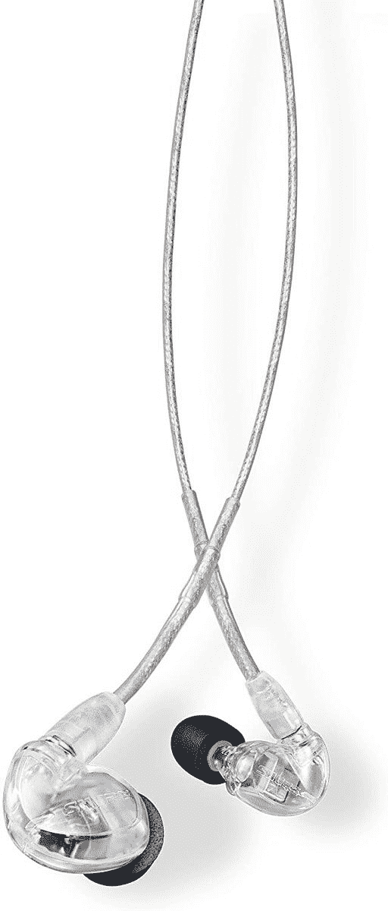
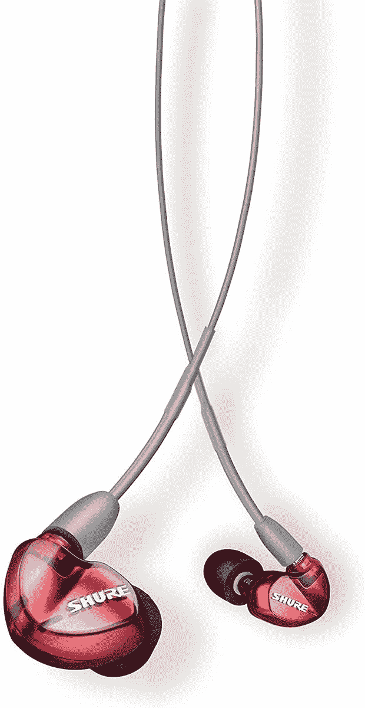
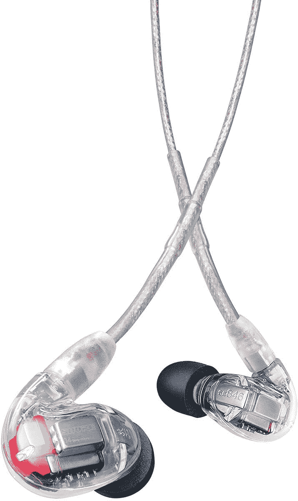

# 舒尔最昂贵但令人惊叹的 iem 现在价格显著降低

> 原文：<https://www.xda-developers.com/shure-iems-cyber-monday-sale/>

# 舒尔最昂贵但令人惊叹的 iem 现在价格显著降低

如果你正在寻找一副出色的 IEM 耳机，舒尔是最佳选择。虽然网络星期一有所帮助，但它们很昂贵。

得益于舒尔的高端产品，舒尔在音频领域是一个非常知名的品牌。虽然他们出售的大多数东西都相当昂贵，但对于黑色星期五和网络星期一，你可以以比平时低得多的价格买到一对他们最昂贵的入耳式耳机。这些是你能买到的[最好的有线耳机](https://www.xda-developers.com/best-wired-earphones-headphones-dac-lossless-audio/)。

舒尔 SE215 耳机从 100 美元降至 80 美元，SE425 从 270 美元降至 200 美元，SE545 从 450 美元降至 360 美元，SE846 从 1124 美元降至“仅”800 美元。

 <picture></picture> 

Shure SE215 PRO

##### 舒尔 SE215 PRO

舒尔 SE215 Pro 是这里最便宜的舒尔耳机，但仍然比许多竞争产品好得多。它们只有很好的声音，没有其他的东西——如果你想要额外的铃铛和哨子，你就得花更多的钱。

 <picture></picture> 

Shure SE425

##### 舒尔 SE425

舒尔 SE425 是一款比 SE215 稍贵的耳机，配有可拆卸线缆。这意味着如果它坏了，你可以很容易地更换它，而不需要支付一套新耳机的全价。

如果这两款耳机对你来说都不够专业，那就做好挥霍的准备吧。SE215 可能超出了大多数消费者的需求，升级到 SE425 也将使您不再支持可拆卸电缆。这意味着，如果它们坏了，你可以更换电缆，继续像往常一样使用它们。

 <picture></picture> 

Shure SE535

##### 舒尔 SE535

舒尔 SE535 比前两款产品更上一层楼，面向主要音频发烧友。不过，这些产品售价 360 美元，相当昂贵。他们还有一根可拆卸的电缆

 <picture></picture> 

Shure SE846

##### 舒尔 SE846

舒尔 SE846 面向最狂热的发烧友。这些价值 800 美元，而且它们拥有你在这个价格上所期望的所有功能。可拆卸线缆、业界领先的声音，甚至包装盒中还有 1/8 英寸的立体声适配器。

以上两款耳机都是为最狂热的音频消费者准备的，价格也不适合胆小的人。尽管如此，如果你想升级你的音频，那么无论价格多少，一副舒尔耳机都不会错。