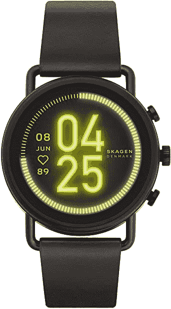

# 智能手表交易:只需 118 美元就能买到带 Wear 操作系统的 Skagen Falster 3

> 原文：<https://www.xda-developers.com/skagen-falster-3-with-wear-os-drops-to-all-time-low-price-of-118/>

# 带 Wear 操作系统的 Skagen Falster 3 降至 118 美元的历史最低价格

光滑时尚的 Skagen Falster 3 配有谷歌的 Wear OS 软件，售价 118 美元，是我们迄今为止见过的最低价格。

Skagen Falster 3 可能是目前设计最好的 Wear OS 智能手表，它有分离的表耳和最小的框架。这款手表的原价为 295 美元，当然不是很值钱，但现在你可以在亚马逊上以 118 美元的价格买到一款，这是有史以来的最低价格。作为参考，过去几个月，这款手表的价格在 295 美元至 200 美元之间波动。

这是 Fossil Group 的众多佩戴 OS 手表之一，基于 Fossil Gen 5 智能手表的硬件。它有 4GB 的内部存储空间，1GB 的内存，5ATM 的防水功能，一个心率传感器，独立的 GPS，以及一个用于呼叫和谷歌助手音频响应的扬声器。它可以与 iPhone 或 Android 设备配对，但如果你有一部 iPhone，你可能最好带一只[苹果手表](https://www.xda-developers.com/tag/apple-watch/)。

 <picture></picture> 

Skagen Falster 3

##### Skagen Falster 3

Skagen Falster 3 降至 118 美元的历史最低价格。不过只有黑色皮质款式打折。

配有黑色皮革表带的黑色款是售价 118 美元的唯一款式，但谢天谢地，Skagen Falster 3 使用了标准的 22 毫米腕带。如果你不喜欢附带的表带，有[数以千计的第三方替代品可用](https://www.amazon.com/s?k=22+mm+band&tag=xda-1tkrgj7-20&ascsubtag=UUxdaUeUpU2171&asc_refurl=https%3A%2F%2Fwww.xda-developers.com%2Fskagen-falster-3-with-wear-os-drops-to-all-time-low-price-of-118%2F&asc_campaign=Short-Term)。

这笔交易的“陷阱”是，尚不清楚 Skagen Falster 3 是否会收到目前正在开发的所有 Wear OS 更新。Wear OS 中的许多新功能都是通过 watch Play 商店推出的，不需要制造商推出完整的系统升级，但至少谷歌正在开发的一些新功能需要标准的操作系统更新。Fossil Group 还没有说它的哪些手表将会升级。