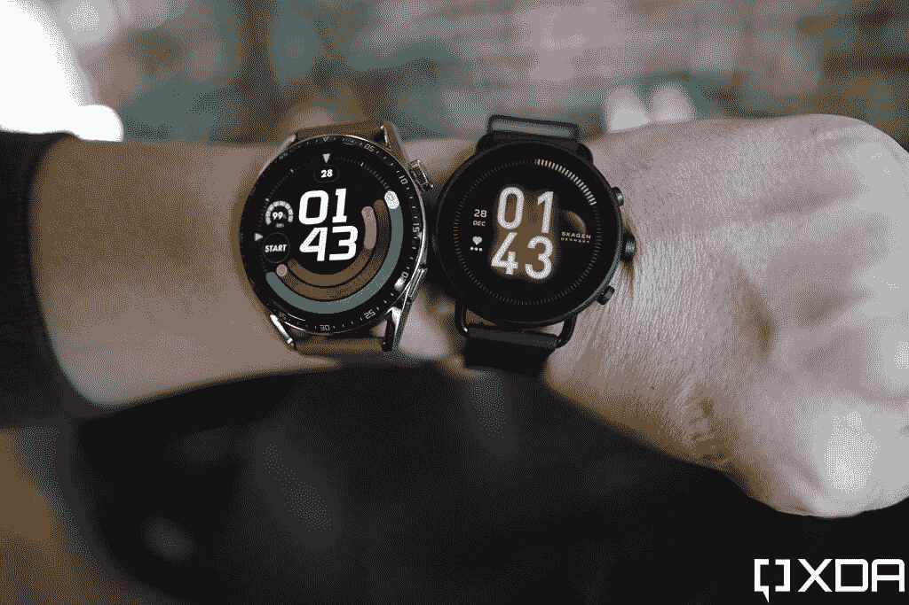
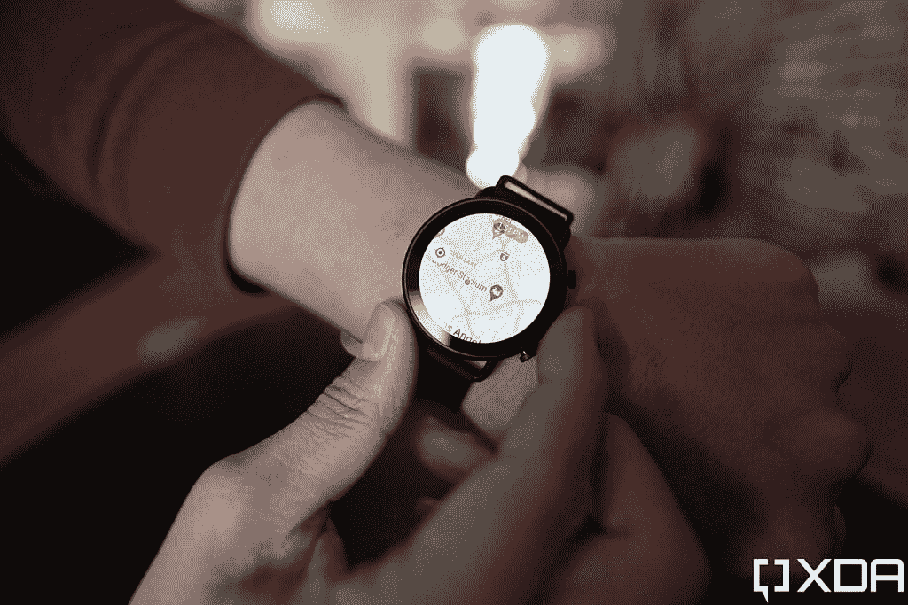
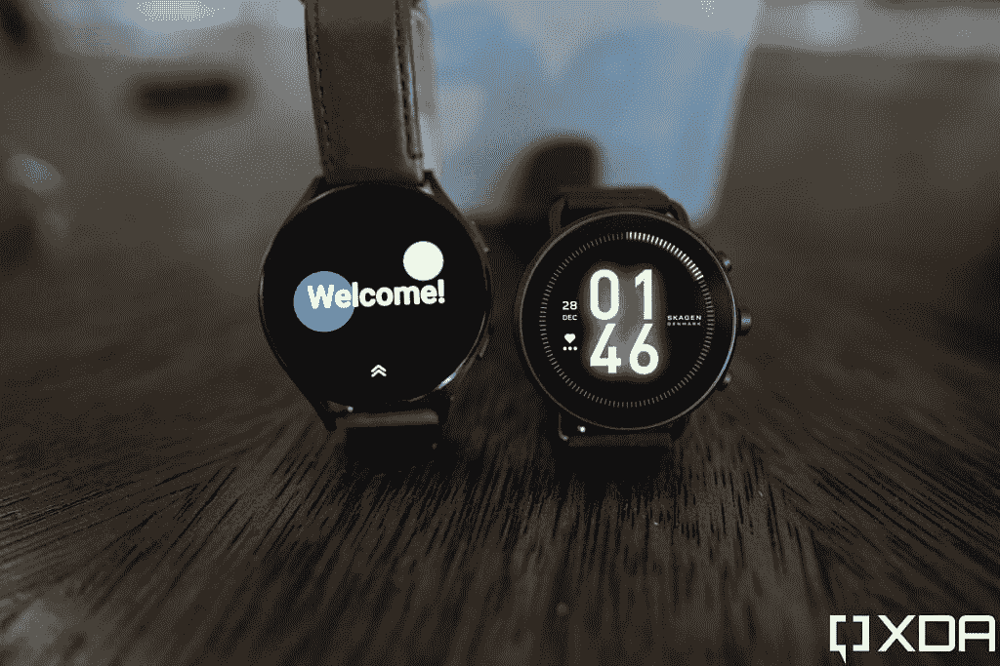
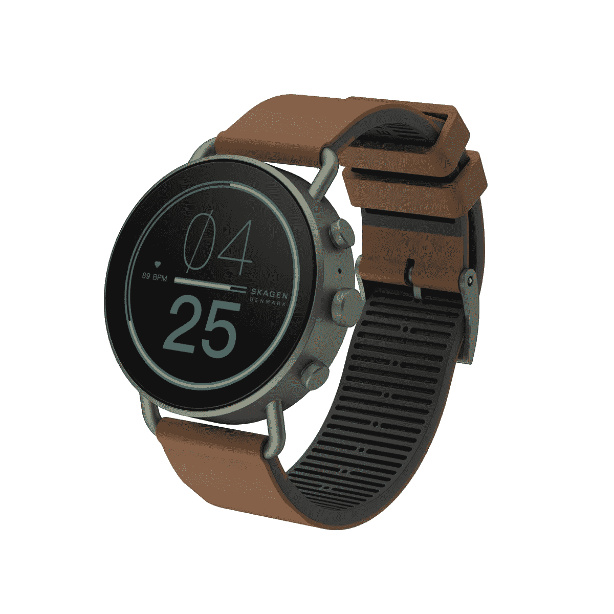

# Skagen Falster Gen 6 是另一款智能手表

> 原文：<https://www.xda-developers.com/skagen-falster-gen-6-review/>

作为一个既使用 iPhone 又使用 Android 手机但更喜欢使用后者的人，多年来我一直很痛苦，迄今为止最好的智能手表(苹果公司生产的)只能与 iPhone 兼容，这意味着每当我使用 Android 手机时，我都知道与之配对的智能手表是二流的。最大的问题是，与苹果的可穿戴设备相比，大多数安卓手表的性能相对较低，功能也乏善可陈——这个问题部分是因为 Wear OS，但主要是因为高通骁龙 Wear 3100 等功能不足的芯片组。

这个问题是，我不想说“解决了”，但至少在 2021 年有所缓解，三星和高通都发布了新的可穿戴 SOC，显著提高了性能。正是后者的芯片——[骁龙 Wear 4100 加](https://www.xda-developers.com/qualcomm-snapdragon-4100-announcement-wear-os-smartwatches/)——为刚刚宣布的 Skagen Falster Gen 6 提供了动力，与 2020 Wear OS 手表相比，速度的提高立即显而易见。

### Skagen Falster Gen 6 规格:单击展开

## Skagen Falster Gen 6:规格

| 

规格

 | 

Skagen Falster Gen 6

 |
| --- | --- |
| **打造** | 

*   不锈钢外壳
*   玻璃面

 |
| **尺寸** | 

*   厚度 11.5 毫米
*   表盘 42 毫米

 |
| **显示** |  |
| **SoC** | 

*   高通骁龙 Wear 4100+

 |
| **闸板&存放** |  |
| **电池&充电** | 

*   电池大小未透露
*   快速充电(30 分钟内 0-80%)

 |
| **音频&麦克风** | 

*   单扬声器
*   单麦克风

 |
| **传感器** | 

*   PPG 心率
*   SpO2
*   加速计
*   陀螺仪
*   指南针
*   高度计
*   体外红外
*   背景光

 |
| **软件** | 佩戴操作系统 |

**关于这次评审:** *Skagen 在发布前向 XDA 提供了手表的评审单位。Skagen 在此次审查中没有任何意见。*

## Skagen Falster Gen 6:设计和硬件

Skagen Falster Gen 6 可能刚刚上市，但它本身并不新。这实际上是两个月大的[化石 Gen 6](https://www.xda-developers.com/fossil-gen-6-launch/) 的更名。它们有完全相同的内部结构，所以你会得到 8GB 的存储空间，1GB 的内存，所有常见的传感器，如加速度计，陀螺仪，高度计等，加上前面提到的骁龙 Wear 4100+。

由于 Skagen 是一个受丹麦启发的品牌，旨在实现“丹麦极简主义”，Falster Gen 6 的机身比 Fossil Gen 6 更小、更光滑，没有凸起的表圈和薄而分离的表耳。在换成 Falster Gen 6 之前，我一直戴着漂亮但笨重的华为手表 GT 3，后者的尺寸小得多，令人耳目一新。

 <picture></picture> 

The Huawei Watch GT 3 (left) and the Skagen Falster Gen 6.

我喜欢手表不锈钢框架上的哑光黑色涂层(它也有银色)，但不太喜欢廉价的橡胶表带。有一个皮革表带的版本，加上你可以使用任何第三方 20 毫米表带，所以这不是一个大问题。

虽然 Falster Gen 6 的 11.5 毫米厚度比 Fossil Gen 6 还要薄，但仍然比 [Apple Watch Series 7](https://www.xda-developers.com/apple-watch-series-7-review/) 或[三星 Galaxy Watch 4 Classic 厚。](https://www.xda-developers.com/samsung-galaxy-watch-4-classic-review/)我还质疑三个物理按钮的必要性(中间的一个是可旋转的)，因为屏幕滑动、点击和单个按钮的组合应该足以导航智能手表 UI。另外，当我把手腕向上弯曲 90 度时，比如当我试图做俯卧撑时，它们会妨碍我。

Falster Gen 6 可以追踪苹果和三星竞争对手的智能手表所能做的一切，除了 EKG

尽管如此，我还是要说，Skagen Falster Gen 6 是一款好看时尚的智能手表，不会妨碍长袖毛衣或夹克。1.28 英寸的 AMOLED 屏幕在真空中看起来很棒，但与华为手表 GT3 相比，它没有那么明亮，颜色也没有那么流行。

表壳左侧有一个扬声器，右侧有一个麦克风。它们都工作得很好——即使在外面有交通噪音的情况下，我也能接电话，而且我和对方都能很好地听到对方的声音。

背面是常见的传感器:Falster Gen 6 可以跟踪苹果和三星竞争对手智能手表的几乎所有功能，除了 EKG(心电图)。否则，血氧水平、走过的步数、爬过的楼梯、心率、GPS 追踪都在这里。

Fossil/Skagen 没有透露电池的大小，但我已经能够一次充电一天半。现在，当我打这篇文章的时候，我的手表已经断电 26 小时了，还有 37%的电量。虽然一天半对我来说没问题，但我必须提到，Fitbit 和华为的竞争对手智能手表可以持续更长时间 Fitbit Sense 和华为 Watch GT 3 一次充电可以持续五到六天。Fossil/Skagen 还声称，这款手表在充电 30 分钟后可以增加 80%的电量，但我无法重现这些速度。在我的测试中，给完全耗尽的 Gen 6 充电半小时只增加了 67%的电池，这与市场数据相差甚远。

对我来说，更大的抱怨是 Falster Gen 6，像 99%的智能手表一样，使用专有充电器，这意味着你需要在旅途中随身携带电缆，如果你丢失了它，你必须再买一个。华为最近的智能手表可以通过任何一个 [Qi 充电器](https://www.xda-developers.com/best-qi-wireless-charger)无线充电。这是智能手表应该走的路。或者至少用 USB-C。

Falster Gen 6 手表的评级为 3ATM，这意味着它可以承受雨水和光线的飞溅，但你不能真的带着它游泳。

## Skagen Falster Gen 6:软件和性能

当谷歌和三星去年在谷歌 I/O 上宣布惊人的合作关系时，Fossil 陷入了困境，这实际上给了三星在 Wear OS 3 上的第一次机会。这意味着 Skagen Falster Gen 6 与 Fossil Gen 6 一样，运行在较旧的 Wear OS 2 上。虽然 Fossil 承诺 Wear OS 3 的更新将在 2022 年的某个时候到来，但我们必须审查这款手表是什么——运行过时的软件。

在很大程度上，我对 Falster Gen 6 的性能没有任何问题。用户界面移动流畅，我喜欢旋转中间的按钮向下滚动。有一些明显的缺点，如低劣的谷歌地图集成。当我用谷歌地图导航并戴着 Galaxy Watch 4 时，我的手腕上会显示即时路线指示。这种情况不会发生在 Skagen Falster Gen 6 上。Wear OS 3 还拥有出色的手表表面复杂功能，并可以独家访问 Wear OS 专用的 YouTube 音乐应用程序。

Skagen Falster Gen 6 有一个关键之处是三星 Galaxy Watch 4 没有的——它有谷歌助手

然而，有一件重要的事情是 Falster Gen 6 做对了，而 Galaxy Watch 4 没有——它有谷歌助手！三星最新的智能手表可能运行 Wear OS 3，但它不是该软件的纯谷歌版本。相反，它充斥着三星的服务，包括明显劣质的 Bixby。

因此，尽管 Falster Gen 6 的 Wear OS 2 速度稍慢，缺乏 Wear OS 3 的一些功能，但它至少可以访问地球上最好、最智能的数字语音助手。

 <picture></picture> 

Google Maps on the Falster Gen 6

Falster Gen 6 可以做得很好的另一个功能是允许我通过语音听写来回复来自各种聊天应用程序的短信。这听起来是一个足够简单的功能，但很少有 Android 智能手表能做到这一点。例如，华为和小米的智能手表只能显示通知，不能实际响应。Fitbit Sense 只能做录音响应。从技术上来说，2021 年之前的任何三星或 Wear OS 手表都可以响应，但语音听写功能非常滞后，几乎毫无用处。直到 2021 年，当三星和高通对芯片进行升级时，一些 Android 可穿戴设备才终于有能力及时处理语音听写。

你也可以用 Falster Gen 6 上的屏幕键盘来回复消息，但 QWERTY 键盘非常局促，经常导致打字错误。这是 Galaxy Watch 4 的另一个优势，因为它提供了一种潦草的文本输入方法(直接从 Apple Watch 复制而来)，比在小键盘上敲击要好得多。

Falster Gen 6 上的健身追踪很好。洛杉矶整个星期都在下雨，所以我不能去跑步，但手表确实准确地跟踪了我的脚步。我还用 Falster Gen 6 以及 Apple Watch Series 7 和 Galaxy Watch 4 尝试了 SpO2 和心率跟踪，所有结果都相似。睡眠追踪工作正常，我认为 Fitbit 的睡眠追踪仍然是同类中最好的，因为它不会因为我翻来覆去几次就被骗以为我已经醒了。

与 Fitbit、苹果、三星甚至小米的类似应用相比，用于跟踪 Wear OS 设备数据的默认健康应用 Google Fit 也有点欠缺。界面很复杂，Google Fit 不会向你展示实际数据，而是习惯向你展示一些任意的积分系统，比如“你下午散步赚了 40 分。”我不在乎分数，只要给我看我实际走了多少步！

遗憾的是，可穿戴应用程序中的手表面部选择非常少，虽然 Facer 等第三方应用程序有更多的选择，但应用程序本身有点垃圾，不断推送通知，大量广告，一些手表面部需要钱，但没有明确标明

## Skagen Falster Gen 6:结论

我真的很享受穿 Skagen Falster Gen 6 的时光。是的，该软件不像 Galaxy Watch 4 那样灵活，电池寿命也不像 Fitbit Sense 或华为 Watch GT 2 那样令人印象深刻。但对我来说，Falster Gen 6 有一点比其他手表更好:它让我可以更少地查看手机。

这是因为我经常使用谷歌助手，一整天都会收到很多聊天消息(Slack、微信、WhatsApp、Telegram、Signal)。带谷歌助手支持的 Skagen Falster Gen 6，以及回复通知的功能性方式符合我的需求。

 <picture></picture> 

Galaxy Watch 4 (left) and Skagen Falster Gen 6.

然而，295 美元的 Falster Gen 6 比 Galaxy Watch 4 贵 50 美元，所以如果你不经常需要谷歌助手(或者如果你对 Bixby 没什么意见)，那么 Galaxy Watch 4 的价格更低，性能更好。

 <picture></picture> 

Skagen Falster Gen 6

##### Skagen Falster Gen 6

Fossil 在其 Skagen 品牌下发布的最新智能手表，这是一款干净、外观简约的 Wear OS 手表，尽管软件过时，但仍然可以很好地完成智能手表的功能。