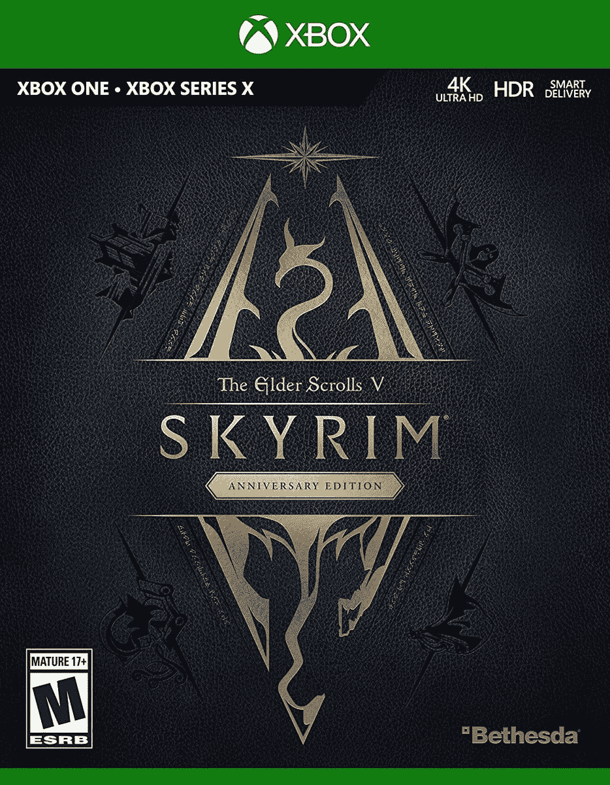
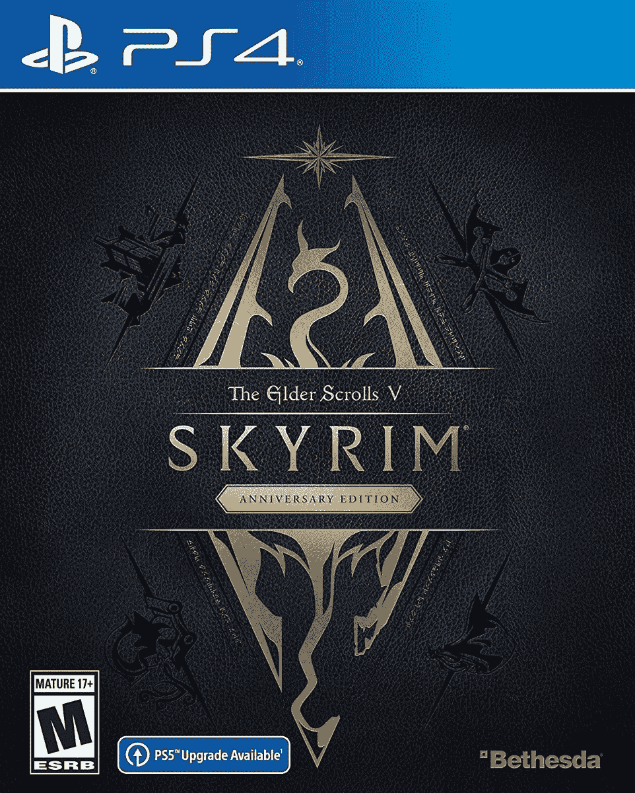

# Skyrim 周年纪念版首次发售，售价 30 美元

> 原文：<https://www.xda-developers.com/skyrim-anniversary-edition-deal-december-2021/>

# Skyrim 周年纪念版首次发售，售价 30 美元

新发布的 Skyrim 周年纪念版的这一交易将 Xbox 和 PlayStation 的价格降至 29.99 美元，打五折。

Skyrim 周年纪念版于上个月发布，作为*上古卷轴 V: Skyrim* 十周年庆典的一部分。这是 *Skyrim* 的又一个重新发布，带有所有官方内容和社区插件，如果你还没有这款游戏，这绝对是最好的选择。现在你可以在游戏机上以 29.99 美元的价格获得 *Skyrim 周年纪念版* *版*，比原价低 50%，并且(看起来)是第一次重大销售。

*Skyrim* 是一款开放世界的动作角色扮演游戏，由 Bethesda 开发，作为长期运行的*上古卷轴*系列的第五个主要入口。你在坦瑞尔的普罗维登斯中扮演“龙族”,竞争任务并漫游世界。主要的故事带你学习如何召唤龙(和龙的力量！)，但是如果你愿意，你也可以忽略它——支线任务基本上是他们自己的游戏。

 <picture></picture> 

Skyrim Anniversary Edition (Xbox One)

##### Skyrim 周年纪念版

该版本游戏适用于 Xbox One 和 Xbox 系列 X/S。

 <picture></picture> 

Skyrim Anniversary Edition (PS4)

##### Skyrim 周年纪念版

这个版本的游戏适用于 PS4 和 PS5 主机。

*周年纪念版*本质上只是 *Skyrim* 的下一代端口，增加了一些额外的社区内容和钓鱼——是的，钓鱼。产品说明上写着，“周年纪念版包括核心游戏、已有和新创造俱乐部内容，加上全部三个官方附加:*道恩加德*、*炉石*和*龙族*”PS4/PS5 和 Xbox One/Series 版本都在销售，价格相同:29.99 美元。

如果你已经在现代游戏机上拥有了 *Skyrim* ，这可能不值得再次购买，但是对于那些不久前还在享受 *Skyrim* 但没有任何更新版本的人来说，这可能是一个很好的购买(或节日礼物)。对于那些根本没有尝试过 *Skyrim* 的人来说，这也可能是一款完美的游戏——尽管这款核心游戏已经超过 10 年了，但它仍然很有趣，尤其是对于那些对开放世界的冒险和幻想元素感兴趣的人来说。花 30 美元，你就有可能获得数百(或数千)小时的乐趣。