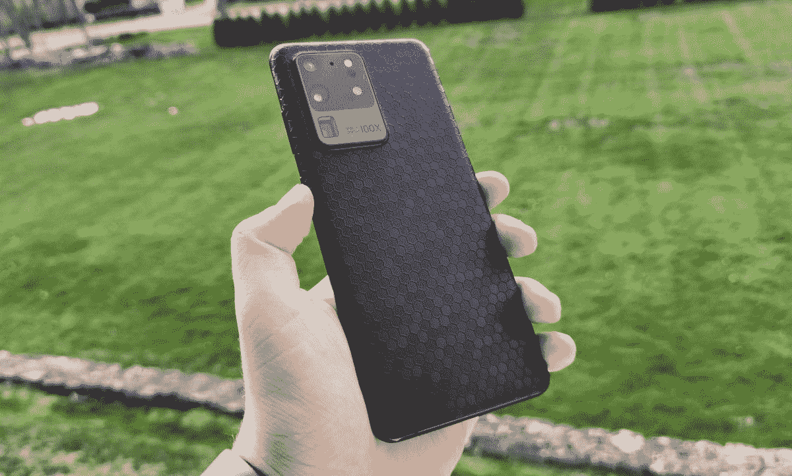
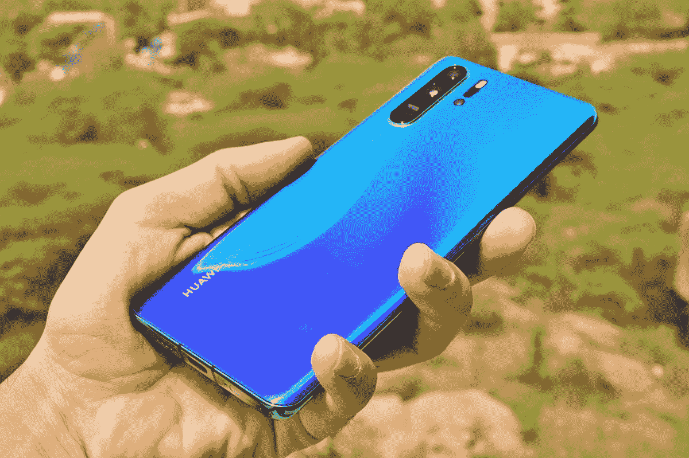
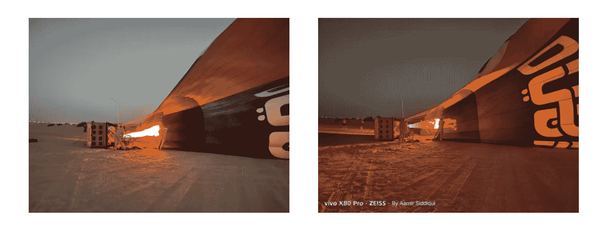

# 当拍摄最好的智能手机照片时，相机硬件仍然很重要

> 原文：<https://www.xda-developers.com/smartphone-camera-hardware-still-matters/>

“计算摄影”在过去几年里一直是智能手机相机的流行语，我越来越多地从科技媒体的同行那里听到，在手机摄影中，相机软件比硬件更重要。

虽然我在这里不是要否定软件在手机摄影中的重要性，甚至不是要争辩软件不如*重要，但我要说明的是，相机硬件在区分真正伟大的相机和仅仅是非常好的相机方面仍然非常重要。*

## 到底是谁开创了这一潮流？

在智能手机时代之前，计算摄影这个词就已经存在了——它指的是以数字方式捕捉图像，而不是使用胶片——但它真正成为热门词汇是在过去五年，大约是在谷歌像素(Google Pixel)开始因其拍照能力而成为头条新闻的时候。使用多堆栈成像(谷歌称之为 HDR+)和实时机器学习等技术，早期的 Pixel 手机能够捕捉到令人瞠目结舌的动态范围的照片，几乎可以在太暗的场景中产生人眼无法看到的光线，并与同类产品相比令人信服的人工散景。

 <picture></picture> 

Google's photo samples showing the Pixel 3's night photography (right) performance against, supposedly, the iPhone Xs (left)

但是，千万不要误以为谷歌在智能手机上发明了计算摄影。根据定义，每一部带相机的智能手机都使用过某种类型的计算摄影，因为它们产生的是数字图像。事实上，早在 2015 年，XDA 当时的总编辑[就已经在思考相机硬件和软件](https://www.xda-developers.com/sunday-debate-great-camera-hardware-or-software/)哪个更重要——当时，争论的焦点是三星的软件方法与 LG 的硬件追求。

当然，谷歌会在一年后将这一讨论推向主流，并率先提出软件*更重要*的观点。几年来，这可能是真的，因为前三个像素被公认为是市场上最好的拍照手机。

## 机器学习的兴起，以及哲学上的差异

尽管最初的几款 Pixel 手机相对于 iphone 和三星 Galaxies of the world 的销量并不多，但对 Pixel 相机的一致好评吸引了所有人的注意，在接下来的几年里，每个品牌的手机发布会都开始花更多时间来宣传其计算摄影能力。回顾 2014 年和 2015 年的 iPhone 6 和 6S 系列发布会，并看到苹果高管菲尔·席勒就这些手机的软件图像处理进行了几秒钟的演讲，这很有趣。到 2016 年和 2017 年，谈论 iPhone 图像处理的时间将大幅增加。在 2019 年的 [iPhone 11 系列发布会](https://youtu.be/-rAeqN-Q7x4)上，席勒花了超过 5 分钟的时间对苹果的“DeepFusion”计算摄影技术进行了诗意的描述。

虽然三星和华为、小米和一加等中国品牌也致力于开发和营销其图像处理软件能力，但这些品牌通常渴望追逐新的硬件，而不是苹果或谷歌。这是纯粹的巧合还是关于东西方文化差异的声明，这是另一天的辩论。但在过去十年的末期，一种叙事出现了:亚洲品牌渴望追逐更多摄像头和更多像素等华而不实的硬件。相比之下，西方品牌(苹果和谷歌)专注于优化软件体验，并使用机器学习来克服光学方面的任何缺点。

这种理念上的分歧可能在 2018 年至 2019 年期间最为明显，当时亚洲手机品牌推出了第三甚至第四后置摄像头，并参与了百万像素军备竞赛，而谷歌在 2018 年的 Pixel 3 中坚持使用一个摄像头。谷歌和苹果也坚持使用 1200 万像素的摄像头，而亚洲手机品牌则使用 4800 万像素、6400 万像素甚至 108 万像素的摄像头。

 <picture></picture> 

The Samsung Galaxy S20 Ultra was one of the first phones to use a 108MP main camera and a Periscope zoom lens. 

## 像素落后了——直到硬件夺回了宝座

但问题是，尽管 Pixel 1 和 2 显然是市场上无可争议的最佳相机，但在 Pixel 3 和 4 于 2018 年底和 2019 年推出时，至少有一场激烈的辩论，即华为 Mate 20 Pro 和 P30 Pro 等亚洲竞争对手是否拥有更好的相机。这是在华为追求更多像素的光学器件、更大的传感器以及推出世界上第一个潜望镜变焦镜头的时候(Oppo 早些时候曾取笑过这项技术，但华为击败了它，实现了大规模生产)。

 <picture></picture> 

The Huawei P30 Pro was in many tech reviewers' opinions the best camera phone at the time of release, based on the strength of its large image sensor and Periscope zoom. 

到 2020 年 Pixel 5 推出时(使用与 Pixel 3 和 Pixel 4 相同的主要相机硬件)，很明显，使用这样过时的相机硬件对谷歌的全能软件来说都是难以克服的。与三星、华为和小米的 2020 年顶级旗舰手机相比，Pixel 5 的照片在弱光下噪音更大，当 Pixel 以 100%的比例偷窥时细节更少，并且无法放大。

这意味着，尽管计算摄影可以创造奇迹，但你最终还是需要相关的相机硬件。谷歌确实会反弹，并在 2021 年凭借 Pixel 6 系列重新夺回相机宝座，其中一些与定制张量 ISP 有关。或许更重要的因素是谷歌大幅升级了其相机硬件。Pixel 6 手机采用了 Vivo 已经使用了很大效果的 50MP GN1 传感器，Pro 型号实现了 Oppo 和华为首创的潜望镜变焦技术。

像谷歌一样，苹果也在过去两年中大幅升级了顶级 iPhones 的摄像头硬件，包括改用 48MP 主摄像头。

## 你可以继续推动硬件的发展，同时不忽视软件

亚洲品牌在推进相机硬件方面没有放松。去年夏天，小米和索尼推出了一款名为 IMX989 的所谓“1 英寸”相机传感器。虽然传感器的尺寸并不精确地测量为 1 英寸(该命名来自旧的相机惯例)，但它仍然比 iPhone 13 Pro 中使用的传感器大 2.7 倍，这是事件发生时可供比较的最新 iPhone。

更大的图像传感器可以获取更多的图像信息，并产生更真实的景深。第一款采用 IMX989 的手机是[小米 12S Ultra](https://www.xda-developers.com/xiaomi-12s-ultra-review/) ，与其他手机相比，它可以产生更清晰的图像，具有更强的动态范围。我有幸测试了 2022 年发布的几乎所有旗舰手机，我根据 1 英寸传感器的强度将 12S Ultra 评为 2022 年最佳拍照手机。我并不是唯一一个有这种想法的人，一些科技评论者，无论是以相机知识闻名的，如[彭博的弗拉德·萨沃夫](https://twitter.com/vladsavov/status/1575853696122224640?s=20&t=w9sZR6iaIPm-HfUxeC6l5Q)，还是以相机为中心的科技媒体，如*千万亿像素*和*数码相机世界*，都称赞它是他们用过的最好的相机手机。

图像传感器并不是唯一重要的硬件。使用一组高级镜头也可以改善图像——这不应该是一个惊喜。例如，Vivo 最近几款旗舰手机使用了蔡司 T 涂层镜头，与其他相机镜头拍摄的照片相比，这种镜头明显减少了镜头眩光或刺眼的高光。

 <picture></picture> 

The same scene, captured by the iPhone 13 Pro (left) and Vivo X80 Pro (right). 

与此同时，三星和半导体公司 Omnivision 都推出了 200 万像素的图像传感器，可以进行疯狂的 16 合 1 像素宁滨。可靠的传言称，即将推出的 [Galaxy S23 Ultra](https://www.xda-developers.com/samsung-galaxy-s23/) 将使用这样一种像素密集的传感器。

然而，说亚洲品牌只是盲目追求规格是不准确的。当然，他们仍在推动硬件边界，但三星、小米、Oppo 和 Vivo 等公司也投资了数百万美元，通过自己定制的 ISP 从事计算摄影工作。例如，200 兆像素的传感器将需要大量的计算摄影才能实时渲染 12.5 兆像素的图像。从 Oppo 的 MariSilicon X 到 Vivo 的 V 芯片，这些品牌不只是为了令人瞠目的规格而追逐硬件，而是专注于构建优秀的软件。

也许再过几年，软件的重要性将再次占据主导地位，因为智能手机机身的物理限制将最终限制相机组件可以变得多大。然而，截至目前，2023 年，相机硬件仍然同样重要。

 <picture></picture> 

Google Pixel 7 Pro

Pixel 7 Pro 是谷歌有史以来最好的手机，拥有精致、优质的设计和谷歌第二代硅芯片，以及一如既往的出色摄像头。

iPhone 14 Pro Max 是苹果最大最好的智能手机，在典型的苹果时尚中，它既是一个发电站，也是一个耐力怪兽。