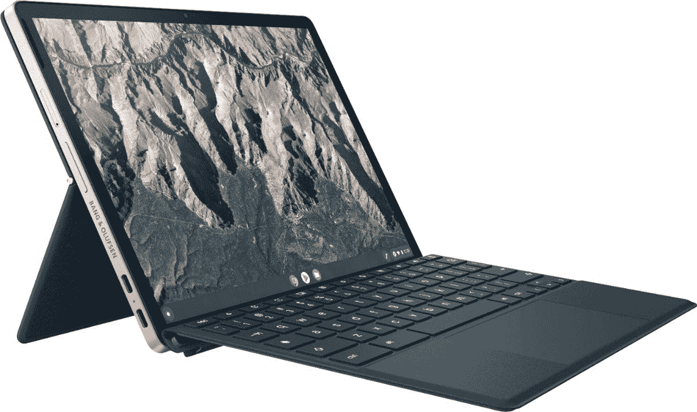

# 采用骁龙技术的惠普 Chromebook x2 11 现已上市

> 原文：<https://www.xda-developers.com/snapdragon-powered-hp-chromebook-x2-11-available/>

惠普在几周前发布了 Chromebook x2 11 [，现在，它可以在百思买](https://www.xda-developers.com/hp-chrome-os-tablet-with-4g-lte-rotating-all-in-one/)买到[。这是该公司最新的可拆卸 Chromebook，这意味着你可以将它用作平板电脑，或者连接键盘底座，像笔记本电脑一样使用它。](https://shop-links.co/1750093367930847612?u1=5ac682d3-d8d6-4a8d-8f85-3eb141143531)

首先，它由高通骁龙 7c 芯片组驱动，这是一种基于 ARM 的处理器。这应该会给你更好的电池效率，平板电脑承诺充电后可持续 11 小时 15 分钟。骁龙 7c 还意味着该平板电脑可以支持 LTE，惠普也表示 Chromebook x2 11 支持 LTE。然而，在产品页面上没有提到它，所以它很可能是一个可选的升级。

惠普 Chromebook x2 配备了 11 英寸 3:2 显示屏，这种宽高比使其无论是在带键盘的横向模式下还是在纵向模式下都非常适合使用。如果你将它用作笔记本电脑，它可以给你更多的空间来阅读文本，但纵向模式下更宽的显示屏也意味着你不太可能遇到奇怪的格式问题。该显示器也非常清晰，分辨率为 2160 x 1440。这款平板电脑还配有可充电的 USI 笔，用于画画和做笔记。这款笔通过磁力附着在平板电脑的侧面，对接时可以充电，所以你永远不用担心电量耗尽。

这款平板电脑的另一个很酷的地方是它可以运行 Android 应用程序，所以你可以放心使用。你不需要在 Android 平板电脑和 Chrome 操作系统之间做出选择，你可以两全其美。

除此之外，还有 8GB 的内存，足以在 Chrome OS 上实现稳定的性能和多任务处理，以及 64GB 的 eMMC 存储。这将是该产品最大的缺点，因为 eMMC 存储没有真正的固态硬盘快。然而，这在 Chromebooks 上并不罕见，尤其是因为你要做的大多数任务都是基于网络的。

平板电脑本身由铝制成，它有两个 USB Type-C 端口，以及内置在电源按钮上的指纹读取器。平板电脑的外壳本身总是银色的，但可拆卸键盘和平板电脑的后壳有两种不同的颜色:暗灰色或夜青色。惠普 Chromebook x2 11 售价 599.99 美元，可以在下面购买。

 <picture></picture> 

HP Chromebook x2 11

##### 惠普 Chromebook x2 11

惠普 Chromebook x2 11 采用高通骁龙 7c 芯片组，以及 8GB 内存。它可以运行 Android 应用程序，并配有 3:2 的高显示屏，非常适合工作。