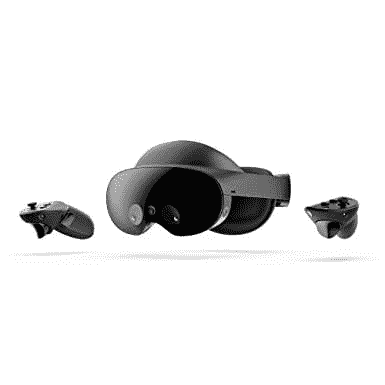

# 新款骁龙 XR2 Plus Gen 1 的性能比上一代产品提高了 30%

> 原文：<https://www.xda-developers.com/snapdragon-xr2-plus-gen-1-launch/>

在今年的 IFA 上，Meta 和高通[宣布了一项多年的合作伙伴关系](https://www.xda-developers.com/meta-and-qualcomm-will-continue-to-partner-for-new-products/)，将由定制虚拟现实平台驱动的新型高端设备推向市场。这种合作关系最终取得了成果，推出了 Meta 的高级虚拟现实耳机 [Meta Quest Pro](https://www.xda-developers.com/meta-quest-pro-launch/) ，它装有高通最新的骁龙 XR2 Plus Gen 1 芯片组。

与 2019 年开始的[骁龙 XR2](https://www.xda-developers.com/qualcomm-snapdragon-xr2-5g-platform-vr-xr-headsets/) 相比，新款骁龙 XR2 Plus Gen 1 带来了显著的性能提升和更好的散热性能。高通声称，与前代产品相比，它提供了 50%的持续功率和 30%的性能提升，这*“允许同时利用更多并发多媒体和感知技术，实现全感官交互，如在元宇宙创建逼真的人类表情，而不牺牲外形。”*

此外，高通表示，新的芯片组引入了更新的图像处理管道，可以实现小于 10 毫秒的延迟，以*“解锁卓越的全色视频直通 MR 体验。”*骁龙 XR2 Plus Gen 1 还支持并发感知技术，如头部、手部和控制器跟踪以及 3D 重建，并支持多达七个摄像头，以提供身临其境的混合现实体验、精确的运动跟踪和自动房间映射。该芯片组支持 60FPS 的 8K 360 度视频、语音输入、上下文感知和 Wi-Fi 6。

Meta Quest Pro 不会是唯一一款采用高通最新芯片组的 VR 耳机。该公司表示，多家原始设备制造商已经承诺将骁龙 XR2 Plus Gen 1 设备商业化，我们预计在未来几个月内将在更多的虚拟现实耳机上看到它。在那之前，如果你想体验骁龙 XR2 Plus Gen 1 的性能和散热改进，你可以通过下面的链接预订 Meta Quest Pro。

 <picture></picture> 

Meta Quest Pro

##### Meta Quest Pro

Meta Quest Pro 是一款面向专业人士的高级 VR 耳机。

目前，高通还没有分享关于骁龙 XR2 加第一代配置的完整细节。我们期待该公司在未来几天透露更多细节，一旦我们有更多的信息，我们将更新这个帖子。

* * *

**来源:** [高通](https://www.qualcomm.com/news/releases/2022/10/qualcomm-powers-the-next-generation-of-mixed-and-virtual-reality)