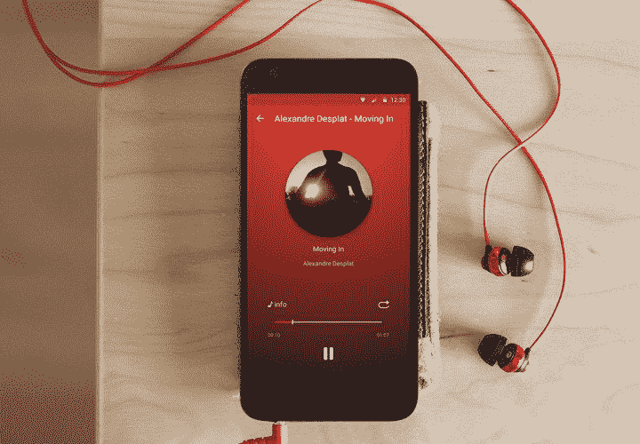

# 快照管 APK

> 原文：<https://www.xda-developers.com/snaptube-apk/>

Snaptube 是一款适用于 Android 的应用程序，它提供了一个从几十个最受欢迎的视频网站下载视频的简单解决方案。该应用程序为您提供了多种不同分辨率的视频下载选项。您还可以下载 MP3 格式的视频，让您轻松地从播放列表中抓取歌曲。以下是 Snaptube 的一些特性。

| 免费下载脸书，Instagram，Twitter | 免费下载高清视频和音乐 | 简单、快速、小巧 |

 <picture></picture> 

Snaptube for Android

由于 Snaptube 在 Google Play 商店中不可用，您可以按照以下说明下载 apk 并将其下载到您的 Android 设备上。

1.  在这里下载最新的 APK 文件[。](https://www.snaptubeapp.com/)
2.  打开文件管理器，导航到保存 APK 的文件夹。
3.  点击要安装的 APK 文件。
4.  按照屏幕上的步骤完成安装。