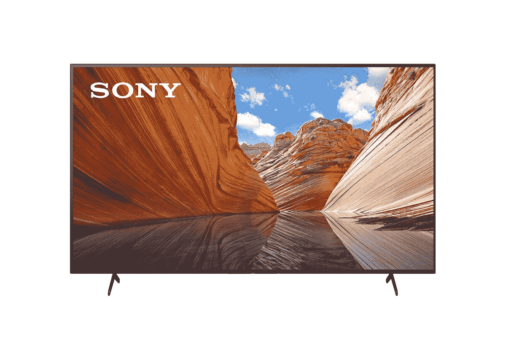
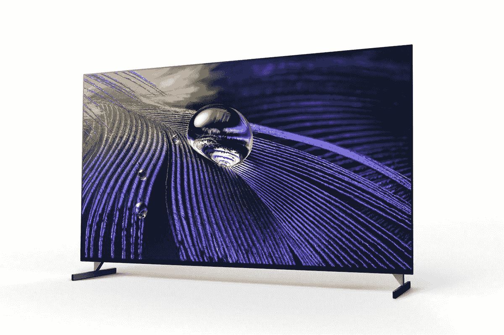

# 带谷歌电视的索尼 Bravia 系列现已在美国上市

> 原文：<https://www.xda-developers.com/sony-bravia-google-tv-goes-on-sale/>

# 索尼 Bravia X80J 和 Bravia XR A90J 是首批可以立即购买的带有谷歌电视的电视

由新的谷歌电视平台支持的索尼新的 Bravia 电视系列现在可以通过百思买在美国购买。

随着去年新款 Chromecast 的推出，谷歌推出了一款名为 [Google TV](https://www.xda-developers.com/new-google-tv-interface-replace-android-tv-ui/) 的特殊版本 Android TV。谷歌强调，这是一个定制的 UX 解决方案，将专注于内容发现和内容聚合，建立在 Android TV 之上，有点像 PatchWall 和 OxygenPlay 的替代品。迄今为止，谷歌电视只适用于[最新的 Chromecast 设备](https://www.xda-developers.com/google-chromecast-with-google-tv-cheap-streaming-tv-stick-50/)，但它最终扩展到了电视机。正如承诺的那样，[索尼新推出的搭载谷歌电视的 Bravia 系列](https://www.xda-developers.com/sony-2021-bravia-google-tv-support-hdmi-2-1-features/)现已在美国上市。

新的索尼 Bravia X80J 英寸型号的起价为 749 美元，75 英寸型号的起价为 1699 美元(via [*9to5Google*](https://9to5google.com/2021/03/30/sony-bravia-google-tv-launch-us/) )。还有高端 Bravia A90J 系列，该系列配有 55 英寸、65 英寸和 83 英寸型号的 OLED 面板。这些产品的起价为 2，999 美元，但索尼尚未确认 83 英寸机型的价格。

Bravia X80J 系列采用 4K 分辨率的标准液晶面板，支持 HDR10、HLG 和杜比视界。它们采用索尼的 4K HDR 处理器 X1 以及 4K X-Reality PRO 清晰度增强。这些电视配备了标准的 60Hz 刷新率，音频方面，有两个 10W 扬声器，支持杜比音频和杜比全景声。

另一方面，Bravia A90J 系列配备了有机发光二极管面板，这意味着您可以期待更好的对比度和更强烈的色彩。除了 X80J 上的所有增强功能，A90J 还支持 120Hz 刷新率和 HDMI 2.1，使其成为索尼 PlayStation 5 或 Xbox 系列 X|S 的完美伴侣。该系列还由于双致动器和超重低音扬声器而提供了更好的音频。

目前只有 Bravia X80J 和 Bravia A90J 下的限量款可通过百思买在线购买。但是我们期待更多的模型很快到达。订单预计最早将于 4 月 1 日开始发货。

 <picture></picture> 

Sony Bravia 65-inch 4K LED TV

##### 索尼 X80J 55 英寸 4K LED 电视

新的索尼 Bravia X80J 系列配有 4K 液晶面板，运行在新的谷歌电视平台上。

 <picture></picture> 

Sony Bravia A90J

##### 索尼 A90J Bravia XR Master 4K OLED 电视

索尼 Bravia X80J 系列采用了 120Hz OLED 面板，并配备了最新的谷歌电视平台。