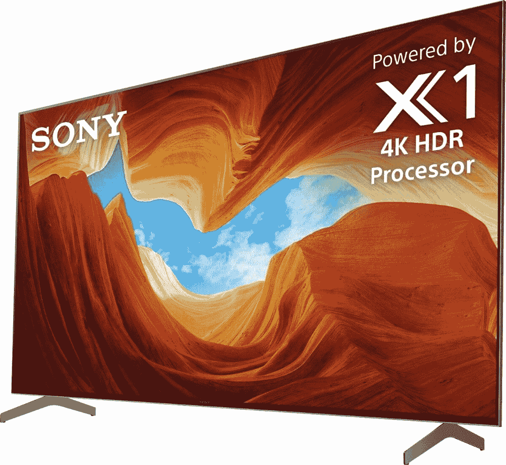

# 索尼优秀的 Bravia X900H 4K120 电视在 Prime Day 获得了超值优惠

> 原文：<https://www.xda-developers.com/sony-bravia-x90h-4k120-tv-deal-prime-day-2021/>

# 索尼优秀的 Bravia X900H 4K120 电视在 Prime Day 获得了超值优惠

索尼 Bravia X90H 是游戏机游戏的最佳选择之一，这要归功于 HDMI 2.1 上的 4K 120Hz，现在它的 85 英寸尺寸正在销售！

索尼生产好的电视，他们也生产优秀的电视。索尼的 X90 系列属于后一类，标志着自己成为该公司液晶电视产品线的首选之一。现在，这款出色的电视的 85 英寸型号降至 1800 美元，使其成为 2021 年黄金日期间你应该考虑购买的[顶级电视](https://www.xda-developers.com/best-tv/)之一。

 <picture></picture> 

Sony Bravia X900H 85 inch 4K Android TV

##### 索尼 X900H Bravia 85 英寸 4K LED 电视

索尼 Bravia X900H 是下一代主机游戏的最佳电视选择之一，这要归功于通过 HDMI 2.1 支持 4K 120Hz，以及你期望从一台好的智能电视中获得的所有功能。

索尼 X90H (/X900H -说真的，索尼，你真的不擅长给你的产品命名)是 4K 120fps 游戏的首选，这要归功于漂亮的高刷新率显示器和 HDMI 2.1 支持。4K 120fps 不是开箱即用的，但索尼已经通过 OTA 更新提供了它，所以请在购买后将电视连接到互联网。Bravia X90 系列进入了我们推荐的[最佳电视](https://www.xda-developers.com/best-tv/)和[最佳安卓电视](https://www.xda-developers.com/best-android-tv/)名单，虽然最新的电视是 2021 年的[Bravia X90J](https://www.xda-developers.com/sony-bravia-x90j-india-launch/)，但 2020 年的 Bravia X90H 也不逊色。Bravia X90H 的 [65 英寸头像在 2020 年黑色星期五](https://www.xda-developers.com/sony-65-bravia-x900h-led-android-tv-black-friday-sale-best-buy/)以 1000 美元的价格出售，这种 85 英寸型号的交易是这款电视所能获得的最好价格。

我最近为自己购买了索尼 Bravia X80H，虽然没有正式的评论，但我认为这款电视是一个非常好的购买决定。Bravia X80H 错过了 HDMI 2.1 和 4K120 游戏，但我仍然对面板和电视包装的其余部分非常满意。Bravia X90H 是我购买和推荐的一个进步，XDA 团队中的一些人也有同样的电视。我们强烈推荐索尼的这款电视。

不过，需要记住的是，索尼不擅长给产品命名。索尼 Bravia X950H 也确实存在，并且该特定阵容没有 4K120。为了避免混淆并确保您获得我们推荐的电视，我建议您通过上面的链接购买电视。