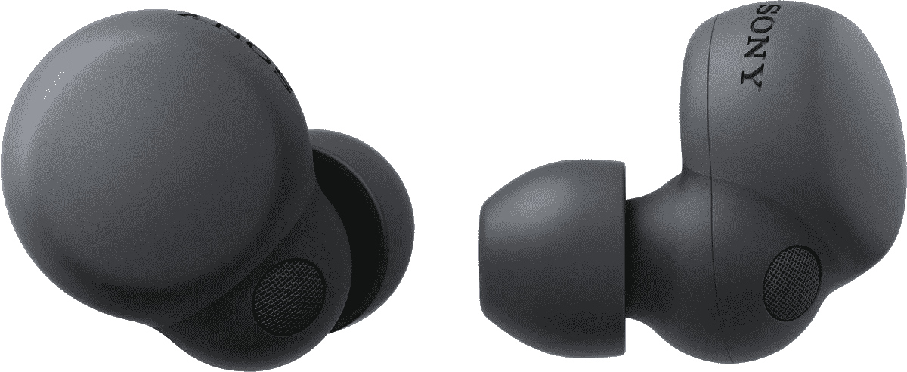

# 索尼推出由回收水瓶材料制成的新型“地球蓝”LinkBuds

> 原文：<https://www.xda-developers.com/sony-debuts-linkbuds-s-earth-blue/>

几个月前，索尼发布了它的 LinkBuds S 耳塞。耳塞提供了独特的设计和出色的功能，并有令人惊叹的三种大地色调。今天，索尼推出了一种新的颜色变体，它是地球蓝，也是由回收的水瓶材料制成的。除了新产品，索尼还在为其 LinkBuds 和 LinkBuds S 添加多点连接支持。

正如你可能从图片中看到的，新的 Earth Blue LinkBuds S 耳塞提供了一个独特的外观，具有乳白色的蓝色，并以淡淡的漩涡突出。这很难描述，但如果必须用一个词来形容，那就是新耳塞看起来像是由大理石制成的。那么 LinkBuds 的耳塞规格如何呢？

耳塞非常轻，重 4.8 克，具有主动降噪(ANC)和透明模式。至于电池寿命，在 ANC 开启的情况下，耳塞一次充电可提供长达 6 小时的收听时间，关闭时可以做得更多。当然，在这种情况下，你会有更多的指控，索尼表示，它将提供总共 20 小时的收听时间。

如果你一直在市场上寻找一套无线耳塞，索尼 LinkBuds S 耳塞可能会适合你。它们的售价为 199.99 美元，现在有四种颜色可供选择:黑色、白色、土蓝和沙漠沙。如果你专门寻找地球蓝型号，你会想前往亚马逊，但如果你想要沙漠沙变种，你需要在百思买拿起它们。如果你不知道该买什么，看看[我们的指南](https://www.xda-developers.com/best-wireless-earbuds/)，找出我们为目前市场上最好的无线耳塞挑选的内容。

 <picture></picture> 

Sony LinkBuds S

##### 索尼 Linkbuds S

索尼 LinkBuds 目前已经降到了最低价格。

* * *

**来源** : [索尼](https://www.sony.com/content/sony/en/en_us/SCA/company-news/press-releases/sony-electronics/2022/sony-electronics-announces-the-new-linkbuds-s-earth-blue-noise-canceling-truly-wireless-headphones-made-from-water-dispenser-bottles-and-new-model-linkbuds-uc-for-microsoft-teams.html)