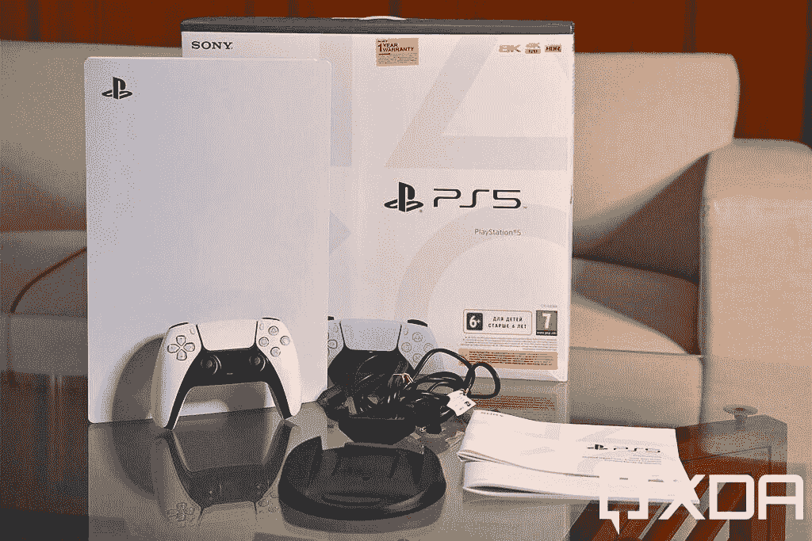
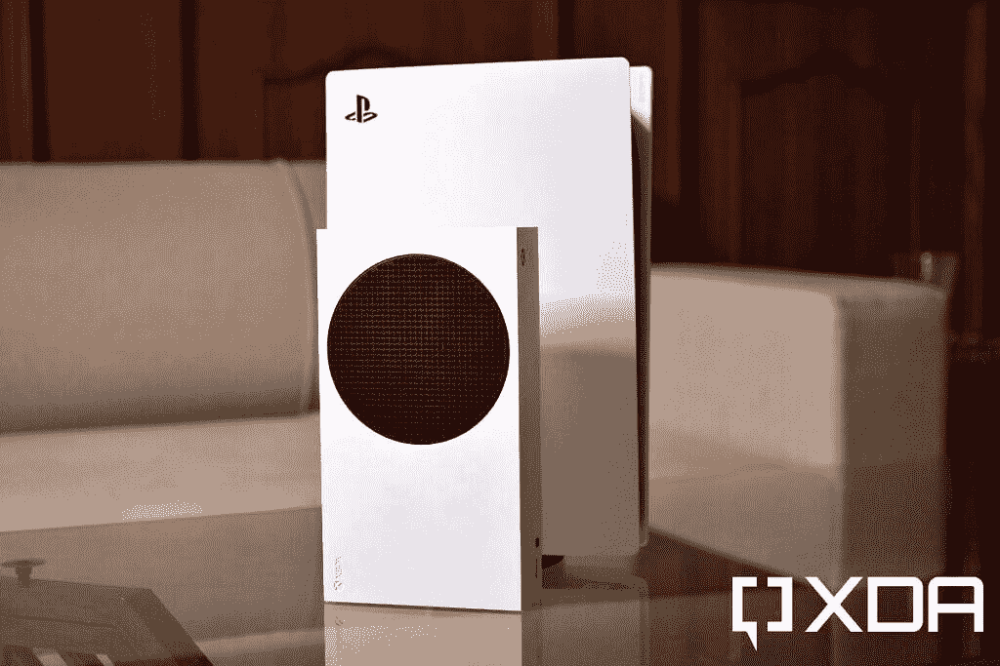
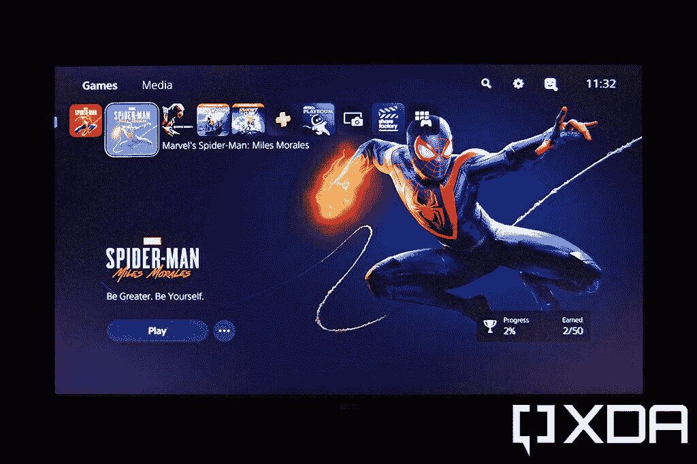
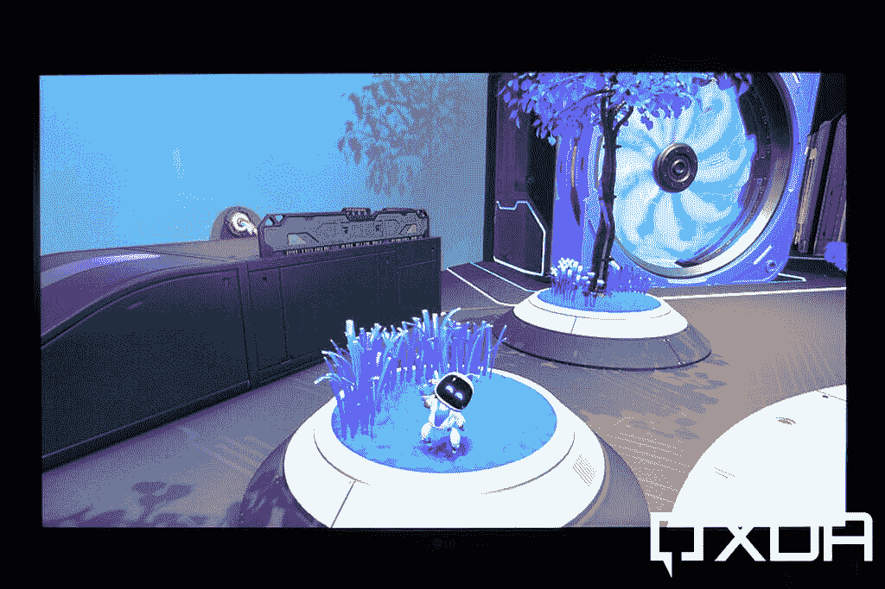
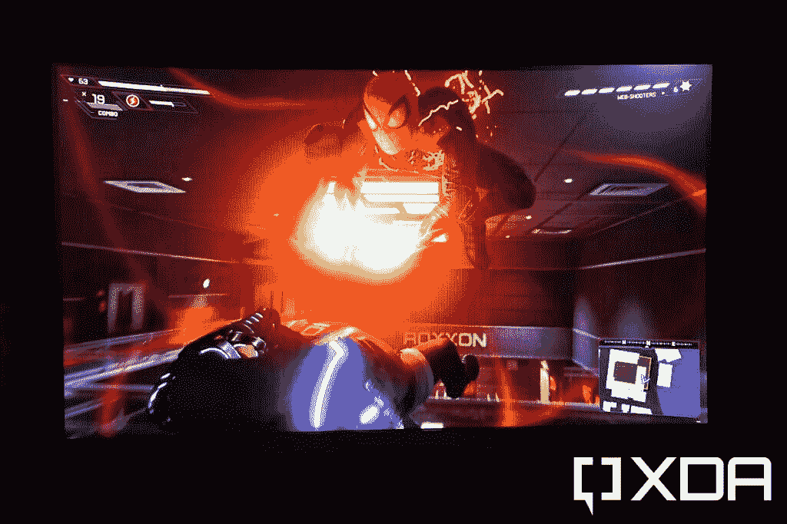
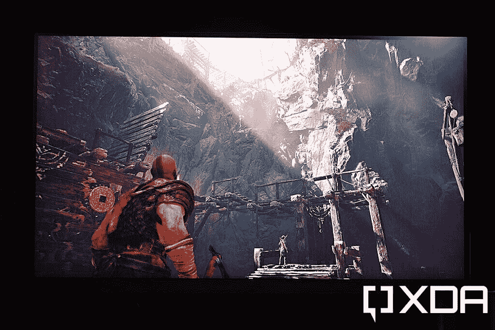

# 索尼 PlayStation 5 开创了游戏机游戏的新时代

> 原文：<https://www.xda-developers.com/sony-playstation-5-first-impressions/>

索尼有史以来最新最棒的游戏主机终于来了。新的索尼 PlayStation 5 采用了 AMD 制造的新 CPU 和 GPU 组合以及快速的内部 SSD，带来了改进的触觉增强的 DualSense 控制器，以及一系列独家游戏产品。就像新的 Xbox Series X 一样，索尼声称你可以在 PS5 上期待流畅的 4K 游戏体验，加载速度更快，光线跟踪的纹理增强，当然，还有 HDR 支持。

话虽如此，对游戏硬件的需求，尤其是对新游戏机的需求，正处于历史最高水平，库存在瞬间消失。PlayStation 5 目前的标准版本零售价为 499 美元，不含光驱的数字版本为 399 美元。自去年 11 月正式上市以来，这款游戏机的销量一直非常有限。所以，如果你设法买到了一个，你应该觉得自己很幸运，如果你没有买到，请参考我们的[补货指南](https://www.xda-developers.com/playstation-5-restocks/)。

值得注意的是，由于全球低库存，PlayStation 5 在印度的[发布被推迟了几个月](https://www.xda-developers.com/sony-playstation-5-finally-launches-india-preorder-availability-price/)直到今天。印度的消费者最终可以通过官方[索尼 PlayStation India 网站](https://www.playstation.com/en-in/ps5/buy-now/)以及其他各种在线和实体零售店购买 PlayStation 5，尽管据推测只有几千台可供使用。索尼印度公司将开始销售普通的 PlayStation 5，其光驱价格为 ₹ 49，990 英镑，而数字版——价格为 ₹ 39，990 英镑——将于本月晚些时候与新附件一起上市。

幸运的是，索尼印度公司给了我们一个单元几天来检查。我们美国团队中的一些(幸运的)成员也已经购买了几个星期的游戏机，他们的想法在下面的一个单独的部分中提到。以下是最热门和最受欢迎的游戏主机。

## 索尼 PlayStation 5:规格

| 

特征

 | 

索尼游戏机 5

 |
| --- | --- |
| 中央处理器 | 

*   3.5GHz 的 AMD 锐龙 Zen 2 八核处理器

 |
| 国家政治保卫局。参见 OGPU | 

*   AMD 公司镭龙 RDNA 2
*   最高 2.23 GHz 的可变频率
*   10.3 万亿次浮点运算

 |
| 记忆 |  |
| 内存储器 | 

*   825GB 固态硬盘
*   667GB 用户可访问

 |
| 存储扩展 |  |
| 外部存储器 | 

*   USB 3.0 外置硬盘/固态硬盘支持

 |
| 光驱 |  |
| 决议的支持 | 

*   120Hz 刷新率下的 4K
*   60Hz 刷新率时高达 8K

 |
| 连通性 | 

*   USB 类型-A (5Gbps)
*   2 个 USB 类型 A (10Gbps)
*   USB 类(10Gbps)
*   以太网
*   HDMI 端口
*   无线网络 6

 |
| 声音的 |  |
| 规模 | 

*   391.16 x 259.08 x 104.14mm 毫米

 |
| 重量 |  |
| 价格 | 

*   $399(数码版)
*   499 美元(光驱版)

 |

***关于这个预告**:索尼印度借给我的 PlayStation 5 做了一个简单的回顾。这篇文章的大部分是在常规使用 5 天后写的。Mishaal 撰写的这一部分是基于他对他在 11 月中旬购买的游戏机长达数周的使用。无论如何，索尼没有投入到这篇文章的内容。*

* * *

## 索尼 PlayStation 5:盒子内容

 <picture></picture> 

Sony PlayStation 5 box contents

PlayStation 5 的零售版本装在一个巨大的盒子里，里面有控制台本身，以及说明手册和保修信息、新的 DualSense 控制器、圆形支架、HDMI 2.1 电缆、USB Type-A 到 Type-C 电缆和电源线。印度的第一批客户也获得了一份证书，作为对他们成为第一批获得新游戏机的人的感谢。

* * *

## 索尼 PlayStation 5:设计

PlayStation 5 绝对是一款大型游戏机

PlayStation 5 绝对是一款大型主机，当我把它从盒子里拿出来时，我对它的巨大尺寸感到惊讶。与我在[体验过的小巧的 Xbox 系列](https://www.xda-developers.com/xbox-series-s-review/)相比，PS5 占据了桌面相当大的空间。即使把它放在一个垂直的位置，也不会有太大的帮助，因为它是一个又高又粗的设备。由此得出的结论是，如果你打算购买 PlayStation 5，你需要确保你的电视/显示器周围或下方有足够的空间。

 <picture></picture> 

Sony PlayStation 5 vs Xbox Series S

PlayStation 5 的支架底部有一个圆形底座。这使您可以将控制台放置在垂直或水平方向。这也有助于保持控制台从表面稍微抬起，从而确保它的底部不会被划伤。支架底部隐藏着一个小螺钉，当控制台处于垂直位置时，可以用它来固定支架。不过，你没有任何工具来拧紧它。

另一方面，如果你想水平放置 PlayStation 5，你需要将夹子旋转到正确的位置，将控制台放在底座上，并通过将它们与 PlayStation 按钮图标图案对齐，使用后面的两个挂钩来固定它。当把 PlayStation 5 放在水平位置时，你需要小心，因为挂钩不会像你希望的那样牢固。有几次，当我从后面拔掉电缆时，控制台就从支架上滑了下来，这确实引起了一些关注。

一旦你克服了它的厚重，你就会开始欣赏索尼在这里所做的一切。PlayStation 5 看起来非常具有未来感，周围都是微妙的曲线。索尼的黑白混合是一种很好的触摸，这也延伸到了新的 DualSense 控制器。外部的模制白色塑料面板具有哑光表面，保护内部深色光滑机身免受灰尘和其他潜在损坏。

实际上，只要在边角上施加一点力，这些面板就很容易脱落。通过这样做，你可以接触到冷却排气风扇和一个微小的插槽，以安装一个额外的基于 M.2 的 SSD，用金属屏蔽和螺钉保护。截至目前，PlayStation 5 不支持任何额外的内部固态硬盘，但索尼表示，他们将通过软件更新来支持。顶部的风扇进气口周围还有一些 led 灯(当处于垂直位置时)，当您启动控制台时，这些 led 灯会亮起蓝色，当控制台打开时会亮起白色，当处于待机模式时会亮起黄色。后面的排气孔相当大。总而言之，你如何定位 PS5 并不重要，因为索尼已经确保这两种定位提供相同的功能。

至于 PS5 上的端口和按钮，前面包括电源和光盘弹出按钮，一个标准的 USB Type-A 端口和一个 USB Type-C 端口。在背面，有一个两针电源端口，两个 USB Type-A 端口，一个 HDMI 2.1 端口和一个以太网端口。就像新的 Xbox 游戏机一样，PlayStation 5 本身没有任何专用的音频端口，所以你只能通过蓝牙音频或 HDMI 端口输出音频。幸运的是，DualSense 控制器底部有一个 3.5 毫米的音频插孔，所以你可以将任何有线耳机插入控制器。

* * *

## 索尼 PlayStation 5:体验和性能

安装 PlayStation 5 相当简单快捷。设置过程大约需要 4-5 分钟才能到达主屏幕。用户界面干净整洁，不会感到格格不入，尤其是如果你来自 PS4 的话。您会看到一排包含您最近所有游戏的水平磁贴、一个显示您所有新闻和更新的“探索”标签、一个“游戏库”标签，以及对 PS 商店和 PS Plus 服务的访问。选择任何一个游戏，都会立即改变游戏对应的背景和声音，这是一种很好的触摸。用户界面非常灵敏，我没有体验到任何类型的滞后或减速。

 <picture></picture> 

Sony PlayStation 5 home screen. Photo: Kunal Khullar

PlayStation 5 预装了 *Astro 的 Playroom* ，这是一款有趣的街机游戏，似乎是为了展示主机的潜力而量身定制的。新的 DualSense 控制器、非常流畅的游戏和视觉体验、出色的音频，以及各种索尼 PlayStation 收藏品的记忆之旅，让您获得绝对惊人的反馈。

 <picture></picture> 

*Astro's Playroom*. Photo: Kunal Khullar

当然，当谈到更严肃的游戏时，我抓住了 PlayStation Plus 游戏服务的 14 天免费试用，在美国从 9.99 美元开始，一个月到每年 59.99 美元。在印度，这项服务在₹499 需要一个月，在₹1,199 需要 6 个月，在₹2,999 需要一年。我相信这是一个很好的价格，因为索尼有一些非常好的独家游戏，以及与 PS4，PS3 和 PS2 游戏的可靠向后兼容性。使用 PS Plus 会员资格，我得到了*战神*、*棘轮和叮当*以及*真人快打 X* ，而索尼则好心地向我提供了*漫威的蜘蛛侠*和新的*蜘蛛侠:迈尔斯·莫拉莱斯*游戏的代码。

内置固态硬盘搭配八核 AMD CPU 带来了急需的提升，以减少加载时间，这一点显而易见。游戏机本身的冷启动时间约为 20 秒，比 2013 年的第一代 PlayStation 4 快了约 10 秒。*战神*大约需要 21-22 秒启动并加载到游戏中，而*蜘蛛侠:迈尔斯·莫拉莱斯*只需要 11 秒就可以从 PlayStation 5 主屏幕加载到纽约的街道上。

 <picture></picture> 

*Marvel's Spider-Man: Miles Morales. *Photo: Kunal Khullar

PlayStation 5 的视觉效果令人印象深刻

PlayStation 5 的视觉效果令人印象深刻，在我测试的几天里，我惊讶于纹理看起来有多平滑。一些针对 PlayStation 5 优化的游戏在视觉设置下提供了一种性能模式，该模式基本上禁用了包括光线跟踪在内的某些纹理功能，并利用升级的 4K 分辨率以每秒 60 帧的速度提供更稳定的帧。这也意味着在光线跟踪打开的情况下，你将无法以每秒 120 帧的速度玩游戏。尽管光线追踪关闭了，但我对视觉效果相当满意，甚至在我的 55 英寸 4K 电视上使用控制台时也是如此。

如果你确实关心真实的照明，那么你可以通过选择保真度模式来打开光线跟踪，该模式将游戏锁定在每秒 30 帧，并提供原生 4K 分辨率。PlayStation 5 也缺乏在多个游戏之间跳转和恢复的能力，而不必从头加载它们，这是新的 Xbox 系列 X|S 所具备的。这并没有真正困扰我，因为游戏加载并不需要很长时间，但我希望索尼通过未来的更新带来这一功能。

索尼在风扇噪音和热量方面做了 A+的工作

至于风扇噪音和热量，索尼在这里做了 A+的工作。你根本听不到冷却风扇的声音，即使在 30-40 分钟的游戏后，游戏机也不会喷出热气。这并不令人惊讶，因为 PlayStation 5 是一个巨大的控制台，允许该公司有足够的空间来安装大型冷却风扇和大型排气孔。我主要是一个电脑游戏玩家，但请相信我，当我说 PlayStation 5 有潜力提供与高端游戏电脑一样好的游戏，而成本只是它的一小部分。

* * *

## 找游戏玩？补上你的 PS4 积压！

由米沙·拉赫曼撰写的章节

当我在 11 月中旬购买我的 PlayStation 5 时，我知道我有点早了。我最兴奋的游戏将于今年晚些时候推出，如*生化危机:村庄*、*地平线禁忌西方*和*战神 2:仙境传说*。我对支付全价购买*蜘蛛侠:迈尔斯·莫拉莱斯*(我听说它很短，我很晚才打折买到它的前传)，所以我选择了*恶魔之魂*翻拍版和*刺客信条:瓦尔哈拉*。前者和我记忆中的一模一样(只在《光荣的 4K》中)，而后者和我想象的一样死记硬背。所以，虽然我很享受与*恶魔之魂*在一起的短暂时光，但我真的没有多少真正的 PS5 游戏可玩。

PlayStation 5 是弥补 PS4 积压的决定性方法

幸运的是，我积压了大量的 PS4 游戏。我很高兴我在等待，因为我觉得 PlayStation 5 是弥补 PlayStation 4 积压的决定性方式。PlayStation 4 的 2013 年末硬件只是在某些游戏中挣扎，特别是那些在游戏机生命周期后期发布的游戏。无论是大规模丢帧、加载缓慢、动态分辨率很少触及 4K、绘制距离差还是缺少 HDR，当你在基本的 PlayStation 4 或 PS4 Pro 上玩某些游戏时，你可能必须处理其中的一些问题。

得益于更好的 CPU、GPU 和存储性能，PlayStation 5 可以按照开发者想要的方式玩 PS4 游戏。以下是我在 PlayStation 5 上玩的 PlayStation 4 游戏的总结，以及我在新硬件上玩这些游戏获得了哪些好处。作为参考，我在 75 英寸 T16 索尼 X900H 上播放了这些内容:

*   *逝去的日子*:这款开放世界生存游戏以持续 60fps 的速度玩，具有动态 4K 分辨率和 HDR。骑着迪肯的摩托车环游世界或与庞大的部落战斗时，速度不会变慢。由于 PlayStation 5 的固态硬盘，快速旅行时的加载时间很短，并且没有纹理弹出问题。
*   *对马幽灵*:这款潜行动作游戏在启用了 HDR 的情况下以一贯的 4K 60fps 进行游戏，并且它的*令人瞠目结舌的华丽*。《GoT》获得了 2020 年游戏大奖的最佳艺术指导，这是基于它在 PlayStation 4 上的表现！我怎么强调这款游戏的视觉效果都不为过，而且在 PlayStation 5 上玩时，你不必在分辨率或帧率上妥协。
*   *13 哨兵:宙斯盾轮缘*:这个....这款半视觉小说半即时战略游戏在去年年底发布时被刑事低估了。虽然这似乎是一个看起来过于简单的游戏，但当涉及到最后几个任务时，实时策略部分可能会加重 PlayStation 4 的硬件负担。然而，PlayStation 5 没有这些问题。

 <picture></picture> 

Didn't have a chance to play *God of War*? A [free update](https://sms.playstation.com/stories/enhanced-performance-experience-playstation-5-god-of-war-2018) will enable dynamic 4K resolution at 60fps on the PlayStation 5! Photo: Kunal Khullar

我也玩过 *Yakuza: Like a Dragon* ，因为我等不及 PS5 正式发布了，但老实说，我现在只想等一个月的 PS5 版本。PS4 版本的游戏在 PS5 上运行速度为 1080p30，现在玩它的唯一好处是加载时间最短。

如果不是因为不得不[送我的 PS5 去维修](https://twitter.com/MishaalRahman/status/1345097913551245313)，我会玩得更多，这让我花了两周时间没有游戏机，但即使是那个挫折也不会让我后悔在 PlayStation 5 发布周期的这么早购买它。我还在发布时购买了 PS2、PS3 和 PS4，到目前为止，PS5 是给我带来最多娱乐的主机，尽管实际上很少为它发布游戏。随着我对未来几个月的预期，我不再后悔。

* * *

## 总结想法

 <picture></picture> 

Photo: Kunal Khullar

我用 PlayStation 5 越多，我就越喜欢这个野兽。当谈到软件体验时，它非常流畅，游戏看起来很有视觉吸引力，总的来说，它是 PlayStation 品牌的一大进步。[我非常喜欢新的 DualSense 控制器](https://www.xda-developers.com/sony-dualsense-wireless-controller-preview/),它具有令人疯狂的直观触觉和响应能力，以及有助于减少加载时间的超快速 SSD。我和可能很多用户唯一担心的是它的巨大尺寸。这是我迄今为止见过的最大的游戏主机，如果你没有合适的空间，存放 PS5 会很棘手。当然，PlayStation 5 的最大问题是供应有限，据我所知，巨大的需求要到 2021 年上半年之后才能满足。

 <picture></picture> 

Sony PlayStation 5

##### 索尼游戏机 5

索尼 PlayStation 5 是索尼成功的游戏主机系列中最新、最棒的一款。凭借全新的 DualSense 控制器，索尼 PlayStation 可以提供高达 4K 120fps 的游戏，为您带来完美的游戏体验。