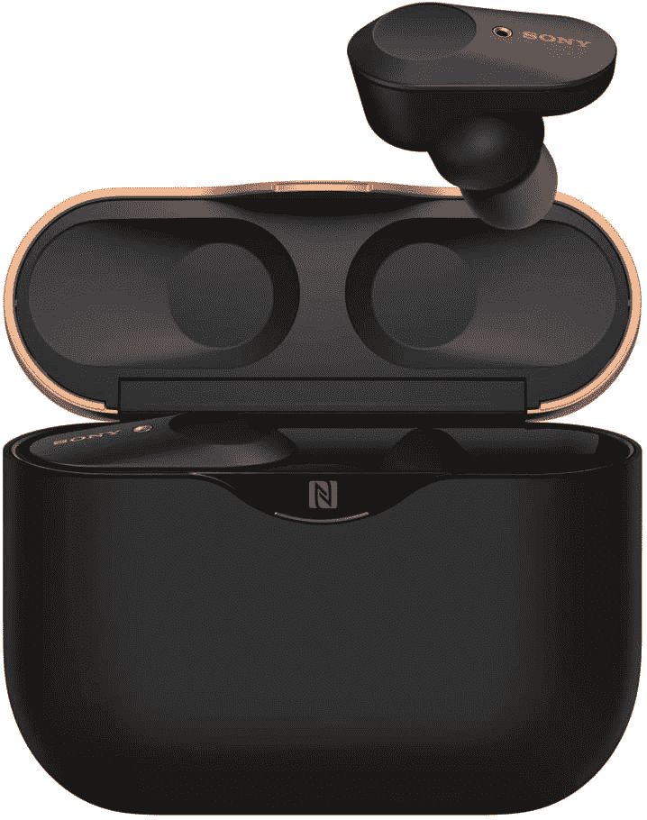

# 在英国只需 105 英镑就能买到一副索尼 WF-1000XM3 耳机

> 原文：<https://www.xda-developers.com/sony-wf-1000xm3-105-uk/>

# 在英国只需 105 英镑就能买到一副索尼 WF-1000XM3 耳机

现在，你可以在英国花 105 英镑买到一副索尼 WF-1000XM3 耳机，这是他们在亚马逊上的最低价格。看看吧！

你想买一副新耳机吗？索尼的 WF-1000XM3 耳机是你能买到的最好的耳机之一，尽管它们通常都很贵。他们现在在亚马逊英国站跌到了 105.03 英镑，这是他们迄今为止的最低价。老实说，当谈到真正的无线耳塞时，并不缺乏选择，我们已经在 *XDA* 这里回顾了许多。每个人都听说过苹果的 AirPods，这可能是人们想到无线耳塞时首先想到的东西。然而，索尼被广泛认为是制造音频产品的最佳品牌之一。

 <picture></picture> 

Sony WF-1000XM3

##### 索尼 WF-1000XM3

索尼的 WF-1000XM3 仍然是你今天能买到的最好的真正的无线耳塞之一，而且它们现在的价格比它们的继任者低得多。

索尼在 2019 年年中推出了 WF-1000XM3，为真正的无线耳塞带来了索尼标志性的高端音频体验。WF-1000XM3 拥有一流的降噪功能和一流的音质，并得到了许多索尼专有技术的支持，因此很容易向任何人推荐，尽管不可否认它们通常都很贵。鉴于这是他们在亚马逊上的最低价格，与一些竞争对手相比，这让他们更容易冒险。毕竟，人们推崇索尼的耳机是有原因的。

其他功能包括一次充电长达 8 小时的电池寿命，内置 Alexa 支持和蓝牙 5.0 支持。它们也是完美的锻炼和旅行伴侣。很明显，这不是最新最棒的耳机，但它们的价格也不到其继任者的一半。这些[最近在美国上市](https://www.xda-developers.com/refurbished-sony-wf-1000xm3-earphones-65/)，一副经过认证的翻新耳机售价 65 美元，现在也有一些库存。