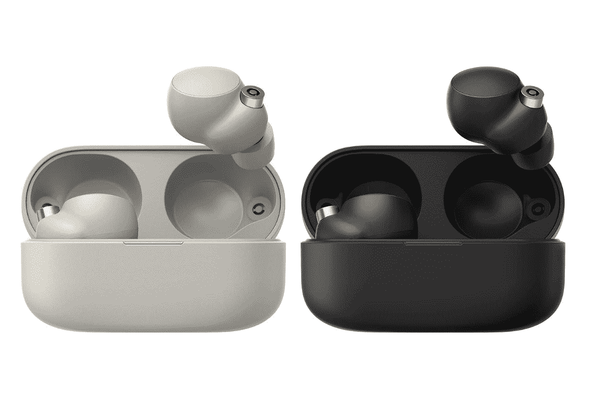

# 索尼 WF-1000XM4 耳塞在亚马逊的 Prime 早期访问销售期间降价 30 美元

> 原文：<https://www.xda-developers.com/sony-wf-1000xm4-prime-early-access-sale/>

# 索尼 WF-1000XM4 耳塞在亚马逊的 Prime 早期访问销售期间降价 30 美元

在亚马逊的 Prime Early Access 活动期间，你可以买到索尼的 WF-1000XM4 耳塞，价格便宜约 30 美元。

有时候，你不需要一套像索尼 WH-1000XM5s 那样的大型耳挂式耳机，你只需要一副小巧而功能强大的耳塞。虽然有很多不同的选择，但索尼 WF-1000XM4 就是这样一款完美平衡的耳塞，提供出色的音质和令人惊叹的主动降噪(ANC)功能。虽然按正常价格这是一笔相当大的投资，但亚马逊在这里提供了一点帮助，比零售价低了 30 多美元。

索尼 WF-1000XM4 是一套漂亮的耳塞，设计独特，有黑色和银色两种色调。尽管尺寸很小，但 WF-1000XM4 凭借索尼专有的集成处理器 V1，提供了出色的声音和 ANC 功能。由于耳机内置了四个麦克风，耳塞还可以在通话过程中提供清晰的音频。此外，耳塞的 IPX4 防水性能使其成为慢跑的完美伴侣。至于电池寿命，一次充电大约可以使用 8 个小时，而外壳可以再使用 16 个小时。值得庆幸的是，如果你发现你的 WF-1000 xm4 没电了，你可以随时快速充电五分钟，以获得 60 分钟的使用时间。

索尼 WF-1000XM4 耳塞是便携式聆听体验的绝佳选择。如前所述，耳塞有两种颜色，黑色和银色，可以在百思买和亚马逊买到。目前，亚马逊的售价略低，为 248 美元。与此同时，百思买将其定价为 249.99 美元。您可以在下面的方框中找到链接的产品，但如果您没有看到该产品的库存，这意味着零售商已经售罄。如果你看到不同的价格，这意味着促销活动结束了，下次你得快一点。

 <picture></picture> 

Sony WF-1000XM4

##### 索尼 WF-1000XM4

虽然很小，索尼 WF-1000XM4s 包相当具有强大的音频和出色的 ANC。