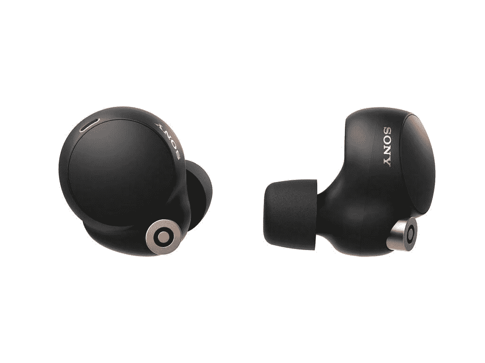

# 索尼的 WF-1000XM4 是带 ANC 和更多功能的无线耳塞

> 原文：<https://www.xda-developers.com/sony-wf-1000xm4-wireless-earbuds/>

索尼推出了 WF-1000XM4，这是该公司长期无线耳塞系列中的最新产品。这些耳塞是近两年前发布的 WF-1000XM3 的直接继任者。这些耳塞被广泛认为是普通人可以购买的最佳音频配件之一，索尼现在推出了一款产品，提供更好的主动降噪功能，并继承了高级 [WH-1000XM4](https://www.xda-developers.com/sony-wh-1000xm4-headphones-multi-device-connection-dsee-extreme/) 耳挂耳机的许多功能。

WF-1000XM4 内置了索尼最新的 V1 处理器。这个处理器，加上两个耳塞两侧的一对麦克风，负责高级噪音消除功能。为了改善语音通话，索尼表示，麦克风支持波束形成技术，耳塞有一个骨传导传感器，V1 芯片能够自动抑制风噪声。另一方面，当你想听周围的声音或与附近的人交谈时，你可以使用环境声音模式(“快速注意”模式)和/或说话聊天。前者使用麦克风来放大环境音频，以抵消耳塞的被动噪声消除，而后者则在 WF-1000XM4 检测到您的语音时禁用 ANC。

 <picture></picture> 

Sony Electronics' new WF-1000XM4 headphones

当然，无线耳塞最常见的用途是听音乐，所以索尼也升级了 WF-1000XM4，拥有更好的音频播放能力。无线耳塞具有新的 6mm 驱动单元，磁体体积增加了 20%，具有高合规性振膜，通过了高分辨率音频认证，支持索尼的 LDAC 编解码器以获得更高质量的音频流(高达 990kbps)，支持索尼的 DSEE 极限，并支持索尼的 360°现实音频技术。索尼解释说，DSEE 极限是“使用人工智能技术以高精度再现压缩过程中丢失的原始声源的频率响应。”360 Reality Audio 是索尼设计的一种音频格式，用于再现空间音频效果。

当连接到 Android 或 iOS 设备时，用户可以通过下载索尼耳机连接应用程序来设置基于位置的配置文件(“自适应声音控制”)。此外，当用户的手机连接到 WF-1000XM4 时，他们可以与谷歌助理或亚马逊 Alexa 等语音助理交谈。

尽管支持所有这些高端功能，索尼仍然设法使这些无线耳塞具有很长的电池寿命。索尼表示，在启用 ANC 的情况下，WF-1000XM4 一次充电可持续 8 小时，在没有 ANC 的情况下可持续 12 小时。当与外壳结合使用时，您将获得额外的 16(带 ANC)或 24(不带 ANC)小时电池续航时间备份，这意味着您将获得 24-36 小时的总使用时间，具体取决于您打开 ANC 的频率。虽然电池寿命有所提高，但新的无线耳塞实际上比上一代小了 10%，外壳也缩小了 40%。

如今的无线耳塞通常支持某种形式的快速充电或无线充电，但往往不能同时支持两者。索尼的 WF-1000XM4 两者都支持。据索尼称，当你需要给这些无线耳机充电时，充电 5 分钟可以播放 60 分钟。您可以通过 USB-C 连接器或将其放在 Qi 无线充电板上为外壳充电。

许多低端无线耳塞缺少的一个功能是防水，或者至少是官方的 IP 等级。索尼 WF-1000XM4 的防护等级为 IPX4，可防止来自各个方向的轻微飞溅。

新闻稿中提到的其他功能包括低延迟收听、快速配对和快速配对支持、耳机连接应用程序中的耳塞尖测量工具以及使用接近传感器的即时播放/暂停支持。

WF-1000XM4 在美国的售价为 279 美元，从今天开始在索尼网站、亚马逊、百思买和其他零售商处提供黑色和银色。

### 索尼 WF-1000XM4

WF-1000XM4 是真正的优质无线耳塞，采用了索尼的高端音频技术。

**Affiliate Links**

Amazon

[View at Amazon](https://www.amazon.com/dp/B094C4VDJZ?tag=xda-2i3bu39-20&ascsubtag=UUxdaUeUpU2898&asc_refurl=https%3A%2F%2Fwww.xda-developers.com%2Fsony-wf-1000xm4-wireless-earbuds%2F&asc_campaign=Short-Term)