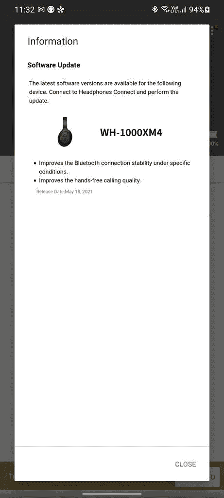

# 索尼 WH-1000XM4 更新提高了通话质量和蓝牙稳定性

> 原文：<https://www.xda-developers.com/sony-wh-1000xm4-update-bluetooth-call-quality/>

# 索尼 WH-1000XM4 的更新提高了通话质量和蓝牙连接的稳定性

索尼 WH-1000XM4 蓝牙 ANC 耳机的最新更新改善了通话的音频质量，使蓝牙连接更加稳定。

索尼是消费音频领域的领先品牌之一。该公司的 [WH-1000XM4](https://www.xda-developers.com/sony-wh-1000xm4-headphones-multi-device-connection-dsee-extreme/) 是最受欢迎的蓝牙主动降噪(ANC)耳机之一，就像它的前身索尼 WH-1000XM3 一样。除了一流的音质和最有效的主动噪音消除能力之一，索尼 WH-1000XM4 还带有佩戴检测，支持多种设备，在您说话时自动暂停音乐，以及恢复压缩中丢失的音频信号的机制。索尼现在已经推出了耳机的新更新，改善了通话质量和蓝牙稳定性。

固件版本 2.4.5 正在向索尼 WH-1000XM4 耳机(h/t: [Reddit 用户 u/hsethi2709](https://www.reddit.com/r/sony/comments/nf1yfv/sony_xm4_250_update_is_here/) )推出，可以通过索尼的耳机连接应用安装。根据应用程序中的变更日志，更新“提高了特定条件下的蓝牙连接稳定性”和“提高了免提通话质量。”值得注意的是，尽管它内置了五个麦克风来提供清晰的音频输入，但用户在通话或使用耳机录制音频时抱怨过音频断断续续。希望，这是固定的更新。

 <picture></picture> 

Screenshot by XDA/Aamir Siddiqui

虽然索尼 WH-1000XM4 是去年推出的，但这对设备仍然是广大用户最受欢迎的选择之一。这款耳机售价 350 美元，你经常可以在包括亚马逊在内的主要卖家那里找到很划算的价格。现在，黑色款已经降到了 199 美元，如果你一直想买的话，这给了你更多的理由。除了黑色和蓝色的变体，你还可以挑选上个月为纪念索尼 75 周年而推出的[限量版静音白色 varian](https://www.xda-developers.com/sony-wh-1000xm4-limited-edition-silent-white/) t。该型号将仅在 2021 年 5 月至 8 月期间销售。

 <picture></picture> 

Sony WH-1000XM4

##### 索尼 WH-1000XM4

这些是目前市面上最好的降噪耳机，音质也非常好。

索尼 WH-1000XM4 配备了 QN1 高清降噪处理器，支持双噪音传感器技术，每秒钟可感应环境噪音高达 700 次。改进的 SoC 还可以根据音乐或音频回放实时调整噪声消除模式。此外，你可以选择免提 Alexa 或谷歌助理。