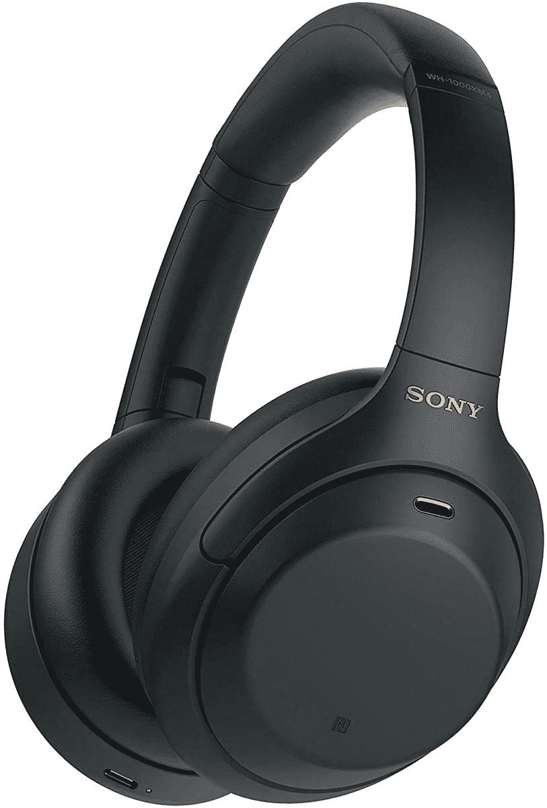

# 索尼神奇的 WH-1000XM4 和 WF-1000XM4 在黄金日获得大折扣

> 原文：<https://www.xda-developers.com/sony-wh-1000xm4-wf-1000xm4-prime-day-deal/>

如果你一直在寻找升级你的无线音频体验，这个关于索尼高端音频产品的[亚马逊 Prime Day](https://www.xda-developers.com/amazon-prime-day/) 交易就是为你准备的。索尼在 Prime Day 推出的 WH-1000XM4 耳机降价 121 美元，WF-1000XM4 耳塞降价 80 美元。撇开令人困惑的名字不谈，这些是你现在能买到的最好的蓝牙音频产品，尤其是在这个价格上。

索尼 WH-1000XM4 是一款顶级无线耳挂式耳机，采用双噪音传感器技术，具有出色的音质和主动噪音消除功能。耳机使用多个麦克风来检测和过滤背景噪音，以便您可以专注于听音乐，索尼的内部 QN1 芯片有助于消除上述噪音。

您可以获得 30 小时的电池续航时间，足以让您度过不想被背景噪音打扰的长途飞行和旅行。此外，通过快速充电支持，10 分钟充电可以使用 5 小时。耳机还内置了触摸控制功能，这样您就不必每次都伸手拿手机了。佩戴检测功能还可以在您戴上或摘下耳机时自动播放或暂停音乐。

现在，你可以在这些耳机上节省 121 美元，这使它们的价格更容易接受，从通常的 349.99 美元降到 228 美元。这是一个巨大的降幅——甚至比我们去年看到的黑色星期五还要大——这使得这些建议比以往任何时候都更容易。是的，索尼有更新的 WH-1000XM5 型号，稍微好一点，但有了这笔交易，你几乎可以用一双那样的价格买两双这样的。你仍然可以听到美妙的声音。

 <picture></picture> 

Sony WH-1000XM4 ($121 off)

##### 索尼 WH-1000XM4

索尼 WH-1000XM4 是高端蓝牙耳机，外观精美，音质出色，具有 ANC。228 美元，非常划算。

如果你不喜欢耳挂式耳机，而喜欢耳塞，还有 WF-1000XM4。这些是索尼最新的旗舰耳塞，它们将该公司的音频专业知识融入到一个更小的包装中。索尼集成处理器 V1(上面提到的 QN1 的增强版本)和多个麦克风用于拾音，仍然可以有效消除噪音。它们还具有出色的音频质量，由 6 毫米驱动器和 LDAC 编解码器支持驱动。

索尼 WF-1000XM4 耳塞一次充电可持续 8 小时，充电外壳可再存储 16 小时，此外，外壳还支持快速充电，因此你可以从 5 分钟的充电中获得一个小时的收听时间。也支持无线充电(虽然不会那么快)。就像耳机一样，触摸控制也内置在耳塞中，因此您可以轻松播放和暂停音乐。

耳塞降价 80 美元，这使得它们的价格低于 200 美元(具体来说是 198 美元)，这让它们更具吸引力。作为参考，黑色星期五的价格是 248 美元，所以即使与此相比，这也是一个很大的降幅。

 <picture></picture> 

Sony WF-1000XM4

##### 索尼 WF-1000XM4

对于真正的无线耳塞的粉丝来说，索尼 WF-1000XM4 是最好的选择之一，具有出色的音质和 ANC，加上看起来很棒的独特设计。它们降到了 198 美元，对于你所得到的东西来说，这是一个非常好的价格。

无论你是耳挂式耳机还是耳塞的粉丝，索尼 WH-1000XM4 和 WF-1000XM4 都非常棒，这些黄金时段的优惠让高质量的音频更容易获得。