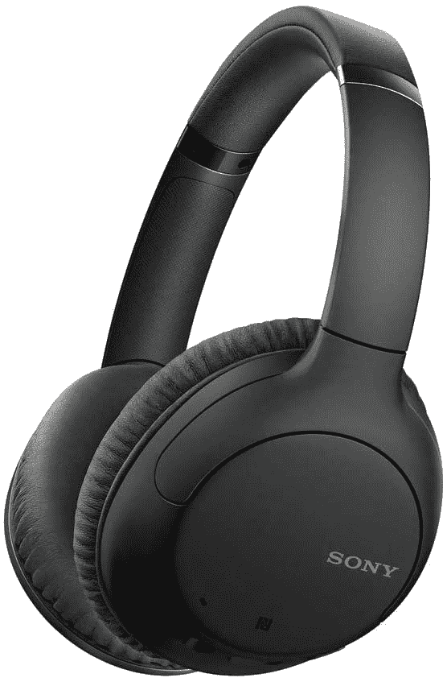

# 索尼 WH-CH710N 带 ANC 的耳机现在仅售 78 美元

> 原文：<https://www.xda-developers.com/sony-wh-ch710n-headphones-deal/>

我们离黑色星期五越来越近了，尽管这一天还有几周的时间，许多零售商已经开始了他们的第一波销售。降噪耳机一如既往地受欢迎，[索尼的 WH-1000XM4 耳机目前打折到 248 美元](https://www.xda-developers.com/sony-wh-1000xm4-headphones-return-to-lowest-ever-price-of-248-102-off/)，这是他们迄今为止的最低价。花在耳机上的钱仍然很多，但现在索尼的预算 ANC 耳机也在销售，价格为 78 美元。

索尼 WH-CH710N 是一对蓝牙耳机，与 WH-1000XM4 和其他更昂贵的耳机具有相似的功能。您可以获得蓝牙和有线音频支持、用于充电的 USB Type-C、主动噪音消除、开启 ANC 时长达 35 小时的电池续航时间、用于改善通话质量的双麦克风以及与 NFC 的一键配对。不到 100 美元还不错。

 <picture></picture> 

Sony WH-CH710N

##### 索尼 WH-CH710N

索尼的预算 ANC 耳机售价 78 美元。黑色和蓝色都有。

去年，我为另一家商店评测了 WH-CH710N 耳机，虽然 ANC 不如索尼 200 美元以上的耳机(或其他优质无线耳机)好，但仍比没有 ANC 好得多。降低的价格也来自塑料构造，但音质仍然很好，当你要离开充电器一段时间时，使用有线音频(ANC 打开或关闭)的选项很有帮助。许多更昂贵的蓝牙耳机，如 [Razer Opus X](https://www.xda-developers.com/razer-opus-x-review/) 或[苹果 AirPods Max](https://www.xda-developers.com/apple-airpods-max-launch-premium-over-ear-headphones-anc/) ，根本没有 3.5 毫米连接器。

如果你不想在耳机上花很多钱，但仍然想要某种程度的主动噪音消除，索尼 WH-CH710N 是一个很好的选择。这款耳机原本标价 179.99 美元，已经相当超值了，现在只卖 78 美元，简直便宜到家了。