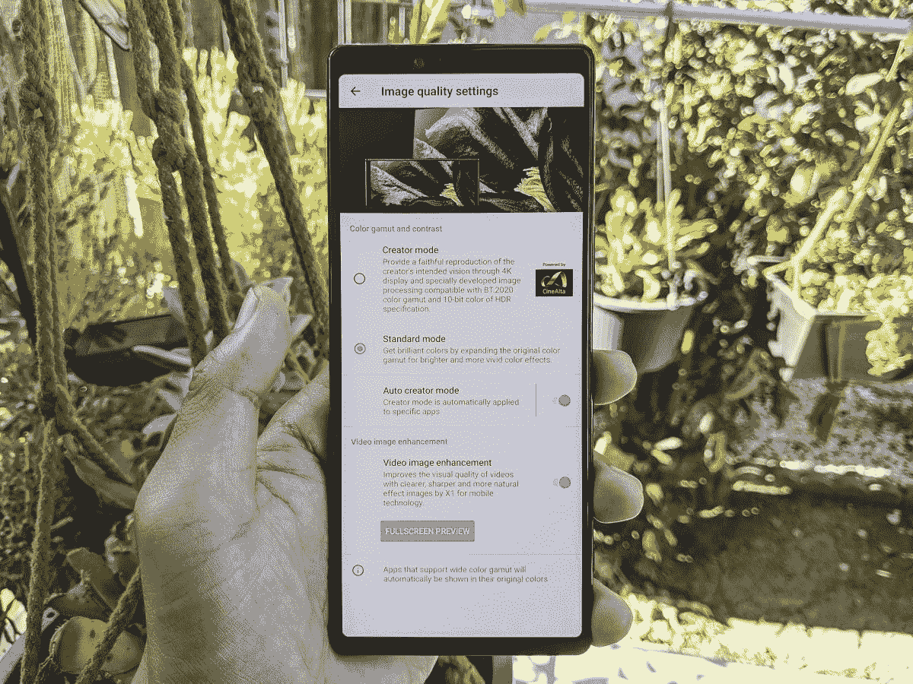
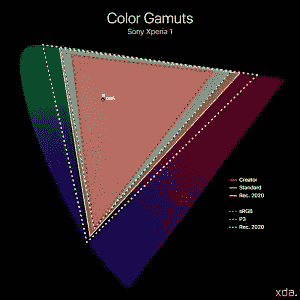
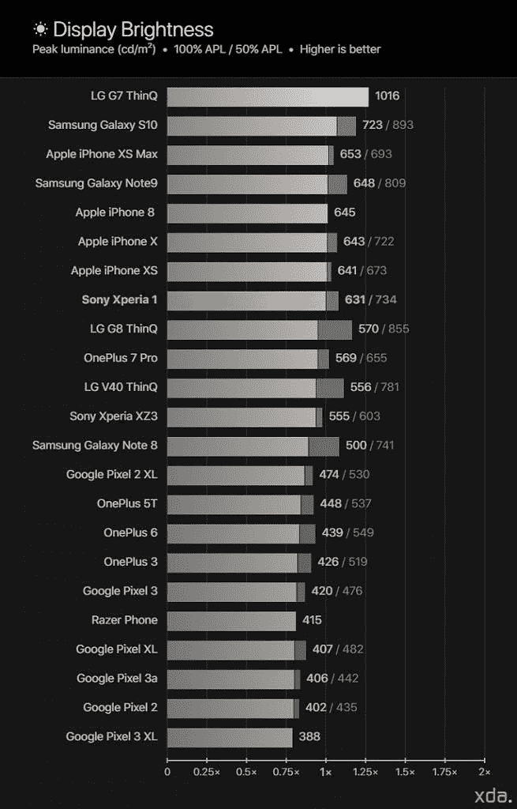
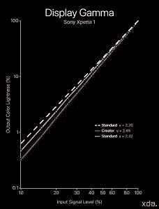
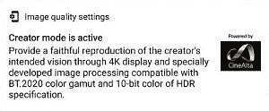
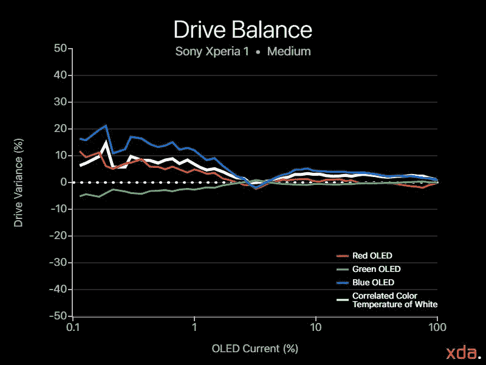
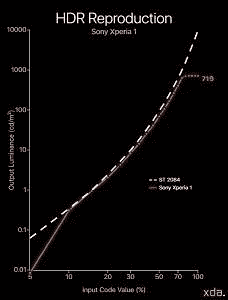
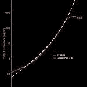
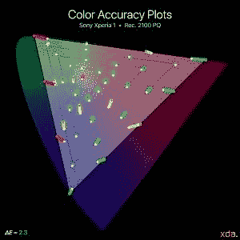

# 索尼 Xperia 1 显示器评论——专为影院和社交媒体供稿制作

> 原文：<https://www.xda-developers.com/sony-xperia-1-display-review/>

最近，智能手机设计变得相当有趣。虽然有些人认为它已经变得务实陈旧，但 2019 年继续展示我们从未见过的屏幕形状因素。去年，我们第一次看到了真正的全屏显示包，Vivo NEX 和 [OPPO Find X](https://www.xda-developers.com/oppo-find-x-pop-up-camera/) ，利用电动弹出式前置摄像头。然而，许多用户反对电动部件，因为它们具有额外的潜在故障层，并且更喜欢固定的前置摄像头。2019 年，我们得到了“打孔”显示器，这是一种全屏显示器，屏幕上有一个洞，用于前置摄像头。许多人认为这比一个等级好不了多少，但这是个人偏好。

虽然这些进步都是为了最大化手机的屏幕面积，但手机机身的尺寸仍然大体相似。侧挡板已经非常小了一段时间，所以显示器制造商一直试图最小化顶部和底部挡板，分别称为“前额”和“下巴”。由于前额和下巴在同一手机机身上被最小化，显示器的屏幕纵横比变得更长。我们已经从标准的 16:9 纵横比发展到 18:9，现在大多数全屏显示器——无论是有凹口、弹出式摄像头还是打孔——都具有大约 19.5:9 的屏幕纵横比，同时保留了类似的手机机身尺寸和纵横比。

索尼 Xperia 1 改变了这一点。

## 索尼 Xperia 1 显示屏概述

索尼将屏幕宽高比提高到了一个新的水平。Xperia 1 显示屏拥有*长* 21:9 的屏幕宽高比，符合许多电影的宽高比。为了实现这一点，手机本身的机身必须做得比典型手机的宽度尺寸更长。手机机身的宽度与 Galaxy S10 等现代紧凑型/非超大型手机相同，但长度与超大型手机相同(如一加 7 Pro)。索尼也不一定追求最高的屏幕与机身比例；没有凹口或打孔，只有一个*loong*无遮挡的屏幕，下巴和额头很小。索尼包括一项名为“侧感”的功能，有助于 Xperia 1 的可用性——在手机的侧挡板上双击或滑动，以显示菜单或调用一个动作，例如向下滑动时的单手模式(如果你没有使用这一功能，你就用错了手机)。

对于 Xperia 1，索尼将其带到三星显示制造这种独特的面板。索尼 Xperia 1 拥有第一个移动 4K OLED 面板，在消费 4K 内容时，这种差异肯定是显而易见的。然而，显示器只能以 1080p ( 2560×1096)渲染 Android 用户界面，但它仍然显得非常清晰，因为有机发光二极管五边形排列以如此高的自然子像素密度对像素进行子采样。只有在播放真正的 4K 内容时，索尼 Xperia 1 才会以其原始 4K (3840×1644)分辨率进行渲染。无论如何，索尼 Xperia 1 拥有市场上最清晰的移动有机发光二极管显示屏。

## **颜色配置文件**

索尼 Xperia 1 的色域

索尼保持简单，只有两个屏幕配置文件:标准模式和创作者模式。索尼甚至包括了对用户描述意图的描述，这是更多手机应该做的。

**标准模式**是 Xperia 1 的默认配置文件，尽管有“标准”的标签，但索尼明确定义该配置文件是为了“扩展原始色域”。该配置文件实际上将 sRGB 色域投影到 P3 色域上，但是该配置文件本身也支持(有些不完善的)自动色彩管理。对于支持宽色域的应用，索尼注意到它会自动显示原始颜色，因此宽色域没有进一步扩展，只是 sRGB。该配置文件的目标是标准的 2.20 伽马，但由于索尼启用了有机发光二极管动态亮度，伽马往往会发生变化，并高于应有的水平。

**创建者模式**声称“提供创建者预期愿景的忠实再现”，这比标准模式的描述更模糊，但它使我们相信该配置文件应该是遵循行业标准的“准确”配置文件。这意味着我们希望它针对标准颜色的 sRGB 标准色度、白点和传递函数，并遵循嵌入式颜色配置文件的特征。但正如我们后面要展示的，事实并非如此。Android 的 CMS 以色彩空间原色为目标，但配置文件本身一直以 BT.1886 传递函数为目标，该函数遵循有机发光二极管显示器的 2.40 的直线伽玛。这是 Rec 的工业标准传递函数。709 和家庭影院视频，索尼似乎正在迎合“创作者模式”的配置文件。对于休闲媒体内容和几乎所有其他内容，2.20 的标准伽玛仍然是标准的，所以我们发现配置文件的较高伽玛不适合作为配置文件的基本传递函数。

这两种配置文件共享相同的白点，可以在索尼 Xperia 1 的“显示->白平衡”下进行调整。有三个预设:“中”，这是默认的，“温暖”和“寒冷”。还有一个“自定义”选项，允许单独的 RGB 调整进行微调。

## **亮度**

与最亮的 OLEDs 竞争；UHD HDR 合规— **B+**

手机亮度参考图表

就像分辨率一样，索尼似乎也没有退缩。Xperia 1 在 100% APL 下与最亮的 OLEDs 具有竞争力，在户外显示的清晰度仍然很明显。移动 OLEDs 仍然有办法获得阳光可见度，但索尼 Xperia 1 正在推动目前可能的事情。索尼还采用了有机发光二极管显示器中典型的动态亮度，通过从不发光的 LED 中吸收一些可用电流，在较低的发射率下进一步增加亮度。在 100% APL(全白图像)下，索尼 Xperia 1 的峰值亮度为 631 尼特。但对于 50% APL，这可能是一个图片重饲料，白色水平可以上升到 734 尼特。当显示 HDR 内容时，有机发光二极管的动态亮度非常有用，在这种情况下，小区域的镜面高光需要非常高的亮度。 [UHD 联盟](https://alliance.experienceuhd.com/)要求有机发光二极管显示器的峰值亮度至少为 540 尼特(黑色水平< 0.0005 尼特)才能获得认证，一条良好表征的动态亮度曲线有助于有机发光二极管显示器在 HDR 播放期间尽可能强烈地突出这些镜面高光。索尼 Xperia 1 远远超过了 540 尼特的阈值，即使是在 100% APL 的情况下。

## **色彩准确度&色彩管理**

色度相对准确；无 D65 标准白点；色彩管理系统一塌糊涂— **C+**

索尼 Xperia 1 显示屏的最大问题是它没有符合 D65 (6504 K)白点的预设。这真的坦克它的颜色精度测量。默认的“中等”白平衡预设相当冷，白点色温约 7300 K，高*δE**7.3。可以清楚地看到，整个色域都向蓝色移动，这严重影响了颜色的准确性。默认“中等”白平衡预设中的 Creator 模式在 sRGB 色域中的平均*δE*为 2.9，这对于旗舰标准来说是很高的。只有大约 43%的色域看起来是准确的(*δE*<2.3)，对于青色色调，*δE*值可以高达 7.5。这对于默认的创建者模式选项来说是很糟糕的，索尼应该真正改进配置文件，以 D65 作为“中等”白平衡，至少对于创建者模式来说是这样。*

 *“暖”白平衡预设将白点降至 6900 K 左右，仍然太冷。然而，使用这种白平衡预设，Creator 模式的平均*δE**提高到 1.6，最大颜色误差降低到 3.9 的*δE**，这并不坏。大约 79%的 sRGB 色域看起来是准确的，这是一个巨大的进步，但与其他旗舰产品相比，它仍然缺乏，对于对颜色敏感的工作来说，它仍然不是最佳的。**

 **索尼(和谷歌)的色彩管理系统开始变得奇怪。为了这次评测，我使用谷歌照片来展示我的 P3 测试模式，因为它现在支持 P3 的色彩管理。问题在于，索尼在谷歌照片中强制使用 HDR 显示模式，这可能是为了从其原生相机应用程序中播放索尼自己在 HDR 录制的视频，然而，当在谷歌照片中查看任何照片时，Xperia 1 会切换到 P3 HDR 显示模式。HDR 显示模式具有不同的白点校准和不同的伽马模式，可禁用系统范围内的动态亮度。白点校准有一个增加的绿色信号，这实际上驱动色温略暖(7150 K)。因此，我们测量的 P3 目标比我们正常的 sRGB 目标稍微精确一些，平均*δE**为 2.1。大约 64%的 P3 色域看起来是准确的，但对于高度饱和的青色-蓝色，最大误差在*δE**= 7.0 时仍然太高。同样，使用“暖”白平衡预设有助于显著提高色彩准确度。**

 **由于索尼 Xperia 1 允许手动调节 RGB，因此可以校正白点。然而，为您自己的 Xperia 1 进行适当的校准需要您自己的色度计仪器。如果你没有，你可以使用我的设置，它显著提高了我的 Xperia 1 的总平均白点为 6600 K，平均*δE*为 1.0，sRGB 色域精度为 97%。

## **对比&色调响应**

好看的直伽玛；创作者模式利用 BT.1886，而不是 gamma 2.20 动态亮度影响伽玛— **B**

索尼 Xperia 1 的伽玛刻度

如前所述，Creator 模式传递函数并不遵循 2.20 的标准伽玛，而是针对现代家庭影院的 BT.1886 传递函数，对于有机发光二极管显示器来说，该传递函数基本上是 2.40 的直线伽玛。BT.1886 传输功能非常适合在昏暗的环境中播放视频，但手机可用于各种明亮的环境中，并且不仅仅用于观看数字电影。2.20 的基本伽马仍然是电话显示器的最实际的目标，直到电话制造商能够基于环境光实现适当的动态伽马系统。

创建者模式的持续通知

然而，该配置文件本身被称为*创建者模式*，因此它并不完全适合普通消费者在典型的办公环境中使用。通常，照片和视频是在非常暗的光线下专业制作的，以最大限度地减少光污染，并保持一致的周围环境。在弱光下，人类具有更高的对比敏感度，这就是为什么使用更高的显示器伽马来增加对比度和动态范围。一个很好的经验法则是，在 0 勒克斯环境光下 2.40 的显示器灰度系数看起来与在 200 勒克斯环境光下 2.20 的显示器灰度系数相似。当最终确定一张照片或一段视频时，目标观众必须接受制作人的评估，以确定内容的输出伽玛。如果图像或视频被随意发布到网上，如社交媒体或 YouTube，它应该以 2.20 gamma 输出，这样内容在大多数环境下看起来都是正确的。如果这是一部主要在昏暗环境中观看的电影，则使用 2.40 灰度系数进行渲染。创作者简介不是针对普通人的，而是针对那些希望在昏暗的环境中掌握内容的人。该简介声称它提供了“创作者意图的忠实再现”，我已经解释过，这通常是在低光下使用较高的伽马射线完成的。

我测得 Creator 模式的平均灰度系数为 2.49，范围从 2.41 到 2.58，因此在此配置文件中，大多数内容的对比度将高于标准对比度。颜色也会比标准颜色暗。伽玛的范围稍大是由于有机发光二极管的动态亮度，这提高了较低发射比/APL 的亮度，但对伽玛校准有负面影响，导致其随着显示器亮度的增加而增加。对于以一致伽马为目标的显示器配置文件，理想情况下应禁用动态亮度。

有趣的是，索尼 Xperia 1 实际上有一个错误，它禁用了动态亮度。您只需查看 HDR 内容，动态亮度在系统范围内被禁用，即使在退出 HDR 内容后也是如此。这是一个有趣的错误，因为动态亮度可能被禁用，以准确再现 HDR 内容的 HLG/PQ 传递函数，索尼可能在退出时忘记重新启用它。没有动态亮度，索尼 Xperia 1 显示器在更高或更低的 APL 下亮度几乎没有变化。当在没有动态亮度的情况下测量 Creator 模式的伽马时，平均伽马下降到 2.42，伽马范围在 2.40 到 2.43 之间，更好地符合 BT.1886 目标传递函数。

索尼希望他们的典型手机消费者使用的标准模式，以更标准的 2.20 伽玛为目标，显示 P3 色彩空间。我测得的平均伽马值为 2.32，范围从 2.23 到 2.41。同样，高方差是由于有机发光二极管的动态亮度。当动态亮度被禁用时，灰度系数的范围仅为 2.23 至 2.27，平均值为 2.25。因为轮廓不一定要精确，所以方差和略高的灰度系数不是重要的问题。

索尼希望他们的典型手机消费者使用的标准模式，以更标准的 2.20 伽玛为目标，显示 P3 色彩空间。我测得的平均伽马值为 2.32，范围从 2.23 到 2.41。同样，高方差是由于有机发光二极管的动态亮度。当动态亮度被禁用时，灰度系数的范围仅为 2.23 至 2.27，平均值为 2.25。因为轮廓不一定要精确，所以方差和略高的灰度系数不是重要的问题。

**驱动平衡**

## **驱动平衡**

颜色大多一致— **B+**

索尼 Xperia 1 驱动器平衡图，中等白平衡

索尼 Xperia 1 有机发光二极管的驱动器平衡在两种显示器配置文件之间几乎相同。“中等”白平衡预设是默认的工厂校准，也是 RGB 调整的基准。除了较低的驱动水平，显示相当均衡，红色和绿色的有机发光二极管几乎始终保持一致。在较低的驾驶水平，蓝色有机发光二极管起飞，并转移到蓝色暗色调。然而，这种变化是渐进的，视觉上很小，所以渐变看起来很好，颜色带最少。

索尼 Xperia 1 有机发光二极管的驱动器平衡在两种显示器配置文件之间几乎相同。“中等”白平衡预设是默认的工厂校准，也是 RGB 调整的基准。除了较低的驱动水平，显示相当均衡，红色和绿色的有机发光二极管几乎始终保持一致。在较低的驾驶水平，蓝色有机发光二极管起飞，并转移到蓝色暗色调。然而，这种变化是渐进的，视觉上很小，所以渐变看起来很好，颜色带最少。

**索尼 Xperia 1 上的 HDR10 播放**

## **索尼 Xperia 1 上的 HDR10 播放**

有限记录。2020 年覆盖面；没有真正的 10 位颜色支持；不准确的白点—**B—**

索尼 Xperia 1 的 HDR 色调响应曲线(PQ)

目前的智能手机显示屏并没有完全准备好按照 HDR10 标准进行严格评估，但索尼全力以赴[吹嘘 Xperia 1 带来了真正的 4K HDR 影院体验](https://www.sonymobile.com/us/products/phones/xperia-1/features/#display)。索尼声称 Xperia 1 支持 BT.2020 和 10 位色深。然而，索尼 Xperia 1 上的 OLED 面板实际上不是 10 位面板，而是 8 位的，在 HDR10 播放期间有 2 位抖动。索尼网站上的 Xperia 1 规格表在脚注中提到了这一点，以及显示器没有覆盖 BT.2020 的整个色域。在很大程度上，除了 4K 分辨率和“电影般”的 21:9 纵横比之外，它看起来与任何其他旗舰产品一样具有 HDR10 功能。

谷歌 Pixel 3 XL 的 HDR 色调响应曲线(PQ)

电影中的动态范围是使画面看起来逼真的关键因素之一。UHD 联盟的“[移动 HDR 高级版](https://www.experienceuhd.com/uhd-mobile-hdr-premium-features)”规范要求有机发光二极管显示器的峰值亮度至少为 540 尼特，我们测量了索尼 Xperia 1 在典型内容级别(20% APL)下输出高达 720 尼特的 HDR 内容。我用标准的 HDR PQ 绝对传递函数测试了索尼 Xperia 1 显示器，它确实*没问题*。没什么特别的。显示器在整个曲线上始终欠调，因此画面没有应有的亮度。索尼 Xperia 1 剪辑了最低的代码级别，这代表了场景中最暗的颜色。此外，索尼 Xperia 1 也几乎在峰值亮度时剪辑其高光，因为它没有在显示器的峰值亮度附近实现滚降曲线。右边是[谷歌 Pixel 3 XL 的](https://www.xda-developers.com/google-pixel-3-xl-display-review-what-google-needs-to-improve-for-the-pixel-4/)PQ 曲线的再现，它在渲染 HDR 内容方面做得更好。相反，它超过了阴影，这比修剪它们好得多，并且它在接近峰值亮度时滚下曲线。

建议。索尼 Xperia 1 的 2020 色彩准确度图

而索尼 Xperia 1 显示屏并没有覆盖完整的 Rec。2020 色域(目前的移动 OLEDs 都没有)，在色彩管理的帮助下仍然可以得到支持——显示器只是无法再现色域中最饱和的颜色。这就是索尼的营销可能会误导人的地方，但它在技术上是有效的。Rec 中掌握的大多数内容。2020 年并不完全期望在显示器上播放完整的记录。2020 色域，至少还要几年。然而，我们将索尼 Xperia 1 显示器与面向未来的色域进行了对比，它的表现比我预期的要好。除了白点，色域饱和度跟踪得相当好，尤其是红色混合。红色强度的峰值实际上穿过 P3 一直延伸到 Rec。2020 年，峰值蓝色强度非常接近 Rec。2020 蓝色。峰值绿色强度是它明显不足的地方，并且绿色混合被高度剪切。除了白点，索尼 Xperia 1 在这方面做得还不错。索尼谎称支持 D65 白点，这无疑会提高色彩准确度。

而索尼 Xperia 1 显示屏并没有覆盖完整的 Rec。2020 色域(目前的移动 OLEDs 都没有)，在色彩管理的帮助下仍然可以得到支持——显示器只是无法再现色域中最饱和的颜色。这就是索尼的营销可能会误导人的地方，但它在技术上是有效的。Rec 中掌握的大多数内容。2020 年并不完全期望在显示器上播放完整的记录。2020 色域，至少还要几年。然而，我们将索尼 Xperia 1 显示器与面向未来的色域进行了对比，它的表现比我预期的要好。除了白点，色域饱和度跟踪得相当好，尤其是红色混合。红色强度的峰值实际上穿过 P3 一直延伸到 Rec。2020 年，峰值蓝色强度非常接近 Rec。2020 蓝色。峰值绿色强度是它明显不足的地方，并且绿色混合被高度剪切。除了白点，索尼 Xperia 1 在这方面做得还不错。索尼谎称支持 D65 白点，这无疑会提高色彩准确度。

**索尼 Xperia 1 显示器评测-最终判决**

## 索尼 Xperia 1 是硬件和软件的完美结合。索尼将其显示器推销为终极影院体验和专业级监控工具。硬件无疑具有非凡的品质——索尼 Xperia 1 的显示屏是顶级面板，在色域和亮度方面与最好的面板竞争，目前在清晰度方面领先市场。视角、黑色剪裁、黑色拖影都和三星自己的对齐。然而，缺乏 D65 白点以及没有完全符合 sRGB 的配置文件与索尼针对内容创作者的活动完全相反。在很大程度上，显示器唯一不好的地方是专门针对内容创作者、着色师和书呆子的。标准模式是不关心色彩准确度、只想要鲜艳屏幕色彩的普通消费者的绝佳选择。然而，用户想要一个精确的颜色模式来编辑照片并不罕见，索尼的 Creator 模式并不完全适合照片编辑。面板是*绝对*能够*真正*专业级校准，无论是颜色还是色调反应。对 RGB 白平衡的简单调整可以产生色度精确的显示，软件中的一个错误显示面板可以精确地跟踪直线伽玛。这两者都应该首先包含在索尼 Xperia 1 中，然后也许称之为“专业级”就不会这么夸张了。

### 好的

好的

| 色彩鲜艳的明亮有机发光二极管显示器

*   鼓励回放的电影 HDR10 支持
*   ### 坏

*   不良

 | 没有完全符合 sRGB 的轮廓

*   错误的色彩管理系统
*   没有 D65 白平衡预设
*   **规格**

 |
| 索尼 Xperia 1 |

| **类型** | AMOLEDPenTile 钻石像素 |
| --- | --- |
| **制造商** | 三星显示公司。 |
| **尺寸** | 6.5 英寸对角线6.0 英寸乘 2.6 英寸 15.3 平方英寸 |
| **决议** | 2560×1096 像素(默认渲染) 3840×1644 像素(原生) 21:9 像素纵横比 |
| **像素密度** | 每英寸 455 个红色子像素每英寸 643 个绿色子像素每英寸 455 个蓝色子像素 |
| **像素锐度距离** *视力为 20/20 的可分辨像素距离。典型的智能手机观看距离约为 12 英寸* | < 7.6 英寸为全彩色图像 < 5.3 英寸为非彩色图像 |
| **角度偏移** *在倾斜 30 度时测量* | -26%为亮度偏移*δE*= 5.8 为色彩偏移 |
| **黑色削波阈值** *要削波为黑色的信号电平。以 10 cd/m 的速度测量* | <创建者模式 2.0%<标准模式 1.2% |
| **规格** | **创建者模式** |

| **标准模式** | **亮度** | **100% APL:** 630 尼特(自动)/ 378 尼特(手动) |
| --- | --- | --- |
| **50% APL:** 735 尼特(自动)/ 423 尼特(手动) | *非常好*APL 的 20%差异**100% APL:** 626 尼特(自动)/ 378 尼特(手动)

* * *

**50% APL:** 732 尼特(自动)/ 425 尼特(手动) | *非常好*与 APL 的差异超过 20%**伽玛** *标准是 2.20 的直线伽玛*

* * *

2.41–2.58 平均 2.49 |
| *伽玛太高方差略高* | 2.23–2.41 平均 2.32*方差略高* | **白点** *标准是 6504 K***介质:**7290K*δE*= 7.3 |
| **暖:**6879K*δE*= 3.4 | **冷:**8041K*δE*= 9.6**中等:**7259K*δE*= 7.5**暖:**6899K*δE*= 3.6 | **冷:**8009K*δE*= 9.3**色差****中等/ sRGB:** 平均值*δE*= 2.9±1.8 最大值*δE*= 7.5，25%青色 |
| *不准确(43%)* *最大误差高* | **中等/ P3:** 平均值*δE*= 2.1 1.0 最大值*δE*= 7.0 100%蓝绿色*不太准确(64%)* *最大误差高***温暖/ sRGB:** 平均值*δE*= 1.6±0.9 最大值*δE*= 3.9，100%蓝绿色*相当准确(79%)*

* * *

平均值*δC*= 7.7红色*δC*= 10.7/*δH*= 0.6 朝向品红色*δC*= 12.2/*δH*= 5.5 朝向青色*δC*= 2.6/*δH*= 0.4 朝向品红色 | *扩展到 P3 色域*红色*δC*= 10.7/*δH*= 0.6 朝向品红色*δC*= 12.2/*δH*= 5.5 朝向青色*δC*= 2.6/*δH*= 0.4 朝向品红色[**索尼 Xperia 1 XDA 论坛**](https://forum.xda-developers.com/xperia-1)&#124; &#124;[&#124;**索尼 Xperia 1 XDA 评测**&#124;](https://www.xda-developers.com/sony-xperia-1-review-video/)&#124; &#124;[&#124;**索尼 Xperia 1 产品页面**](https://www.sonymobile.com/us/products/phones/xperia-1/) |

[**索尼 Xperia 1 XDA 论坛**](https://forum.xda-developers.com/xperia-1)| | |[|**索尼 Xperia 1 XDA 评测**|](https://www.xda-developers.com/sony-xperia-1-review-video/)| |[|**索尼 Xperia 1 产品页面**](https://www.sonymobile.com/us/products/phones/xperia-1/)*****