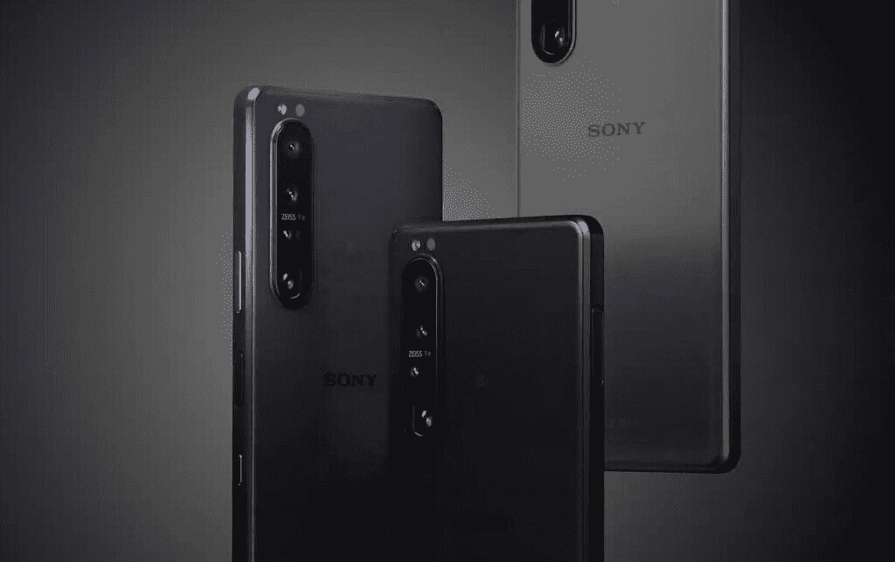
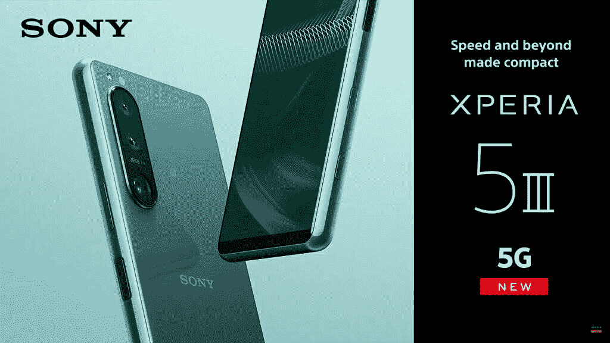

# 索尼推出搭载骁龙 888 的 Xperia 1 III 和 Xperia 5 III

> 原文：<https://www.xda-developers.com/sony-xperia-1-iii-xperia-5-iii-launch/>

在今天的在线活动中，索尼推出了两款新的 Android 智能手机，分别是 Xperia 1 III (Xperia 1 Mark 3)和 Xperia 5 III (Xperia 5 Mark 3)。两款手机的硬件基本相同，但尺寸不同。Xperia 1 III 作为一款成熟的旗舰产品处于领先地位，而 Xperia 5 III 试图在紧凑的包装中提供相同的旗舰体验。索尼也在同一场活动中推出了 [Xperia 10 III](https://www.xda-developers.com/sony-xperia-10-iii-launch/) 。

## Xperia 1 III 和 Xperia 5 III:规格

| 

规格

 | 

Xperia 1 III

 | 

Xperia 5 III

 |
| --- | --- | --- |
| **尺寸&重量** |  |  |
| **显示** | 

*   6.5 英寸 4K 有机发光二极管 HDR (3840 x 1644)
*   120 赫兹刷新率
*   240Hz 触摸采样率
*   100% DCI-P3
*   HDR BT.2020(建议 2020)
*   D65 白点
*   21:9 宽高比
*   康宁大猩猩玻璃 Victus

 | 

*   6.1 英寸 FHD+有机发光二极管 HDR (2520 x 1080)
*   120 赫兹刷新率
*   240 赫兹刷新率
*   100% DCI-P3
*   HDR BT.2020(建议 2020)
*   D65 白点
*   21:9 宽高比
*   康宁大猩猩玻璃 6

 |
| **SoC** | 

*   高通骁龙 888:
    *   1 个 Kryo 680 Prime 内核@ 2.84GHz
    *   3 个 Kryo 680 性能内核@ 2.4GHz
    *   4 个 Kryo 680 高效内核@ 1.8GHz
*   肾上腺素 660

 | 

*   高通骁龙 888:
    *   1 个 Kryo 680 Prime 内核@ 2.84GHz
    *   3 个 Kryo 680 性能内核@ 2.4GHz
    *   4 个 Kryo 680 高效内核@ 1.8GHz
*   肾上腺素 660

 |
| **内存&存储** | 

*   12GB 内存
*   256GB 存储空间
*   MicroSD 卡支持

 | 

*   8GB 内存
*   128GB 存储
*   MicroSD 卡支持

 |
| **电池&充电** | 

*   4500 毫安时
*   30W 快速有线充电
*   无线充电支持

 | 

*   4500 毫安时
*   30W 快速有线充电

 |
| **安全** | 侧装式指纹扫描仪 | 侧装式指纹扫描仪 |
| **后置摄像头** | 

*   摄像机设置:
    *   **主** : 12MP，f/1.7，24 毫米，1/1.7 英寸，1.8 米，OIS，双像素 PDAF
    *   **辅助** : 12MP 超宽，f/2.2，16mm，1/2.6”，双像素 PDAF
    *   **三级** : 12MP 潜望镜，f/2.3-2.8，70mm-105mm，OIS，双像素 PDAF
    *   **四元** : 3D iToF 传感器
*   特点:
    *   蔡司光学
    *   20fps 自动对焦/自动曝光跟踪连拍，带降噪功能
    *   60fps 连续自动对焦/自动曝光计算
    *   实时眼睛自动对焦
    *   AI 超分辨率变焦
    *   带 FlawlessEye 的光学防抖
    *   Cinema Pro 4K 120fps 录制，最高 5 倍慢动作

 | 

*   摄像机设置:
    *   **主** : 12MP，f/1.7，24 毫米，1/1.7 英寸，1.8 米，OIS，双像素 PDAF
    *   **辅助** : 12MP 超宽，f/2.2，16mm，1/2.6”，双像素 PDAF
    *   **三级** : 12MP 潜望镜，f/2.3-2.8，70mm-105mm，1/2.9”，OIS，双像素 PDAF
*   特点:
    *   蔡司光学
    *   20fps 自动对焦/自动曝光跟踪连拍，带降噪功能
    *   60fps 连续自动对焦/自动曝光计算
    *   实时眼睛自动对焦
    *   AI 超分辨率变焦
    *   带 FlawlessEye 的光学防抖
    *   Cinema Pro 4K 120fps 录制，最高 5 倍慢动作

 |
| **前置摄像头** | 800 万像素 | 800 万像素 |
| **端口** | 

*   USB 类型-C
*   3.5 毫米耳机插孔

 | 

*   USB 类型-C
*   3.5 毫米耳机插孔

 |
| **音频** | 

*   全音域前置立体声扬声器
*   杜比大气
*   高分辨率音频
*   360°真实音频(通过扬声器)
*   360°空间声音(通过耳机)

 | 

*   全音域前置立体声扬声器
*   杜比大气
*   高分辨率音频
*   360°真实音频(通过扬声器)
*   360°空间声音(通过耳机)

 |
| **连通性** | 

*   5G(低于 6Hz)
*   蓝牙 5.x
*   802.11 a/b/g/n/ac 双频 WiFi
*   国家足球联盟
*   全球定位系统，GLONASS，伽利略

 | 

*   5G(低于 6Hz)
*   蓝牙 5.x
*   802.11 a/b/g/n/ac 双频 WiFi
*   国家足球联盟
*   全球定位系统，GLONASS，伽利略

 |
| **软件** | Android 11 开箱即用 | Android 11 开箱即用 |
| **其他特性** | 

*   IP68 防水防尘等级
*   DualShock 4 直接连接
*   专用相机快门按钮

 | 

*   IP68 防水防尘等级
*   DualShock 4 直接连接
*   专用相机快门按钮

 |

从 Xperia 1 III 开始，最新的索尼旗舰产品坚持使用与其前任相同的方形设计——无论是好是坏。索尼继续推广 21:9 的高纵横比、无凹槽显示屏、3.5 毫米音频插孔和真正的双立体声扬声器。

 <picture></picture> 

Xperia 1 III

Xperia 1 III 配备了 6.5 英寸的 4K OLED 面板，屏幕刷新率为 120Hz，触摸采样率为 240Hz。另一方面，Xperia 5 III 配备了更小的 6.1 英寸 FHD+有机发光二极管显示屏，刷新率为 120 赫兹。两款手机都采用了[高通骁龙 888](https://www.xda-developers.com/qualcomm-snapdragon-888-explained-specs-features/) 芯片组，搭配 8GB / 12GB 内存和 128GB / 256GB 存储。

转到相机方面，Xperia 1 III 拥有 12MP f/1.7 主传感器，等效焦距为 24 毫米，像素为 1.8 微米。这种传统的相机设计提供了比当前 Quad-Bayer 传感器更快的读取速度，使索尼能够实现 20fps 连拍拍摄、60fps 连续自动对焦和自动曝光计算以及双像素 PDAF 等功能。等效焦距 16mm 的 12MP f/2.2 超宽传感器也不变。旧的长焦传感器不见了，取而代之的是一个 12MP 的潜望镜传感器，具有可变的 70mm-105mm 等效焦距，OIS 和 PDAF。很遗憾，这款手机仍然使用相同的 8MP 低分辨率前置摄像头。Xperia 5 III 拥有完全相同的相机设置，但放弃了其更大的兄弟姐妹上可用的 3D ToF 传感器。

 <picture></picture> 

Xperia 5 III

两款手机都升级了 4500 毫安时电池(高于 4000 毫安时)，并支持 30W 快速充电和无线充电。

索尼继续非常重视音频体验，因此 Xperia 1 III 和 Xperia 5 III 都配备了 3.5 毫米音频插孔、全范围前置立体声扬声器、杜比 Atmos 和高分辨率音频支持、360°扬声器现实音频和 360°空间声音。

Xperia 1 III 和 Xperia 5 III 的其他值得注意的亮点包括 IP68 防尘和防水保护，侧装指纹识别器，NFC，蓝牙 5.x，5G 支持和双 SIM 卡。

### 定价和可用性

索尼 Xperia 1 III 有磨砂黑和磨砂紫两种颜色。与此同时，Xperia 5 III 有黑色、粉色和绿色三种颜色。这两款手机都将在“初夏”上市，确切的上市时间和价格信息尚未由该公司透露。