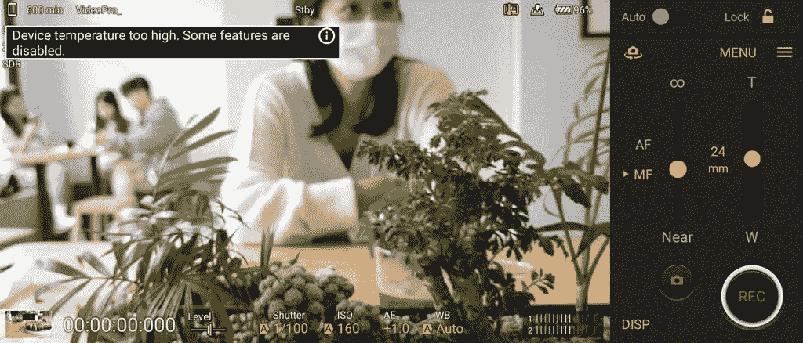

# 索尼 Xperia 1 IV 回顾:手机摄影的一种不同方式

> 原文：<https://www.xda-developers.com/sony-xperia-1-iv-review/>

索尼的智能手机总是不同于市场上的其他手机，因为它们似乎从来不关心行业趋势。这可能是像边框尺寸这样肤浅的东西--索尼从来没有像其他 Android 品牌那样费心追求全屏外观--也可能是像数字成像哲学这样重要的东西。虽然其他所有手机品牌都在吹嘘他们的计算摄影能力——他们的手机人工智能在分析场景方面非常智能，几乎可以为你拍照——但索尼加倍努力，让用户更多地手动控制其智能手机摄像头。事实上，索尼邀请了其受欢迎的 Alpha 相机系列的工程师来开发去年的 Xperia 1 III (发音为 Xperia One mark)的相机系统，这在相机爱好者中引起了轰动。

现在推出了 Xperia 1 IV (mark four)，这是对 mark three 的迭代更新，延续了手动相机的方式，增加了更多“真实相机”的功能，如实时眼睛自动对焦(索尼相机的一项专长)，连拍模式可以在一秒钟内拍摄多达 20 张照片，并且可以在每个后置镜头上拍摄 4K/120fps 视频。但也许更重要的是，索尼还打磨了*的其他东西*，让 Xperia 1 IV 不那么像一款硬核小众设备。这包括一个更智能、更易于使用的基本相机模式，适合那些只想瞄准和拍摄的人，以及一个大得多的电池，为华丽(和过度)的 4k/120Hz 有机发光二极管显示器供电。

毫无疑问，Xperia 1 IV 仍然是一款非常小众的手机，主要是为了迎合索尼 Alpha 相机的粉丝。但至少它现在对普通人来说也很有用。

 <picture></picture> 

Sony Xperia 1 IV

 <picture></picture> 

Sony Xperia 1 IV

##### 索尼 Xperia 1 IV

索尼的新 Xperia 1 IV 是去年备受追捧的 Xperia 1 III 的迭代更新，因此你可以获得相同的 4K 120hz 有机发光二极管屏幕以及三镜头相机系统，努力提供更多的手动控制。这里有明显的改进:包括一个改进的变焦镜头。

## 索尼 Xperia 1 IV:规格

| 

规范

 | 

索尼 Xperia 1 IV

 |
| --- | --- |
| **打造** | 

*   颜色:黑色、青绿色、紫色
*   防护:康宁大猩猩 Victus(正面和背面)，防水防尘等级 IP68

 |
| **尺寸&重量** | 165 毫米 x 71mm 毫米 x 8.2mm 毫米，191 克 |
| **显示** | 

*   主要的
    *   6.5 英寸 4K 有机发光二极管 HDR (3840 x 1644)
    *   120 赫兹刷新率
    *   240Hz 触摸采样率
    *   100% DCI-P3
    *   HDR BT.2020(建议 2020)
    *   D65 白点
    *   21:9 宽高比

 |
| **SoC** | 

*   高通骁龙 8 代 1

 |
| **闸板&存放** | 

*   12GB 内存
*   256GB/512GB 存储空间
*   MicroSD 卡支持

 |
| **电池&充电** | 

*   5000 毫安时
*   30W 快速有线充电
*   无线充电支持

 |
| **安全** | 

*   侧装式指纹扫描仪

 |
| **后置摄像头** | 

*   **主** : 12MP，f/1.7，24mm，1/1.7 寸，1.8 m，OIS，双像素 PDAF
*   **辅助** : 12MP 超宽，f/2.2，16mm，1/2.6 寸，双像素 PDAF
*   **三级** : 12MP 可变潜望镜，f/2.3-2.8，85mm-125mm，OIS，双像素 PDAF
*   **四元** : 3D iToF 传感器
*   **功能:**
    *   蔡司光学
    *   20fps 自动对焦/自动曝光跟踪连拍，带降噪功能
    *   60fps 连续自动对焦/自动曝光计算
    *   实时眼睛自动对焦
    *   AI 超分辨率变焦
    *   带 FlawlessEye 的光学防抖
    *   Cinema Pro 4K 120fps 录制，最高 5 倍慢动作

 |
| **前置摄像头** | 12MP |
| **端口** | 

*   USB 类型-C
*   3.5 毫米耳机插孔

 |
| **音频&振动** | 

*   全音域前置立体声扬声器
*   杜比大气
*   高分辨率音频
*   360°真实音频(通过扬声器)
*   360°空间声音(通过耳机)

 |
| **连通性** | 

*   5G(低于 6Hz)
*   蓝牙 5.x
*   802.11 a/b/g/n/ac 双频 WiFi
*   国家足球联盟
*   全球定位系统，GLONASS，伽利略

 |
| **软件** | 安卓 12 |

**关于这篇评测:** *这篇评测是在对一台由索尼香港提供的索尼 Xperia 1 IV 进行了两周的测试后写的。索尼在这次审查中没有任何投入。*

* * *

## 索尼 Xperia 1 IV:硬件和设计

新款 Xperia 1 IV 看起来与 Xperia 1 III 几乎相同，唯一的区别是取消了去年用于启动谷歌助手的物理按钮，并将 SIM 卡托盘重新放置在新款机型的底部。这意味着新手机仍然是一个长方形的玻璃和金属平板，比市场上的大多数手机都有点笨重和细长。索尼决定使用 21:9 的宽高比是为了迎合电影视频的粉丝——当横着拿时，屏幕非常适合宽屏内容——但这也使手机更容易拿着，因为它从左到右没有那么宽。

去年 Xperia 1 III 推出的 6.5 英寸 4K 120 赫兹有机发光二极管屏幕回归，但它明显更亮。索尼没有透露数字，但这是去年有点平庸的亮度水平的一个很大的进步。虽然它仍然没有达到 Galaxy S22 Ultra 的亮度水平，但现在即使在晴天，它也比可用的多。当然比 Pixel 6 Pro 的屏幕亮度要好。

我曾公开表示，在智能手机显示屏上显示 4K 分辨率毫无意义，我认为这一点很重要。当然，这款屏幕非常锐利，但在过去几个月里，我测试的六款其他旗舰产品的 1440p 屏幕也是如此。疯狂的是，索尼没有给你手动降低分辨率的选项，刷新率要么是 120Hz，要么是 60Hz。所以是的，这个屏幕是一个电池猪。

索尼今年用 5000 毫安时的电池解决了电池问题，虽然它比去年的 4500 毫安时电池的电池寿命有所提高，但仍然不够。如果你白天过得轻松，它可以是一部全天手机，但在繁忙的日子里，你需要在夜晚结束前充值——稍后在性能部分会详细介绍。

屏幕被引人注目的边框夹在中间，我不太介意它们——它们是对称的，它们装有非常好的前置立体声扬声器。是的，这款手机是一款非常好的移动网飞机器，因为它相对较轻，191 克，宽屏，消除了许多电影的信箱，以及前置扬声器。如果你想插入高端耳机，还有一个耳机插孔。

在设备的右侧有一个电源按钮，它可以兼作指纹扫描仪、音量摇杆和一个纹理物理按钮，该按钮可以用作手机附带的两个相机应用程序中的一个而不是一个相机快门。按钮有一些行程，允许它在半按下时开始自动对焦(就像索尼相机一样)。当然，全媒体拍摄照片。

正如预期的那样，这款手机由[骁龙 8 Gen 1](https://www.xda-developers.com/qualcomm-snapdragon-8-gen-1/) 驱动，内存为 12GB，存储空间为 256GB 或 512GB。还有无线充电和 IP68 防水防尘等级。

* * *

## 索尼 Xperia 1 IV:相机

索尼 Xperia 1 IV 采用三重 12MP 相机系统，覆盖广角(24 毫米)、超广角(16 毫米)和可变人像变焦镜头，可在 85 毫米(或约 3.5 倍)至 125 毫米(5.2 倍)之间改变光学变焦长度。后一个镜头是独特的，因为它是一个潜望镜变焦镜头，里面有一个物理移动镜头，据我所知，只有索尼在做。去年的 Xperia 1 III 已经使用了类似的技术，但镜头只能在两个设定的光学变焦范围之间跳跃。今年，范围是可变的，这意味着变焦镜头可以在 3.5 倍到 5.2 倍的距离之间产生光学变焦。还有一个 TOF 传感器，有助于额外的深度映射。

如果你不熟悉索尼的智能手机相机，你需要知道索尼对待手机摄影的方式与其他品牌不同。本质上，索尼希望你能像用真相机一样拍照。例如，大多数摄影师都知道，你应该避免逆光拍摄(直接对着太阳或面对光线充足的窗户)，因为这将导致对比度过强的不平衡拍摄。真正的相机要么适当曝光光源，让画面的其余部分沉浸在阴影中，要么尝试曝光黑暗区域；虽然，结果，完全吹灭了光源。

最近的智能手机相机，使用像多堆栈 HDR 这样的计算摄影技巧，已经成功地将这种传统智慧扔出窗外。你可以将你的 iPhone 或 Pixel 直接对准背光拍摄，手机应该会拍摄出均匀照明的照片(或者至少应该是这样，因为根据我的测试， [iPhone 13 Pro/Pro Max 实际上有时会在这一点上失败](https://www.xda-developers.com/apple-iphone-13-pro-review/))。这对大多数人来说都很好，他们在拍摄时不再需要担心灯光，但有时一部 HDR 太好的手机(如 [Vivo X70 Pro Plus](https://www.xda-developers.com/vivo-x70-pro-plus-first-impressions/) )会拍摄出看起来有点不真实的照片，几乎就像已经完成了编辑工作——因为手机的 ISP 确实做过编辑。

在下面的照片中，在世界上最严酷的光源下拍摄，索尼的镜头吹灭了天空，让地面上的任何东西都笼罩在阴影中，让一些部分处于黑暗中。相比之下，iPhone 13 Pro 和 Vivo X70 Pro Plus 拍摄的照片更好地暴露了一切。我想大多数人都会同意苹果和 Vivo 的照片“更好”，但那些苹果和 Vivo 的照片也不现实。索尼的照片更接近我眼中的场景。

事情是这样的:如果一个真正的摄影师拿着一个真正的相机决定拍摄这张照片，他们已经有意识地决定拍摄一张非常反差的照片，有极端的阴影和高光。在某种程度上，苹果和 Vivo 制造更蓝的天空和更亮的阴影违背了摄影师的意图。这就是索尼移动相机的理念:不要只是无意识地指着拍；相反，你的投篮要有意图。

索尼对待手机摄影的方式与其他品牌不同。本质上，索尼希望你能像用真相机一样拍照

在不太恶劣的条件下，Xperia 1 IV 照片仍然会在拍摄中留下更多阴影，仍然不会像其他智能手机一样人为地照亮场景，通常情况下，它的效果相当好。在下面的照片中，我们可以看到索尼的部分照片明显比其他两张照片暗。iPhone 13 Pro 的镜头非常明亮，展示了主要的数字锐化——与其他两个镜头相比，看看佛像上坚硬、深刻的线条。个人认为苹果的镜头看起来非常不自然。不出我所料，Vivo 的照片可能是三张照片中最平衡、最具美感的一张——它比当时的场景照亮得多一点，而且对绿叶有额外的冲击力。但这也不自然。索尼的镜头是我眼中对当时场景最准确的刻画，阴影笼罩下的左帧对比更好的传达了当时场景的意境。

以上索尼镜头都是手动模式下拍摄的。如果我切换到自动模式，让索尼的大脑帮我固定灯光和曝光，结果相当不错。这与以前的 Xperia 手机有所不同，以前的自动模式根本达不到标准。下面是 Xperia 1 IV 的主摄像头在自动模式下拍摄的更多照片。

正如评测开始时提到的，Xperia 1 IV 有三个索尼非常自豪的相机功能:

*   自动眼睛自动对焦，这意味着手机将检测大多数哺乳动物的眼睛，并锁定其中一只眼睛，以便在照片和视频中对焦
*   连拍模式可在一秒钟内拍摄多达 20 张照片
*   4K 120fps 视频录制，主要用于慢动作视频

所有这些功能都支持后向主系统中的每个镜头。他们都像广告上说的那样工作。无论我使用广角镜头还是长焦镜头，眼睛自动对焦都会自动启动，根据我的测试，它对人类、猫和狗都有效。

连拍模式非常适合那些想要拍摄运动或移动动物等快速移动场景的人。在下面的截图中，你可以看到我能够捕捉到一只猫在拉伸中的爆裂照片，或者一个人投篮的照片。如果我快速连续地循环浏览这些照片，它们看起来就像动画一样。

用变焦镜头拍摄快速连拍的能力让我捕捉到了一些慢速手机可能无法捕捉到的精彩镜头。下面的变焦镜头是我在高速公路上行驶的公交车上拍摄的。

虽然索尼热衷于销售其可变光学变焦镜头，但现实是质量相当好，但不是很好——肯定不是 Galaxy S22 Ultra level。但它仍然是一个比没有潜望镜镜头的手机更好的变焦镜头，就像 iPhone 13 Pro 一样。

超宽相机在良好的照明条件下很好，但在晚上产生的图像在细节上有点柔和。

Xperia 1 IV 的相机应用程序可以在自动瞄准和拍摄模式下使用，但大多数爱好者都希望切换到手动模式，这种模式提供了与索尼 Alpha 相机类似的用户界面控制。在这里，你可以调整 ISO，快门速度和白平衡，以及使用直方图来衡量曝光水平。

稍加调整，你就可以对同一个场景拍摄出截然不同的照片。

对相机的完全控制也适用于摄像——我可以使用手动对焦转盘实现“机架对焦”等电影技巧，放大和缩小比大多数安卓手机更流畅，但最重要的是，4K 120fps 的慢动作视频看起来很棒。

总的来说，我很喜欢使用索尼 Xperia 1 IV 的相机系统。我不是专业摄影师，但我有两台索尼 Alpha 相机用于工作，所以我可以说我制作的照片和视频还算专业。我尊重 Xperia 1 IV 没有走所有其他手机品牌的路线，并试图坚持摄影的基本原则。拥有一个物理快门按钮和一个提供更多控制的相机用户界面让我比以前更想抓拍照片。

拥有一个物理快门按钮和一个提供更多控制的相机用户界面让我比以前更想抓拍照片

我发现自己经常侧着手机在城市里走来走去，手指放在快门按钮上，随时准备对我可能遇到的任何有趣的事情开火。现在，照片是最好看的照片吗？不一定，但他们至少有一个独特的氛围，而不是看起来像过度有力，完美的 HDR 谷歌像素外观。

* * *

## 索尼 Xperia 1 IV:软件

Xperia 1 IV 运行 Android 12，上面是索尼非常轻薄的 Android 皮肤。这款手机的用户界面基本上像普通的 Android 一样，带有一个通知面板，看起来非常类似于 Pixel 6 Pro 的通知面板。最值得注意的是“侧感”，位于屏幕边缘的侧边栏，可以通过双击或滑动来触发。根据触发动作，它将启动一个浮动菜单，其中包含经常使用的应用程序，或者以分屏模式启动应用程序对。由于 21:9 的纵横比，两个应用程序可以在对称的正方形中以分屏模式打开。许多应用程序，包括我日常使用的关键应用程序，如 WhatsApp 和 Slack，也可以在浮动窗口模式下打开。

动画是流畅的，当长按主屏幕时，快门按钮可以被指定为快速启动应用程序。在很大程度上，我对这个软件没有任何抱怨。如果我必须吹毛求疵的话:浮动窗口选项在屏幕上移动时有轻微的口吃，它不像三星或 OPPO 的实现那样流畅。

* * *

## 索尼 Xperia 1 IV:一般性能和电池寿命

使用骁龙 8 Gen 1，这款手机可以在大多数任务中发挥旗舰水平。然而，这款手机比其他手机更容易过热，可能是由于 4k 屏幕和强大的摄像头硬件的结合。实际上，在正常使用手机甚至玩游戏时，我都没有注意到散热问题。反而是我在录视频的时候。有时候在炎热的日子里，我会收到一个弹出通知，警告我手机过热。不过，尽管有弹出信息，我仍然可以在手机将我踢出视频应用程序之前，用手机毫无问题地拍摄几分钟。

 <picture></picture> 

The Xperia 1 IV displaying an overheating warning.

Xperia 1 IV 是一款非常棒的网飞观看机，这要归功于它的前置扬声器和宽屏幕宽高比

如上所述，Xperia 1 IV 是一款非常好的网飞观影机，因为它的前置扬声器和更宽的屏幕消除了电影中的大多数信箱。电池寿命，也如前所述，刚刚好。在一个非常繁忙的使用日，比如上周六我带着手机出去拍摄时，电池在六个小时内从 100%耗尽到 20%。在中等使用量的一天，比如第二天，我整个周日都把手机拿出来，但没有拍摄那么多照片和视频，那么 Xperia 1 IV 在电池电量下降到 10%以下之前持续了整整 10 个小时。在使用量较低的日子里，比如工作日，当我大部分时间都呆在电脑前时，Xperia 1 IV 可以在电池剩余超过四分之一的情况下坚持 12 到 13 个小时。基本上，如果你在周末把手机拿出来，在晚上结束前准备好充电。

* * *

## 该不该买索尼 Xperia 1 IV？

在外观和感觉都相似的智能手机的海洋中，我对索尼有一种天然的尊重和喜爱，因为它打破常规思考，坚持己见，跟随他人的步伐。老实说，我仍然认为像[谷歌 Pixel 6 Pro](https://www.xda-developers.com/google-pixel-6-pro-review/) 或 Vivo X70 Pro Plus 这样的东西在大多数时候都可以捕捉到更好的照片，但我喜欢 Xperia 1 IV 挑战我做出必要的调整，以在一张照片中找到更好的曝光。但在仍然低于标准的电池寿命(由不必要的 4K 显示屏造成)、散热问题和非常高的 1600 美元零售价格之间，Xperia 1 IV 很难向除了发烧友以外的任何人推荐。

这个价格理所当然地受到了那些关注智能手机新闻的人的嘲笑，但老实说，喜欢相机的人不会被这个价格吓倒，因为相机设备很贵。仅我的索尼相机的 20 毫米镜头就要 1200 美元。一个品牌名为 Manfrotto 的三脚架可以轻松卖到 800 美元。一个摄影包，300 美元。对这个群体来说，1600 美元一部手机并不算高。但是那个群体是小众，Xperia 1 IV 是小众手机。

在以下情况下，您应该购买 Xperia 1 IV:

*   你想要一个不同的、更加手动的智能手机相机系统
*   你拍了很多动态照片，可以使用连拍模式
*   你想要一部与众不同的手机
*   你想要一个耳机插孔和前置扬声器，而不是一款游戏智能手机

在以下情况下，您不应购买 Xperia 1 IV:

*   你想要顶级的计算摄影，比如动态 HDR 和真正的夜景模式
*   您想要/需要全天电池续航时间
*   你关心的是在购买智能手机时获得良好的“常规”价值

 <picture></picture> 

Sony Xperia 1 IV

##### 索尼 Xperia 1 IV

索尼 Xperia 1 IV 带来了 4k，120Hz 有机发光二极管屏幕，三镜头系统，具有索尼标志性的眼部自动对焦和连拍模式，以及拍摄 4K 120fps 视频的能力。