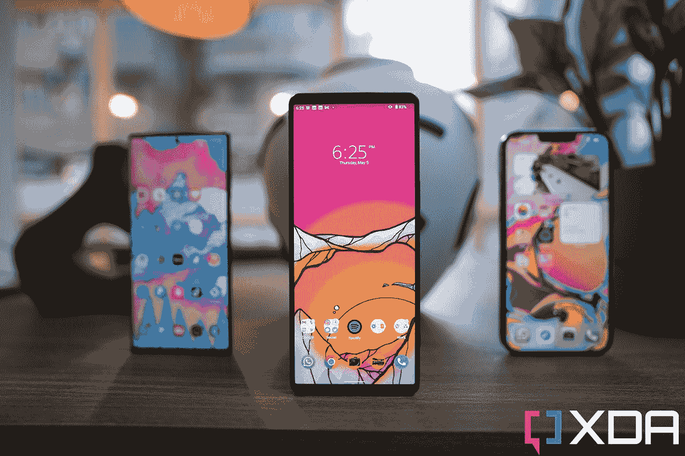

# 索尼 Xperia I IV 推出了 4K 120Hz 显示屏和骁龙 8 Gen 1

> 原文：<https://www.xda-developers.com/sony-xperia-i-iv-launch-specs-features-pricing/>

索尼早就放弃了在每个市场以每个可能的价格区间与大型智能手机原始设备制造商竞争的想法。该公司没有试图吸引主流买家，而是接受了自己的小众玩家身份，似乎满足于迎合一小部分忠实观众。该公司的 Xperia 1 系列一直以其独特的特点和早就从主流旗舰中消失的推广功能脱颖而出。今天，这家日本智能手机制造商发布了新一代旗舰产品 Xperia I IV。

## 索尼 Xperia I IV:规格

| 

规格

 | 

索尼 Xperia I IV

 |
| --- | --- |
| **尺寸和重量** |  |
| **显示** | 

*   6.5 英寸 4K 有机发光二极管 HDR (3840 x 1644)
*   120 赫兹刷新率
*   240Hz 触摸采样率
*   100% DCI-P3
*   HDR BT.2020(建议 2020)
*   D65 白点
*   21:9 宽高比
*   康宁大猩猩玻璃 Victus

 |
| **SoC** | 

*   **骁龙 8 代 1**
    *   1x ARM Cortex-X2 @ 3.0GHz
    *   3 个 ARM Cortex-A710 @ 2.50GHz
    *   4x ARM Cortex-A510 @ 1.80GHz
*   Adreno 730 GPU
*   4 纳米工艺

 |
| **RAM 和存储器** | 

*   12GB 内存
*   256GB/512GB 存储空间
*   MicroSD 卡支持

 |
| **电池&充电** | 

*   5000 毫安时电池
*   30W 快速充电器(包装盒内)
*   无线充电
*   反向无线充电

 |
| **后置摄像头** | 

*   摄像机设置:
    *   **主** : 12MP，f/1.7，24 毫米，1/1.7 寸，1.8 米，OIS，双像素 PDAF
    *   **辅助** : 12MP 超宽，f/2.2，16mm，1/2.6”，双像素 PDAF
    *   **三级** : 12MP 潜望镜，f/2.3-2.8，85mm-125mm，OIS，双像素 PDAF
    *   **四元** : 3D iToF 传感器
*   特点:
    *   蔡司光学
    *   120fps 读出速度(所有镜头)
    *   20fps 自动对焦/自动曝光跟踪连拍，带降噪功能(所有镜头)
    *   60fps 连续自动对焦/自动曝光计算
    *   实时眼睛自动对焦(所有镜头)
    *   AI 超分辨率变焦
    *   带 FlawlessEye 的光学防抖
    *   Cinema Pro 4K 120fps 录制，最高 5 倍慢动作

 |
| **前置摄像头** |  |
| **端口** | 

*   USB 类端口
*   3.5 毫米耳机插孔

 |
| **连通性** | 

*   5G(低于 6Hz)
*   蓝牙 5.x
*   802.11 a/b/g/n/ac 双频 WiFi
*   国家足球联盟
*   全球定位系统，GLONASS，伽利略

 |
| **其他特性** | 

*   全音域前置立体声扬声器
*   杜比大气
*   高分辨率音频
*   360°真实音频(通过扬声器)
*   360°空间声音(通过耳机)
*   IP68 防水防尘等级
*   专用相机快门按钮

 |
| **软件** | 

*   开箱即用的 Android 12

 |

总的来说，Xperia I IV 是一个渐进的升级，但它确实为这款电脑带来了一些显著的改进，包括更亮的显示屏，更好的长焦和自拍相机，新的摄影功能，以及更大的电池。

索尼 Xperia 1 IV 坚持了我们在以前的 Xperia 1 型号上看到的相同的方形设计。你会在正面看到一个 6.5 英寸的大型无凹槽 4K 有机发光二极管显示器，刷新率为 120 赫兹，宽高比为 21:9。虽然尺寸和分辨率没有变化，但新面板的亮度比去年提高了 50%。

相机再次成为这里的焦点。索尼没有在百万像素竞赛中倒下，选择为所有三个摄像头使用良好的旧 12MP 分辨率传感器。主射手 f/1.7 光圈，24mm 等效焦距，光学防抖，1.8 微米像素。12MP f/2.2 超宽射手和去年一样。

长焦传感器是我们看到的升级。索尼使用了可变潜望镜变焦镜头，可以在 85 毫米和 125 毫米之间的不同焦距之间无缝切换。这意味着您现在可以在 90 毫米、100 毫米或 85 毫米至 125 毫米范围内的任何其他焦距拍摄，而不会降低分辨率。这在 Xperia 1 III 上是不可能的，它只能在两种焦距之间切换:70 毫米和 105 毫米。

 <picture></picture> 

Xperia 1 IV with Galaxy S22 Ultra (left) and iPhone 13 Pro Max (right)

这三款镜头都提供了 120fps 的读取速度，实时眼睛自动对焦，20fps 的 HDR 连拍，以及 60fps 的连续自动对焦和自动曝光计算。其他值得注意的相机功能包括 4K 120fps 视频录制，支持实时流媒体的 Videography Pro，以及改进的 HDR 视频录制。在正面，自拍相机从 800 万像素升级到了 1200 万像素。

在引擎盖下，Xperia 1 IV 由[骁龙 8 Gen 1](https://www.xda-developers.com/qualcomm-snapdragon-8-gen-1/) 驱动，配有 12GB 内存和 256GB/512GB 存储。这款手机配备了 5000 毫安时的大电池，比 Xperia 1 III 的 4500 毫安时电池更高，支持快速有线、无线和反向无线充电。

索尼是少数几个密切关注音频体验的原始设备制造商之一，新的 Xperia 1 IV 就是一个证明。这款手机配备了 3.5 毫米音频插孔、全频双立体声扬声器、杜比 Atmos 支持、360°现实音频和高分辨率音频支持。由于增加了额外的增强单元，设备上的扬声器现在声音更大，改善了低频声音。

在软件方面，Xperia I IV 运行的是开箱即用的近似库存版本的 [Android 12](https://www.xda-developers.com/android-12/) 。其他值得注意的亮点包括侧装式指纹识别器、IP68 防水和防尘保护、Wi-Fi 6、NFC、microSD 卡插槽和双 SIM 卡。

### 定价和可用性

索尼 Xperia 1 IV 售价 1600 美元，将于 2022 年 9 月上市。从今天开始，它可以在索尼的网站上预订黑色和紫色。