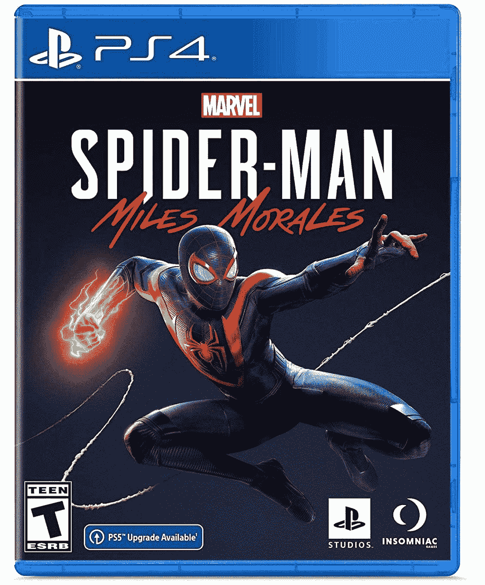

# 蜘蛛侠:迈尔斯·莫拉莱斯现在在 PS4 和 PS5 上只卖 30 美元

> 原文：<https://www.xda-developers.com/spider-man-miles-morales-is-now-just-30-on-ps4-and-ps5/>

# 蜘蛛侠:迈尔斯·莫拉莱斯现在在 PS4 和 PS5 上只卖 30 美元

索尼(Sony)和 Insomniac Games 的最新网络冒险游戏现在降价 20 美元，PS5“Ultimiate Edition”也在销售。

由 Insomniac Games 出品的漫威的《蜘蛛侠》是最好的 PlayStation 独占游戏之一，让你在开放的纽约扮演蜘蛛侠的角色。去年，Insomiac Games 和索尼随后推出了*漫威的《蜘蛛侠:迈尔斯·莫拉莱斯》*,这款游戏主要是为 PlayStation 5 设计的，但也适用于老款 PS4。如果你还没有机会享受最新的网络冒险，或者你需要为拥有 PS4/5 的人准备一份生日礼物，这款游戏现在已经降至 29.99 美元。这是有记录以来的最低价格，比最初的建议零售价低 20 美元。

*蜘蛛侠:迈尔斯·莫拉莱斯*的灵感来源于蜘蛛侠：平行宇宙*电影(这是一部*奇幻*电影)和迈尔斯·莫拉莱斯的漫画原版。你可以在纽约市四处游荡，同时完成任务并升级你的套装，就像以前的游戏一样，但有一个全新的故事，围绕着补锅匠的高科技军队和洛克森能源公司之间的冲突。该游戏在 Metacritic 上的评分为 [85/100。](https://www.metacritic.com/game/playstation-5/marvels-spider-man-miles-morales)*

 <picture></picture> 

Marvel's Spider-Man: Miles Morales

##### 漫威的蜘蛛侠:迈尔斯·莫拉莱斯

这是漫威的《蜘蛛侠》的续集，由迈尔斯·莫拉莱斯主演，有着和第一部一样的织网乐趣和一个新的故事。

 <picture></picture> 

Marvel's Spider-Man: Miles Morales Ultimate Edition

##### 漫威的蜘蛛侠:迈尔斯·莫拉莱斯终极版

这个 PS5 版本包括迈尔斯·莫拉莱斯和原版蜘蛛侠游戏的更新版本。

PS4 和 PS5 版本没有太大的不同，除了 PS4 版本没有光线跟踪或 60FPS 的性能模式。PS5 的“终极版”也以 50 美元的价格出售(比建议零售价低 20 美元)，其中包括*蜘蛛侠:迈尔斯·莫拉莱斯*和原版*漫威蜘蛛侠*的重制版。