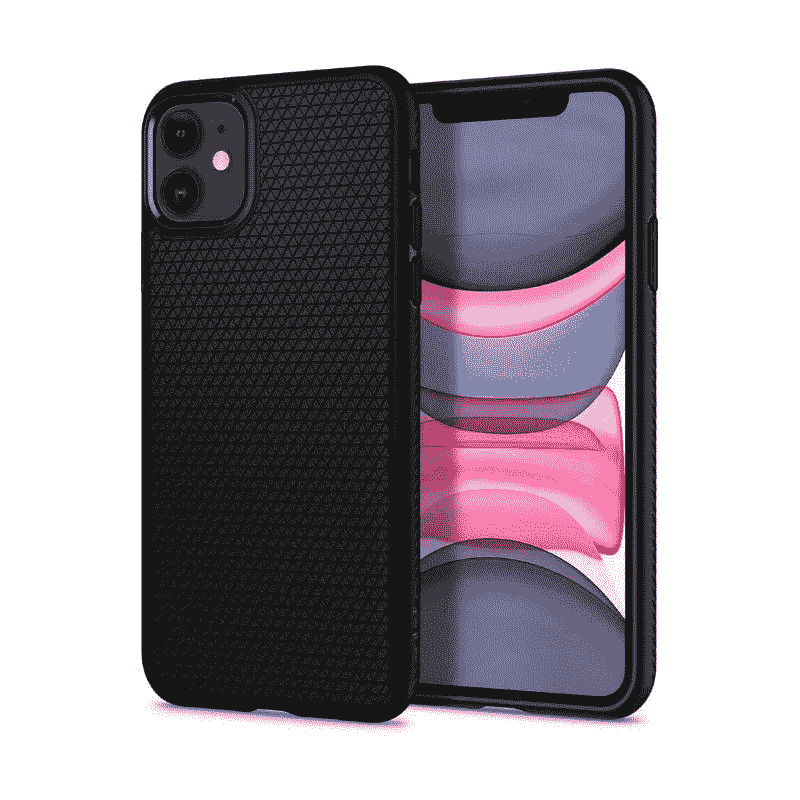
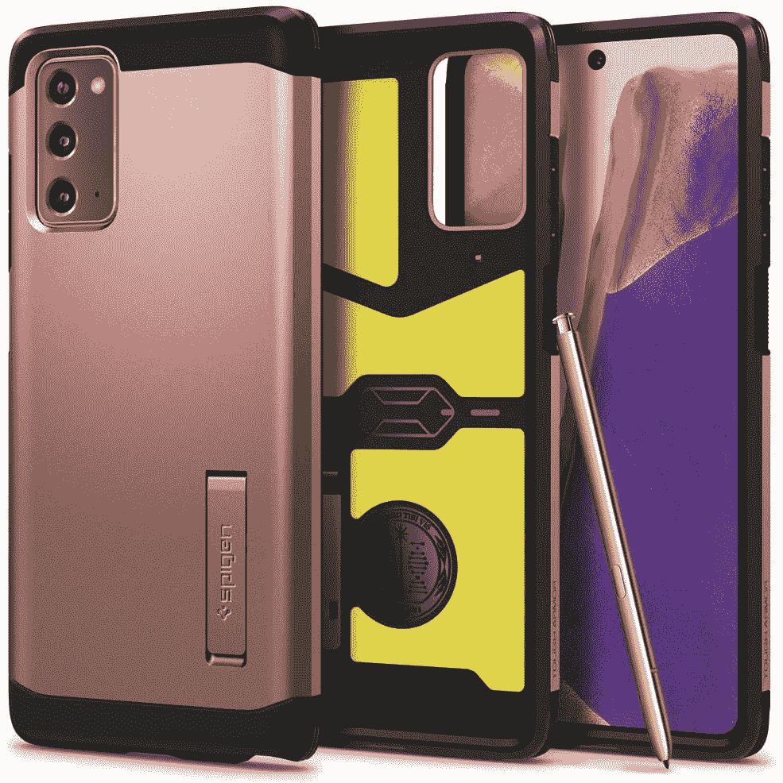

# 2022 年该不该买 Spigen 保护套？它们物有所值吗？

> 原文：<https://www.xda-developers.com/spigen-cases/>

你是否曾经决定为你的智能手机买一个保护套，然后被亚马逊上的所有选项淹没了？你并不孤单。不过，在搜索的时候，你可能会相对经常地遇到一个特殊品牌的案例——斯皮根。

什么是 Spigen 案例？它们值入场费吗，或者你应该选择另一个品牌？有了过多的选择，让我们看看 Spigen 的产品，并告诉你你的下一个手机壳是否应该来自这个受欢迎的品牌。

## 什么是 Spigen 案例？

Spigen 成立于 2008 年，致力于制造满足每个人需求的高品质手机配件。他们通过大量案例来实现这一点，每一个案例都有自己的目的和功能。因此，Spigen 有五种不同的产品线可供选择:

*   装甲 -如果你需要确保你的设备坚固，即使在最恶劣的摔落情况下也能得到保护，Spigen 的装甲外壳就是你想要的。
*   **混合型**——混合型 Spigen 保护套融合了时尚和安全，可以保护你的手机免受大多数摔落和事故的影响，但不会像盔甲一样笨重。
*   **液体** - Spigen 的液体系列为保护套提供了少量保护，如果你不担心磨损，但仍然想要比手机更光滑的东西来握持，这是完美的选择。一些液体外壳也是透明的，所以你可以在下面看到原来的手机颜色。
*   **轻薄贴合/透气** -与液体类似，轻薄贴合紧贴手机，但提供的保护略低于液体。主要是为了防刮伤。
*   **钱夹** -这款钱夹一点也不神秘——这是一款 Spigen 钱夹，可以兼作钱夹使用！钱包给你的手机提供了一些保护，同时提供了一个可以放信用卡和身份证的翻盖。

Spigen 也有一些市场上更便宜的品牌保护套。价格会因手机型号而异，但一般来说，Spigen 的价格不会太高，大多数人都买得起。这些箱子在不影响质量的情况下提供了很高的性价比。

## 最好的 Spigen 案例台词是什么？

在众多主线中，哪种 Spigen case 系列最好将在很大程度上取决于您对该设备的日常使用。对于大多数人来说，混合动力可能是最好的选择，它提供了很好的保护，又不会让手机太大。毕竟，大多数人都会偶尔将手机掉在人行道上，混合动力 Spigen 保护套可以防止这些事故。

然而，如果你是一个从事建筑等劳动密集型工作的人，或者正在为年轻的手机用户购买手机外壳，这款盔甲将能够保护你的智能设备免受生活中可能发生的一切事情的影响。亚马逊对其中一个 Spigen Armor 案例的评论称，他们的手机在被汽车碾过后毫发无损！没有比这更好的支持了。

归根结底，这完全取决于您的使用模式。让我们将它分解为所有案例类型，然后告诉您哪一个适合您。

### Spigen 坚固装甲/坚韧装甲/纤细装甲/地理装甲/核心装甲/磁力装甲

这些是 Spigen 提供最佳跌落保护的最难处理的案例，每种具体类型之间存在一些差异。例如，坚固的装甲是一个 TPU 外壳，它并不太大，但仍然增加了保护。坚韧的装甲在 TPU 内壳上增加了聚碳酸酯背板，从而提高了防护等级。薄甲保留了与坚韧甲相同的基因，但体积略小。

Geo Armor 是所有产品中保护性最强的，仅适用于某些手机。它本质上是一个包裹整个手机的外壳，如果你不想使用单独的屏幕保护器，它还包括一个内置的屏幕保护器。装甲阵容中的其他情况也是相似的——强调保护，在这里和那里有微小的变化。例如，Mag Armor 可用于 iPhone 13 系列，并支持 MagSafe 配件。

如果你不小心使用手机，而你的朋友称你为笨手笨脚，你应该选择 Spigen Armor 系列保护套。

### Spigen 超混合/超混合 S/石英混合/哑光混合

很多人都想展示他们智能手机的原始颜色或设计，同时也增加一点保护。如果这听起来像你，超混合动力系列是一个考虑。标准的超混合动力有一个 TPU 框架以及一个硬聚碳酸酯背部是明确的。侧框可在跌落时为手机提供保护，透明背板可在展示手机的同时保护手机后部。

其他变化的情况是类似的，但略有不同。Ultra Hybrid S 内置支架，石英版采用玻璃背而非塑料，哑光版采用磨砂背而非透明背。您还可以选择多种颜色，例如边框是彩色的，而不是透明的，背面仍然保持透明。

虽然混合系列的箱子没有装甲系列提供那么多保护，但对普通人来说应该足够好了。除非你不小心把手机乱扔，否则应该没事。此外，你还可以向所有人展示你买了最新款的 iPhone。

### Spigen 液态空气/液晶/水晶亮片

液体系列保护套增加了一点保护，但不一定会让你的手机太大。它们非常柔韧，完全由 TPU 制成，因此不会有任何坚硬的聚碳酸酯材料。虽然不如 Ultra Hybrid 具有保护性，但 Liquid Air 系列可以在意外跌落时幸存下来，并为您的手机增加了良好的抓握力。标准液态空气有一个很好的纹理，看起来微妙而优雅。

 <picture></picture> 

Spigen Liquid Air

液晶再次为那些想炫耀他们的手机背面，但想要一个更薄的超混合动力的替代品的人。还有一个闪光版本的情况是不言自明的。请注意，液晶是一个普通的 TPU 盒，因此随着使用时间的推移，它很有可能会变黄。Ultra Hybrid 就不一样了，因为背面是聚碳酸酯。

### Spigen 薄款/AirSkin

如果您寻求最低限度的保护，同时保持接近手机的外形，Thin Fit 系列适合您。直到几个月前，Thin Fit 系列还非常薄，完全由硬塑料制成。这意味着这种保护只是最低限度的，也只是防止刮伤。Spigen 最近改进了 Thin Fit 系列，现在，你可以获得一个注入硬聚碳酸酯背部的 TPU 层。这确保了一些基本的防跌落保护，同时又不会对外壳的轻薄特性造成太大的影响。

另一方面，AirSkin 是一个完全透明的薄外壳，只能防止划伤。它非常薄，看起来好像根本不存在。由于新的轻薄贴合比以前更具保护性，它很容易被许多想要体面保护但希望手机保持体面轻薄的人推荐。

### Spigen 超薄装甲 CS/水晶插槽

有没有过因为裤兜满了而想把钱包丢下的感觉？好吧，这些来自 Spigen 的皮夹盒会让你做到这一点。超薄装甲 CS 提供了足够的保护，就像标准的超薄装甲一样，但它的袖子上有一个额外的技巧。背面有一个滑动装置，滑出后会显示一个最多可容纳两张卡的插槽。你也许可以带一张身份证和一张信用卡，或者也可以放一些现金。

水晶槽是一个透明的盒子，有一个槽可以放你的卡。在我们看来，超薄装甲 CS 看起来更好，因为它更简约，而且存放卡片的地方很隐秘。一个透明的盒子会显示你已经用手机储存了你的卡，这不是很理想。

* * *

你可以查看我们为 iPhone 13 Pro 准备的全面的 [Spigen 保护套综述，了解不同类型的保护套以及哪一种最适合你。Spigen 还生产其他配件，如 MagSafe 充电器、无线充电器、屏幕保护器和手机支架。上面提到的文章应该会让你对这些配件有所了解。](https://www.xda-developers.com/spigen-iphone-13-pro-case-accessory-review/)

## Spigen 案例与竞争对手相比如何？

大多数 Spigen 保护套买家表示，他们的保护套很好地融合了保护和风格，这有助于他们与其他受欢迎的保护套品牌针锋相对。Spigen 盔甲保护套经常被比作保护套中的领先品牌——OtterBox。大多数用户认为，虽然 OtterBoxes 感觉可以保护他们的手机免受任何东西的伤害，但它们太厚了，不舒服。另一方面，Spigen 保护套通常也很结实，但不像 OtterBox 那么厚，一般来说对普通用户来说更舒适。

Spigen 的液体保护套通常没有 Totallee 的薄保护套薄，而且你也买不到哑光液体保护套，但 Spigen 的优势是可以用于更多设备。当然，如果你买的是最受欢迎的旗舰设备，你就不会缺少可供选择的外壳...但是，Spigen 的案例超越了苹果、谷歌和三星，这对许多用户来说是一个很大的优势。

很明显，消费者喜欢 Spigen 皮套。市场上几乎每款现代手机都有选择，加上该品牌的低成本，使 Spigen 成为手机壳爱好者的最爱。所有 Spigen 的保护套，包括新的 Thin Fit，都采用了 Air Cushio 技术，可以吸收手机掉落时的冲击。这很好，因为不是很多薄的情况下有这样的保护功能。

## 什么手机可以买 Spigen 保护套？

Spigen 为大多数现代旗舰手机以及许多中档和经济型设备提供保护套。无论你有一部 [iPhone 13](https://www.amazon.com/stores/page/4B81EB9B-19B8-42DF-8D95-FC3687F4B363/?tag=xda-4b6oku0-20&ascsubtag=UUxdaUeUpU6949&asc_refurl=https%3A%2F%2Fwww.xda-developers.com%2Fspigen-cases%2F&asc_campaign=Short-Term) ，三星 Galaxy S21 Ultra，一部[谷歌 Pixel 6](https://www.amazon.com/stores/page/2EECA81C-05BD-4CE7-8081-A6B1E5637995/?tag=xda-4b6oku0-20&ascsubtag=UUxdaUeUpU6949&asc_refurl=https%3A%2F%2Fwww.xda-developers.com%2Fspigen-cases%2F&asc_campaign=Short-Term) ，还是一部 [MacBook](https://www.amazon.com/stores/page/0482A026-04A3-43E2-8606-9150ECDBCE0F/?tag=xda-4b6oku0-20&ascsubtag=UUxdaUeUpU6949&asc_refurl=https%3A%2F%2Fwww.xda-developers.com%2Fspigen-cases%2F&asc_campaign=Short-Term) ，总有一款 Spigen 保护套适合你。Spigen 甚至还有旧款手机的保护套，例如，你仍然可以购买 LG v40 ThinQ 或 Pixel 3 的保护套，这两款手机都很旧了。

最重要的是，Spigen 不仅仅生产智能手机。想要保证你的[银河芽](https://www.amazon.com/Spigen-Rugged-Armor-Designed-Galaxy/dp/B086PC7DH9/?tag=xda-4b6oku0-20&ascsubtag=UUxdaUeUpU6949&asc_refurl=https%3A%2F%2Fwww.xda-developers.com%2Fspigen-cases%2F&asc_campaign=Short-Term)和[任天堂 Switch](https://www.amazon.com/Spigen-Rugged-Designed-Nintendo-Switch/dp/B087D9KGF2/?tag=xda-4b6oku0-20&ascsubtag=UUxdaUeUpU6949&asc_refurl=https%3A%2F%2Fwww.xda-developers.com%2Fspigen-cases%2F&asc_campaign=Short-Term) 的安全吗？斯皮根有你要的箱子。

## 哪里可以买到 Spigen 保护套？

Spigen 在亚马逊上有一个独特的[商店页面，那里有大部分库存，我们可以在那里购买 Spigen 保护套。由于快速 Prime 运输，您可以让您的新外壳与新手机同时到达，甚至早于新手机！你也可以搜索特定的设备，如](https://www.amazon.com/stores/Spigen/page/1B6B4933-0D21-4FF4-AB37-F74CD4F5CB1C?tag=xda-4b6oku0-20&ascsubtag=UUxdaUeUpU6949&asc_refurl=https%3A%2F%2Fwww.xda-developers.com%2Fspigen-cases%2F&asc_campaign=Short-Term)[最佳三星 Galaxy S21 Ultra 外壳](https://www.xda-developers.com/best-galaxy-s21-ultra-cases/)或[最佳 Pixel 6 和 6 Pro 外壳](https://www.xda-developers.com/best-google-pixel-6-pro-cases/)，Spigen 肯定也会出现在那里！

您还可以在百思买找到[精选 Spigen 案例。这不是获得完美保护套的理想方式，但如果你在百思买激活了一部手机，商店里可能会有一个 Spigen 保护套！那你就不需要等箱子运到你那里了。](https://shop-links.co/link/?exclusive=1&publisher_slug=xda&article_name=Spigen+Cases%3A+Are+they+any+good+and+should+you+buy+them%3F&article_url=https%3A%2F%2Fwww.xda-developers.com%2Fspigen-cases%2F&u1=UUxdaUeUpU6949&url=https%3A%2F%2Fwww.bestbuy.com%2Fsite%2Fsearchpage.jsp%3Fst%3Dspigen%26_dyncharset%3DUTF-8%26_dynSessConf%3D%26id%3Dpcat17071%26type%3Dpage%26sc%3DGlobal%26cp%3D1%26nrp%3D%26sp%3D%26qp%3D%26list%3Dn%26af%3Dtrue%26iht%3Dy%26usc%3DAll%2BCategories%26ks%3D960%26keys%3Dkeys)

 <picture></picture> 

Spigen Cases

##### 斯皮根

准备好保护你的新手机了吗？您可以购买很多保护套，但我们总是会选择 Spigen 这个品牌，因为它以实惠的价格完美融合了保护和纤薄的外形。