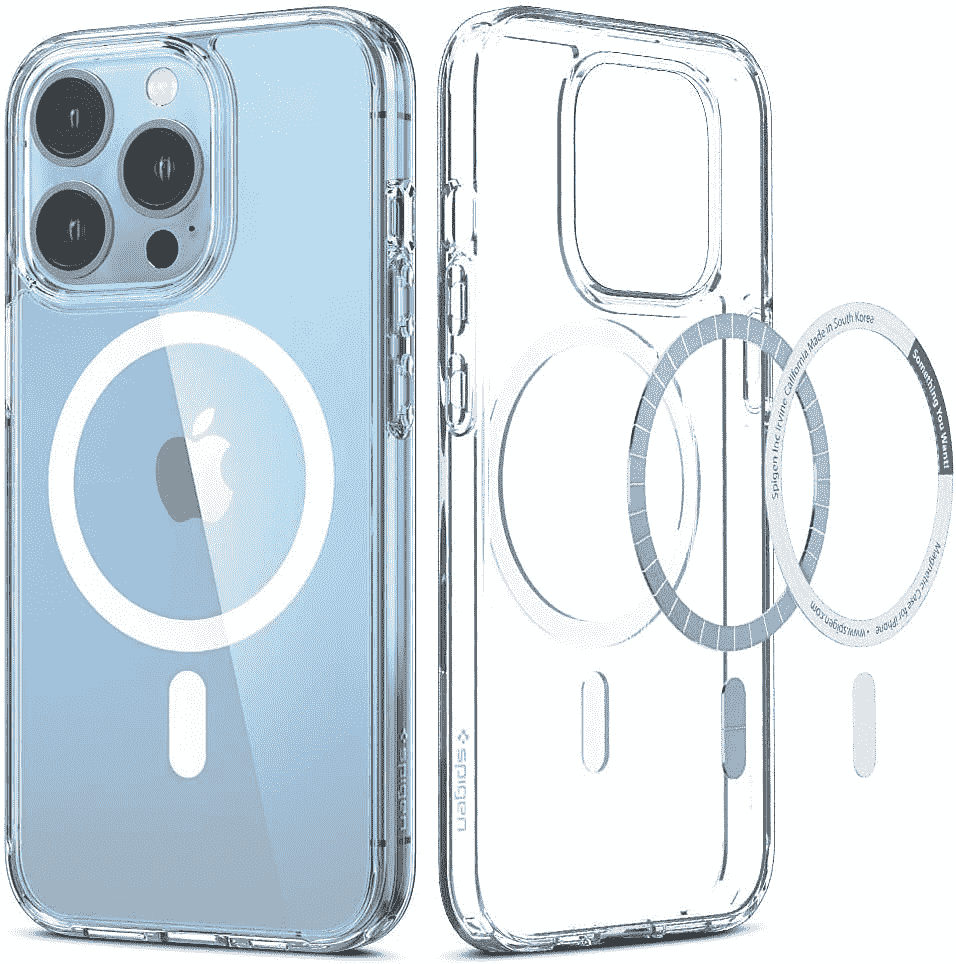
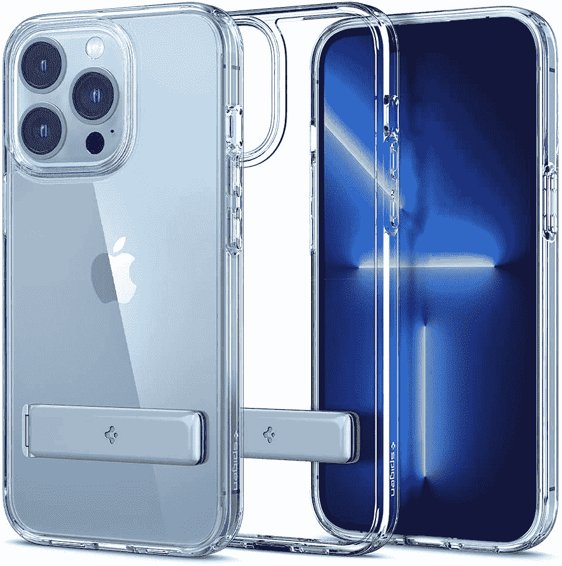
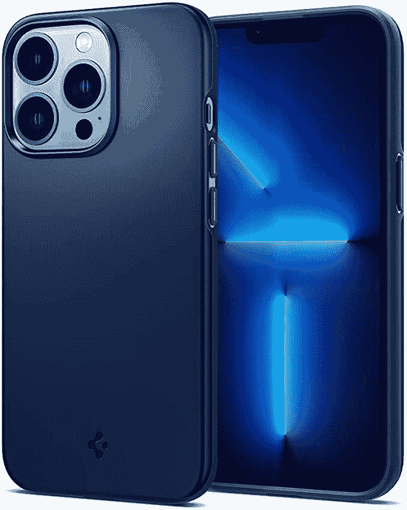
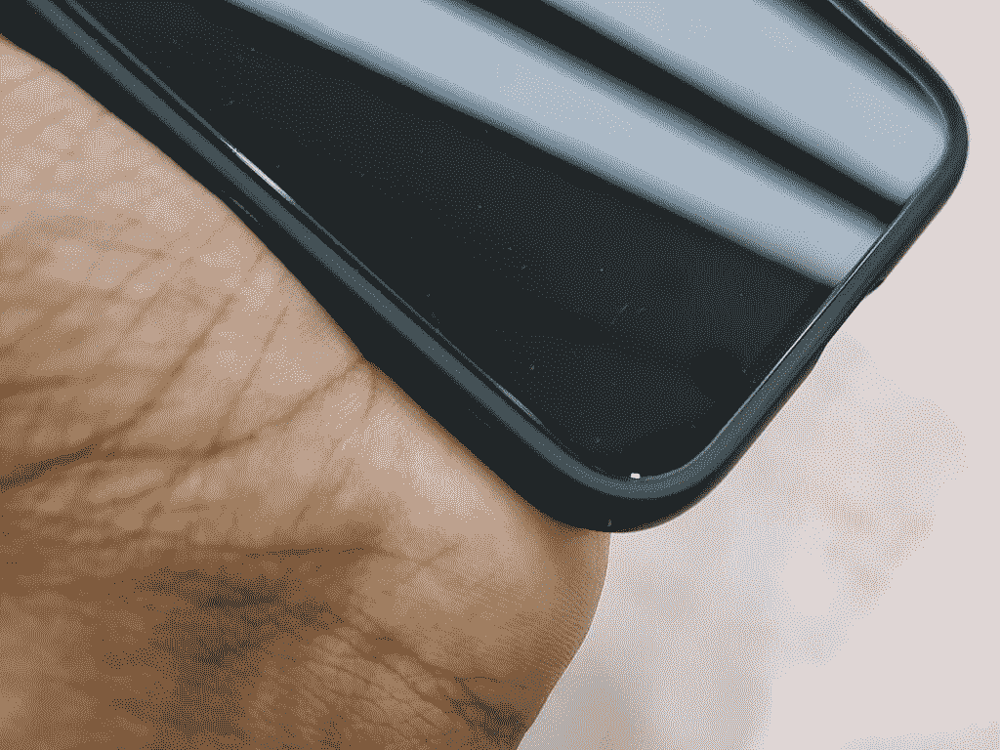
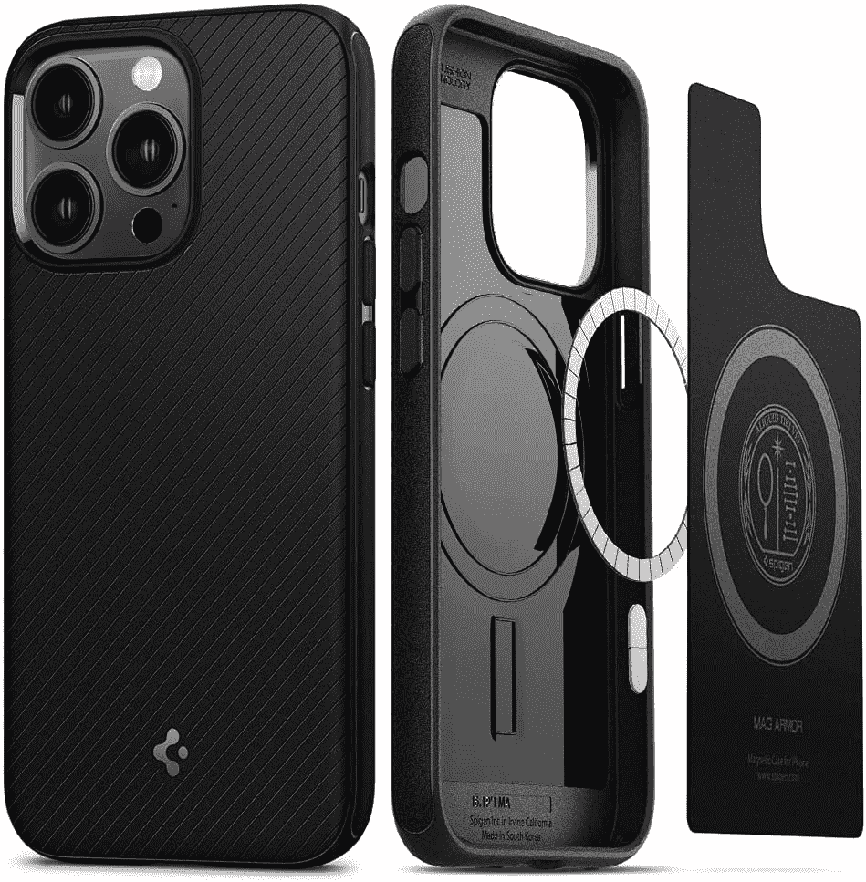
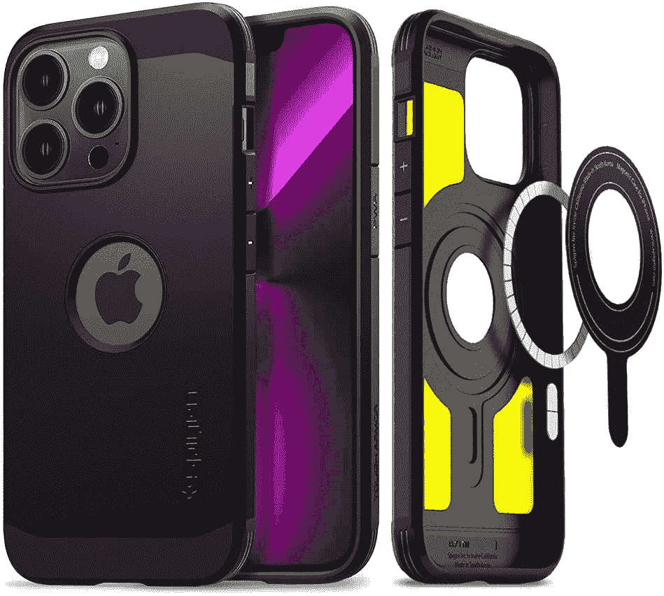
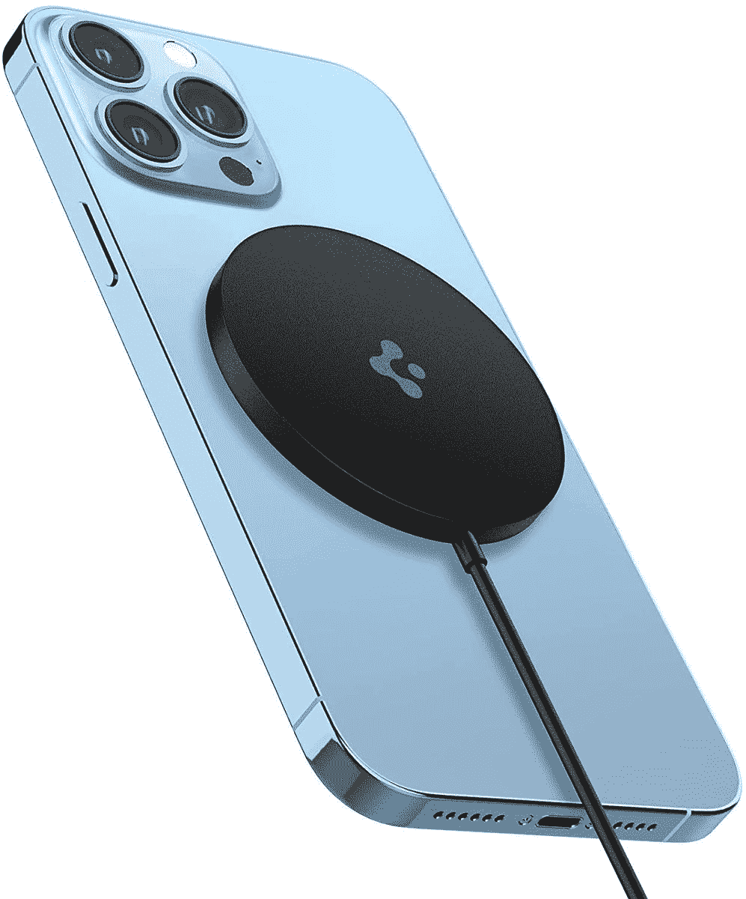
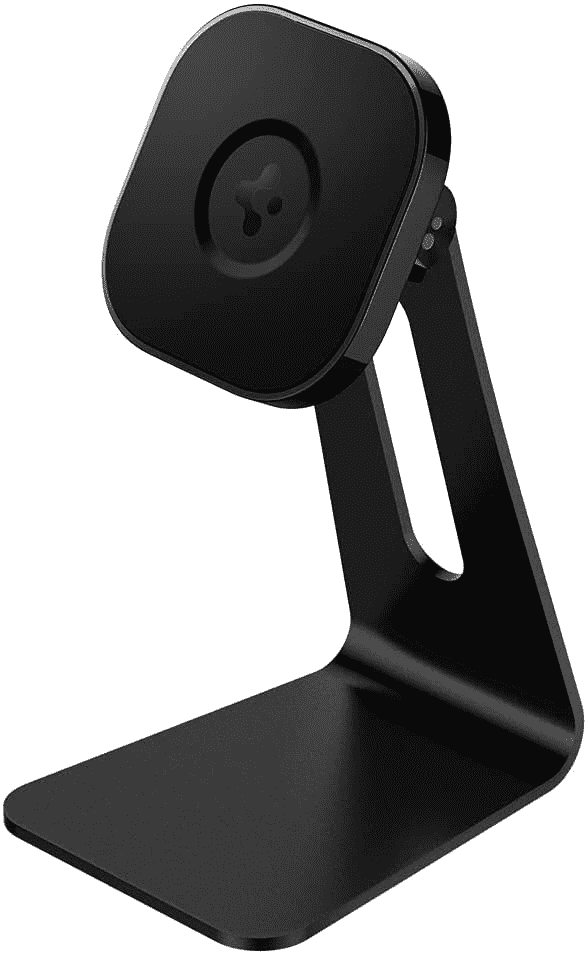

# 查看 Spigen 的 iPhone 13 Pro 外壳和配件系列

> 原文：<https://www.xda-developers.com/spigen-iphone-13-pro-case-accessory-review/>

苹果 iPhone 13 系列注定会受欢迎，直到下一代产品出现，甚至可能超过这一时间，因为苹果可能会打折销售几年。对于大多数购买这款手机的人来说，机箱将是购买优先级最高的。我们确实有一些关于 iPhone 13 保护套的[推荐，其中一个容易推荐的品牌是 Spigen。在本帖中，我们将为](https://www.xda-developers.com/best-iphone-13-cases/)[苹果 iPhone 13 Pro](https://www.xda-developers.com/apple-iphone-13-pro-review/) 盘点一些最受欢迎的 Spigen 保护套，看看它们的使用效果如何。

***关于本次评测:** Spigen 送了他们的[苹果 iPhone 13 Pro 保护套](https://www.xda-developers.com/best-iphone-13-pro-cases/)四个，一个 iPhone 13 保护套，还有 MagSafe 充电器进行评测，其余的保护套和配件都是我之前购买的自用。该公司对这篇文章的内容没有任何意见。*

我是一个无案例团队，尤其是在审查手机的时候。但偶尔，我确实需要自己购买智能手机。或者有时候，手里的复习工具本身并没有那么好。对于新的苹果 iPhone 13 Pro，这是一个两者兼而有之的*案例*——这是我个人购买的，我需要在一年内保持完好无损(这样当我跳到下一部手机时，我就可以在这部手机上获得最好的转售价值),我讨厌每当我握着手机超过五分钟时就会钻入我手掌的方形设计。侧框还会粘上指纹和手上的油渍，破坏了这款苹果旗舰产品的外观。机箱很有意义，所以我选择了我长期以来最喜欢的 Spigen Ultra Hybrid 机箱。作为一个经常去海滩的人，我也需要一个屏幕保护器，我选择了 Spigen EZ Fit 钢化玻璃屏幕保护器。我在 iPhone 13 Pro 在印度上市的第一天(2021 年 9 月 24 日)购买了这两款手机，所以你在这篇文章中看到的是它们在过去两个多月的常规使用中是如何老化的。

## iPhone 13 Pro 的 Spigen Ultra Hybrid(水晶般透明)外壳

我立即选择 iPhone 13 Pro 的 Spigen Ultra Hybrid 的原因是，我已经是这一系列案例的长期用户。我最近在 iPhone 12、一加 8 Pro 和三星 Galaxy S21 Ultra 上使用过它，所有这些都是个人购买的。我不小心把它们都摔了，但是机身从来没有因为外壳而受损，不过请注意，我也用屏幕保护器砸过外壳。

对于 iPhone 13 Pro 的 Spigen Ultra Hybrid 外壳，我期望获得更多相同的保护，到目前为止，我没有失望。在印度，你可以买到价格低至₹50(约 0.67 美元)的廉价硅胶手机壳和 TPU 手机壳，所以这款 Spigen 手机壳上的₹1,599(约 21.5 美元)价格可能看起来有些过高。但对于像 iPhone 13 Pro 这么贵的手机，我真的不想便宜。到目前为止，我已经从大约 3 英尺的地方摔了下来，并且不小心弹到了桌子上，没有对手机造成损坏，所以我真的很高兴我坚持使用这个案例。

Spigen Ultra Hybrid 系列主要使用灵活的 TPU 保险杠和坚硬的聚碳酸酯背板。这种组合意味着外壳不会像普通硅胶外壳那样弯曲或扭曲。如果你把它的顶部和底部向不同的方向扭转，它几乎不会移动。有意弯曲的是 TPU 保险杠，让你可以相对轻松地将手机滑入，同时仍然牢牢地固定住。外壳的 TPU 保险杠侧面是平的，但不锋利，所以你保留了 iPhone 13 系列的整体形状。你确实会在外壳上留下指纹，甚至灰尘也相当明显——但对于光滑透明的外壳来说，这是意料之中的事情。Spigen 有哑光变体，以防你希望保持可见的指纹较少，但它带有磨砂玻璃外观。

名字中的水晶般透明代表保险杠上缺少颜色——如果你想要一些颜色来搭配你的手机，Spigen 有一些颜色可供选择。这种情况下也有什么 Spigen 所谓的“气垫技术”-它本质上是一个角落里的空气袋，旨在吸收任何直接影响角落的压力。我不知道这种方法是否比没有气垫有任何好处，但我没有损坏过任何我使用过 Ultra Hybrid 的手机(但我承认相关性不等于因果关系)。

外壳上的其他保护元件包括用于相机岛的凸唇。嘴唇突出了一点，但 iPhone 13 Pro 的摄像头也是如此，实际上，如果你把手机放在背面，你会得到一个非常小的间隙来保护你的相机镜头。其他三面也有凸起的嘴唇，所以手机晃动得少一些(否则它会晃动得更多)。你还可以在前面得到凸起的嘴唇，它们足以保持你的手机在适当的位置，但不妨碍你的手机使用。

Spigen 为充电端口、扬声器孔和警报滑块提供了精确的切口。对于按钮，你得到了更薄的空腔，让你可以轻松地点击音量摇杆和电源按钮。

请注意，这种情况是**不兼容**MagSafe-正如你可以清楚地看到，没有 mag safe 磁铁的情况下本身。MagSafe 配件仍然会粘在手机的磁铁上，但磁性拉力非常小，您可以轻松地将配件取出。你可以通过外壳为 iPhone 无线充电，但请注意，你不会获得完全充电速度。

我确实想解决这个案子明显发黄的问题。如果你注意到，在我两个月的使用中，箱子上的 TPU 保险杠已经变黄了。变黄几乎是所有透明 TPU 的正常现象——当暴露在高温和阳光下时，会有自然的化学降解导致其变黄。不过，质量没有下降。这个箱子看起来不像第一天那么原始，当你拿在手里的时候，你会注意到更多的黄色。但当外壳在你的手机上时，颜色更容易被忽略，特别是因为聚碳酸酯背面保留了其清晰的颜色，只是保险杠变黄了。解决这一问题的方法可能是为保险杠选择不同的颜色，但我还没有被逐渐变黄的颜色困扰到去选择一个彩色的外壳。

 <picture></picture> 

Spigen Ultra Hybrid (Crystal Clear) case for the iPhone 13 Pro

##### Spigen 超混合 iPhone 13 Pro 外壳

Spigen Ultra Hybrid 机箱系列是最安全的机箱选择之一，在保护、体积、风格和实用性之间取得了很好的平衡。背面是聚碳酸酯，保险杠是 TPU。虽然外壳与 MagSafe 不兼容，但您可以通过外壳为手机充电。

## iPhone 13 Pro 的 Spigen Ultra Hybrid(白色)MagSafe 兼容保护套

这与上面的情况相同，但现在与 MagSafe 兼容。正如你所看到的，在表壳的背面有一个白色的环和坠饰，这些是磁铁。MagSafe 保护套可让您在 iPhone 上使用 MagSafe 配件，而无需移除保护套。磁铁的吸引力和裸露的 iPhone 一样强，如果不是更强的话。您可以通过外壳为 iPhone 无线充电，并获得完全充电速度。

如果你用手指在表壳背面滑动，你不会感觉到白色的环条。戒指放在表壳内侧，这里可以感觉到质感的变化。Spigen 有不同颜色的磁环变体，名称中的白色是指磁环的颜色。不过，我找不到 TPU 保险杠的任何颜色变化。

一个非常小的变化是 MagSafe 外壳上的电源按钮切口比非 MagSafe 外壳上的大。然而，我没有注意到在可点击性上有什么不同——它们实际上是一样的。

 <picture></picture> 

Spigen Ultra Hybrid (White) MagSafe Compatible case for the iPhone 13 Pro

##### Spigen 超混合 iPhone 13 Pro 外壳

Spigen Ultra Hybrid 外壳系列是最安全的外壳选择之一，这种特殊的外壳具有与 MagSafe 兼容的额外优势，允许您在打开外壳时使用 iPhone 的所有 MagSafe 配件。

## iPhone 13 Pro 的 Spigen Ultra Hybrid S(水晶般透明)外壳

这与上面的非 MagSafe 情况相同，但现在有了支架。该支架从大约 30°打开到大约 75°。任何低于最小拉出值的情况都会使支架突然关闭。支架的两侧都有磁铁，因此在静止状态下不会掉落，便于放在口袋里随身携带，不用担心拔出手机时支架会卡住。

这种情况下的主要用例显然是为了支架和保持你的 iPhone 13 Pro 支撑在桌子上。你可以将手机放置在横向或纵向，但最有信心的姿势是横向，因为 iPhone 13 Pro 头重脚轻，可能会向后倾斜。

注意，这种情况与 MagSafe 不兼容。您可以通过外壳为 iPhone 无线充电，但您将无法获得完全充电速度。支架还会妨碍充电器，因此您需要一个无线充电器，能够在支架处于静止位置时使用。

 <picture></picture> 

Spigen Ultra Hybrid S (Crystal Clear) case for the iPhone 13 Pro

##### Spigen Ultra Hybrid S iPhone 13 Pro 外壳

Spigen Ultra Hybrid S 与常规 Ultra Hybrid 表壳系列相同，但增加了支架。支架上有一个磁铁，可以牢固地关闭，您可以将手机放置在纵向和横向两个方向。

## iPhone 13 Pro 的 Spigen 薄款(海军蓝)保护套

顾名思义，Spigen Thin Fit 是一款专为想要轻薄、不笨重的包的人设计的包。这里的重点是划痕保护和增加一些抓地力和防滑涂层，而不是跌落保护。这种情况下可能会处理一两滴，但我个人还没有在这种情况下摔过手机。

仔细观察，你会发现 Thin Fit 确实与 Ultra Hybrid 系列有着相同的制造理念。有一个聚碳酸酯背板，但这个确实延伸到侧面的一半。TPU 保险杠也存在，这种情况下触摸起来很柔软。你的嘴唇会因为摄像头凸起而翘起来，在显示面会翘起来更多。切口保持精确，按钮保持容易按下-没有抱怨。

评论案件的感觉，它仍然忠于它的名字。因为有了外壳，几乎没有增加体积，但您仍然可以获得使用外壳的好处。是的，我不像打开 Ultra Hybrid 时那样有信心放下 iPhone。但这没关系，因为这个案例有意服务于不同的受众。聚碳酸酯背面的哑光手感也不会让任何指纹显现出来，因此您可以保持手机非常干净的外观。

注意，这种情况与 MagSafe 不兼容。您可以通过外壳为 iPhone 无线充电，但您将无法获得完全充电速度。

 <picture></picture> 

Spigen Thin Fit (Navy Blue) case for the iPhone 13 Pro

##### Spigen Thin Fit iPhone 13 Pro 保护套

Spigen 薄型电脑包适合不喜欢笨重电脑包的人。该外壳提供了一个体面的基本保护水平，没有增加任何重量或手机的厚度。

## iPhone 13 Pro 的 Spigen Mag Armor 保护套

我过去用过 Spigen 的坚固装甲外壳，但 Mag 装甲对我来说是新的。顾名思义，Mag Armor 外壳的亮点是强大的保护和 MagSafe 兼容性的结合。Spigen 声称这是他们为 MagSafe 设计的第一个案例。据我所知，其他装甲阵容的情况下，如强硬装甲和薄装甲已经增加了 MagSafe 兼容性，而 MagSafe 兼容性是一个目标，从一开始就为这个案件。因此，这种情况没有非 MagSafe 版本。

让我们先把 MagSafe 的部分去掉。手机背面什么也看不见，但在手机内部，你可以看到磁环的明显痕迹。有了这款保护套，您就可以在 iPhone 上使用 MagSafe 配件，而无需取下保护套。磁铁的吸引力和裸露的 iPhone 一样强，如果不是更强的话。您可以通过外壳为 iPhone 无线充电，并获得完全充电速度。Spigen 警告说“*外壳可能会随着时间的推移显示出磁铁充电器压缩的圆形痕迹*，但在我两周的轮换使用中，这种情况还没有发生。

继续说，Mag Armor 外壳真的造得很好，实际上我越来越喜欢它，而不是超混合动力。大部分情况下是一个 TPU 保险杠和其他 TPU 元素，但有(似乎是)半个聚碳酸酯背板。由于顶部和底部没有被板覆盖，因此外壳具有更大的弹性。这种情况下也有气垫技术。你还可以看到相机和前面的普通嘴唇，端口的精确切口，以及保持可点击性的按钮。

 <picture></picture> 

The Spigen Mag Armor case adds just a hint of curve on the side frame on the otherwise flat side frame of the iPhone 13 Pro, making the phone far more comfortable to hold

箱子的外部有各种各样的装饰。背面有这个可见的图案，可以很好地隐藏指纹。保险杠的底部和顶部是柔软光滑的，而两侧有一种不同的感觉，我可以最好地描述为软砂岩(想想一加，但更柔软，更平坦)。这款保护套最终为 iPhone 13 Pro 四四方方的扁平侧面增添了一些曲线，让我拿着这该死的 iPhone 瞬间变得容易多了。请注意，曲线很微妙，但这种情况软化了手机中框的坚硬边缘，足以让我不害怕抓住这个昂贵的手机矩形。

 <picture></picture> 

Spigen Mag Armor case for the iPhone 13 Pro

##### Spigen Mag Armor iPhone 13 Pro 外壳

Spigen Mag Armor 外壳优先考虑 MagSafe 兼容性，而不牺牲跌落保护。外壳还在侧框上增加了轻微的曲线，使这款四四方方的手机握起来更舒适。

## Spigen 坚韧装甲弹匣

Spigen 送去审查的 Tough Armor Mag 外壳被错误地用于 iPhone 13，而不是我拥有的 iPhone 13 Pro。我过去使用过坚固的装甲外壳，但是由于明显的原因，我不能使用这个特殊的外壳，因为它不合适。

尽管如此，坚韧的装甲弹匣拥有一个好箱子的所有通常特征。它具有 Spigen 在此系列中展示的传统平边，混合 TPU 加聚碳酸酯制造，以及 MagSafe 兼容性。中间有几片泡沫用于防震，但这种 MagSafe 兼容外壳的总泡沫覆盖率比非 MagSafe 外壳低得多。请注意，泡沫件仅在背板上，而不在侧框上，因此 MagSafe 保护套和非 MagSafe 保护套在实际应用中的总体差异可能并不完全相同。在常规的非 MagSafe 情况下，您还可以选择背板的颜色。然而，你确实会在中间看到一个圆形切口，以展示这两种外壳上的手机后部苹果标志，这是我没想到会在为最大冲击保护设计的外壳上看到的。

 <picture></picture> 

Spigen Tough Armor Mag case for the iPhone 13 Pro

##### 斯皮根坚韧盔甲 iPhone 13 Pro 外壳

Spigen Tough Armor Mag 系列是 Spigen 最受欢迎的系列之一。你得到一个 TPU-聚碳酸酯混合建设以及背板上的泡沫口袋。在这个不透明的外壳上，苹果的标志依然清晰可见。

## iPhone 13 Pro 的 Spigen Glastr EZ Fit 屏幕保护器

在 Spigen 发给我之前，我确实在第一天为我的 iPhone 13 Pro 购买了完全相同的 Glastr EZ Fit 屏幕保护器，就像我为 iPhone 12 购买的一样。这个屏幕保护线我用了一年了，没有任何抱怨。

首先，你会得到两个屏幕保护器。每一个都有自己的托盘，与手机的轮廓相匹配。托盘是一半的魔力，因为它促进了近乎完美的应用。擦拭手机屏幕，将手机放在一个平坦的表面上，从托盘内的屏幕保护器上撕下保护膜，然后将托盘放在手机上，在那里它会发出咔嗒声并安装到位。按下屏幕保护器的中间，你会看到它贴在手机屏幕上。将支架贴纸从托盘上撕下，屏幕保护贴将完全贴在手机上。然后，您可以提起托盘，用橡胶扫帚清除任何气泡。

我第一次尝试这个屏幕保护时，我真的搞砸了。我住在一个满是灰尘的地方，所以尽管我尽了最大努力，还是有一些灰尘溜进了申请过程，破坏了一个完美的申请。我让屏幕保护器像这样贴了一个小时，然后我决定拿起保护器，用 cello-tape 去除灰尘(我已经用完了提供的除尘贴)。令人惊讶的是，那起作用了，同样的屏幕保护装置在那之后完美地固定住了。这个应用程序持续了我拥有 iPhone 12 的整个期间，所以我也为 iPhone 13 Pro 选择了相同的屏幕保护是有意义的。

我喜欢 Spigen Glastr EZ Fit 的原因是它便于使用，并且与 Spigen 的所有外壳兼容。假设你的托盘对齐正确(你怎么能不呢？)，我在这篇评论中尝试的所有其他保护套都是在戴着保护套的 iPhone 上磨损和移除的(循环 10 天，然后在写这篇文章时再一次)，没有引起不安。在外壳和屏幕保护之间有一条很窄的缝隙，刚好足够让这两种产品和谐共存。屏幕保护套也有圆角边缘，不加保护套使用也不会觉得锋利。

在一年多的使用中，屏幕保护器承受了我口袋里划痕的冲击，但在其他方面幸免于几滴(带着 Spigen 外壳)。如果你只使用屏幕保护器而没有任何外壳，有可能手机掉落会给你带来裂缝或碎片，但这正是屏幕保护器的目的。它需要承受使用的主要冲击，而不会对你的手机屏幕造成任何损害，因为更换手机屏幕要困难得多，也昂贵得多。为此，Spigen Glastr EZ Fit 在我的体验中表现良好。我也没有抱怨其他方面，如清晰度或抗污性-它的表现就像我体验过的其他屏幕保护器的表现一样。这不是最便宜的屏幕保护器，但我对它的表现非常满意，并认为这是对一部昂贵手机的投资，而不是一项支出。请注意，我使用的是普通版本的屏幕保护器，它是透明的，不覆盖前置摄像头和 Face ID 传感器，Spigen 还出售一种“传感器保护”版本，它覆盖这些传感器以及一种“隐私”版本。

 <picture></picture> 

Spigen Glastr EZ Fit Screen Protector for the iPhone 13 Pro

##### Spigen GlasTR EZ FIT iPhone 13 Pro 屏幕保护器

Spigen Glastr EZ Fit 屏幕保护套是一款易于使用的屏幕保护套，使用非常方便，效果非常好。

## Spigen PowerArc 电弧磁场无线充电器

Spigen 还送来了他们的 ArcField 磁性无线充电器。这基本上是一个 MagSafe 充电器，但比苹果 39 美元的充电器便宜 25 美元。苹果和 Spigen 都没有在产品中包含充电砖。Spigen 无线充电器的一侧有一个 USB Type-C 端，另一侧有一个无线充电器圆盘。这是一个非常轻的圆盘，可以轻轻地吸附在兼容 iPhone(如 iPhone 12 和 13 系列)的 MagSafe 磁铁上。iPhone 13 Pro 的最大输出功率为 7.5W，而苹果充电器的最大输出功率为 15W——对于无线充电，我不会把这两个数字都称为“快”，你可以责怪苹果的数字差异。请注意，充电器下方没有抓握表面，因此它会在桌子上滑动——这是一个有意的设计决定，因为 MagSafe puck 充电器旨在允许手机移动。Spigen 充电器可以通过薄外壳工作，但一般的经验法则是，手机上的充电线圈和充电器之间的距离越大，充电速度越慢。你也可以用这个给其他设备充电，但你仍然被限制在 7.5W，而且你可能没有任何磁锁。

我不是苹果 MagSafe 充电器的粉丝，Spigen ArcField 磁性无线充电器也没有以任何方式重新发明这个类别。如果你特别需要一个 MagSafe 充电圆盘，你可以考虑买一个。但除此之外，市面上还有更好的 iPhone 无线充电器。

 <picture></picture> 

Spigen PowerArc ArcField Magnetic Wireless Charger

##### Spigen PowerArc 电弧磁场无线充电器

Spigen PowerArc ArcField 磁性无线充电器是 MagSafe 充电器的替代产品。然而，它与苹果官方充电器具有相同的设计限制，苹果不允许 Qi 充电器进行 15W 的完全充电。

## Spigen OneTap MagSafe 支架

Spigen OneTap MagSafe 支架是个人购买的，不属于 Spigen 的审查套件，它是我最惊讶的 Spigen 产品。我没有意识到我有多喜欢它，现在它已经在我的桌子上找到了一个永久的位置。

顾名思义，MagSafe 支架是一种依靠 MagSafe 来固定 iPhone 的手机支架。当您将手机靠近支架时，它会卡入到位。这是一款 MagSafe 兼容支架，您可以将手机放置在任何方向或角度。支架的头部可以一直向下倾斜，直到头部接触到支架，并且几乎可以一直倾斜到另一侧(但这会导致不平衡)。没有其他活动部件。支架上有一个狭缝，可以帮助你将充电线穿过。背面还有一个磁铁区，你可以把盒子里的电缆磁铁放进去(可惜我的不见了)。该支架有橡胶支脚，起初感觉像粘合剂，但我后来意识到不是粘性的，而是抓握性的。

我真正喜欢 MagSafe 支架的原因是，它确实如包装盒上所说的那样。iPhone 13 Pro 牢牢地锁定在它上面，拔出它需要刻意的努力，就像你在支架上期望的那样。我把它放在我的桌面旁边，结合手机的 FaceID，这让我可以快速浏览一天内收到的无数通知，而无需拿起手机。

您可以将脚架与非 MagSafe 表壳搭配使用，但在这种情况下，磁性握柄并不十分可靠。将它与 MagSafe 外壳搭配，它足够坚固，足以让我在 5 英尺高的空中拍摄卡在上面的手机。我对这个支架非常满意，虽然现在我有了它，但我希望我有一个带无线充电的支架。现在，要给手机充电，我需要正常布线并插上插头，这有点不方便——无线充电完全可以省去我的麻烦。这两种型号的价格相差 7 美元。我确实认为手机支架是一个非必需品，所以你必须决定花 30 美元是否值得，尤其是因为你不能在上面放置任何其他非 MagSafe 产品。

 <picture></picture> 

Spigen OneTap MagSafe Stand

##### Spigen OneTap MagSafe 支架

Spigen OneTap MagSafe 支架是一款适用于兼容 iPhones 的可靠 MagSafe 支架。你可以把手机放在任何方向，头部倾斜给你足够的角度来玩。它也有一个漂亮坚固的底座，但没有无线充电。

* * *

Spigen 生产高质量的产品，这是我作为一名快乐的顾客和快乐的评审员走过的又一年。你在这篇评论中看到的许多案例和配件都是个人购买的，它们是第一天购买的，因为该品牌已经积累了过去的商誉。是的，有些价格偏贵，尤其是如果你将它们与世界各地不太知名品牌的众多替代品相比较的话。但我不介意支付少量的额外费用来获得我能够并且确实依赖的东西。基于这个产品，如果你能从它身上得到和我一样的价值，这是值得评估的。

*对于上述来自 Spigen 的案例，你有什么想法？您对 Spigen 案例也有好(或坏)的体验吗？请在下面的评论中告诉我们！*