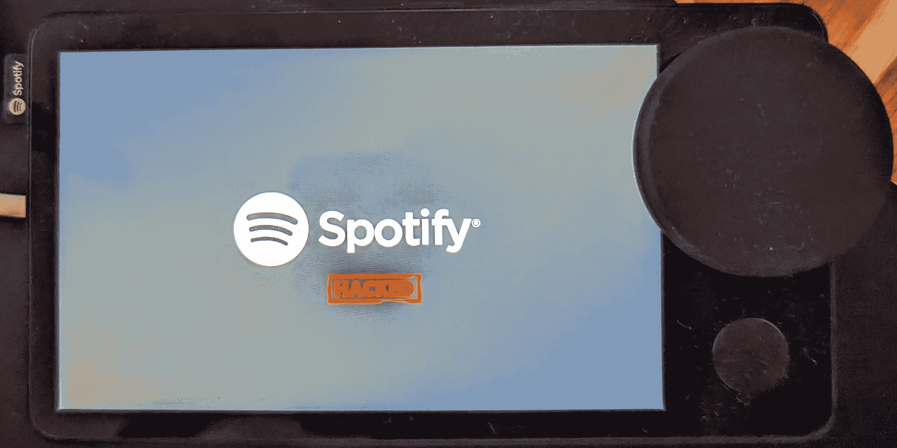

# 以下是你如何扎根于 Spotify 汽车的方法

> 原文：<https://www.xda-developers.com/spotify-car-thing-root/>

几个月前，Spotify [停止了它的“汽车用品”配件](https://www.xda-developers.com/spotify-discontinuing-car-thing/)，这是一个用于在汽车上播放 Spotify 内容的触摸屏控制面板。尽管这款设备在停产前增加了一些功能，比如免提通话，但在一段时间内，汽车这个东西不会有太大用处，因为操作系统太有限了。虽然我们批评这种有计划淘汰的做法，但必须赞扬一群现在已经成功扎根于 Spotify 汽车的开发人员，他们开辟了更多的售后发展可能性。

Nolen Johnson(又名 XDA 认可的开发者 [npjohnson](https://forum.xda-developers.com/m/npjohnson.5848265/) )与安全研究员 Frédéric Basse 合作，提出了汽车的信任链旁路。在引擎盖下，Spotify 的小工具由一个虚弱的 Amlogic S905D2 SoC 驱动，由于其固有的 *USB 刻录模式*，它被证明是一个优秀的攻击载体。Basse 和 Johnson 都在之前[开发了基于 Amlogic 的设备，因此通过 SoC 制造商留下的漏洞绕过汽车启动过程的安全措施对开发人员来说变得相当微不足道。](https://www.xda-developers.com/chromecast-with-google-tv-bootloader-unlock-exploit/)

为了实现这一壮举，研究人员不得不撬开外壳，露出一些用于调试或维修的引脚。接下来，他们组合了一些聪明的 Amlogic USB 模式特定命令和一个修改的 USB 连接参数，以实现持久的 ADB(根)访问。令人欣慰的是，自己开发设备相对容易，因为开发人员已经设法将所有东西都塞进了一组易于执行的脚本中。你所需要的只是一辆没有任何 USB 密码的汽车，一根 USB 线，一台安装了`libusb-dev`包的运行 Linux 的 PC，以及解锁超级用户权限的脚本。

 <picture></picture> 

Spotify Car Thing with a modified boot logo after being rooted

这种努力是否值得最终取决于你，但如果你有一辆旧的 Spotify 汽车，并且你喜欢小修小补，探索潜在的改装机会可能是有用的。值得注意的是，这款设备(代号为“超级鸟”)只有大约 500MB 的内存，这意味着移植任何现代版本的 Android 都将是一项极其困难的任务。

您可以在下面的文章链接中找到根指南的完整概要、安装说明和下载链接。

* * *

**来源:** [诺伦·约翰逊](https://npjohnson.github.io/Spotify-Car-Thing-Root/)