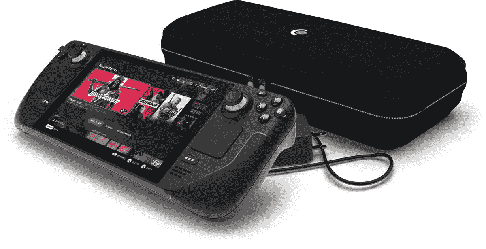

# 最新的蒸汽甲板更新增加了每场比赛的性能档案终于

> 原文：<https://www.xda-developers.com/steam-deck-performance-profiles/>

# 最新的蒸汽甲板更新增加了每场比赛的性能档案终于

最新的 Steam Deck 更新允许您为每个游戏创建性能配置文件，这样您就不必在每次玩游戏时都这样做。

随着[蒸汽甲板](https://www.xda-developers.com/valve-steam-deck-unboxing/)的更新，阀门正牢牢地踩住油门，最新的是一个好的。包括我自己在内的许多玩家一直想要一个每场比赛的个人资料功能，Valve 已经提供了。更新正在推出，并增加了快速访问菜单的新功能。

自推出以来，Steam Deck 所有者已经可以控制 TDP、帧速率和时钟速度，最近还出现了显示器的刷新率切换器。这一最新功能使您比以往任何时候都更容易获得恰到好处的游戏性能，再也不用碰它了。

一旦进入游戏，打开性能菜单将会显示一个新的切换。启用后，Steam Deck 将为该游戏创建一个配置文件，以便您可以根据需要调整设置。然后，当您再次播放时，这些设置将自动加载。如果您关闭切换，您将恢复到现有的任何全局设置。这对 Steam Deck 所有者来说将是一个非常重要的生活质量改善，因为有时感觉花在性能菜单上的时间比享受游戏的时间还多。

这不是更新中发现的唯一新功能，还有常见的修复和改进。Valve 改进了在线和离线模式之间切换的性能，并修复了一个当你不在线时朋友在线的问题。在连接外部显示器方面也有所改进，现在甲板将显示缩放的虚拟 1280x800 分辨率。这方面的更多工作显然也在进行中。

随着越来越多的设备开始进入世界各地的游戏玩家手中，Steam Deck 的更新将持续不断。我们推出还不到三个月，该平台已经经历了一系列重大升级。查看[完整补丁注释](https://store.steampowered.com/news/app/1675200?emclan=103582791470414830&emgid=3216144458727332893)来看看所有的新东西。

 <picture></picture> 

Steam Deck

Valve 的第一款便携式游戏电脑 Steam Deck 是 2022 年最热门的设备之一，拥有庞大的游戏库