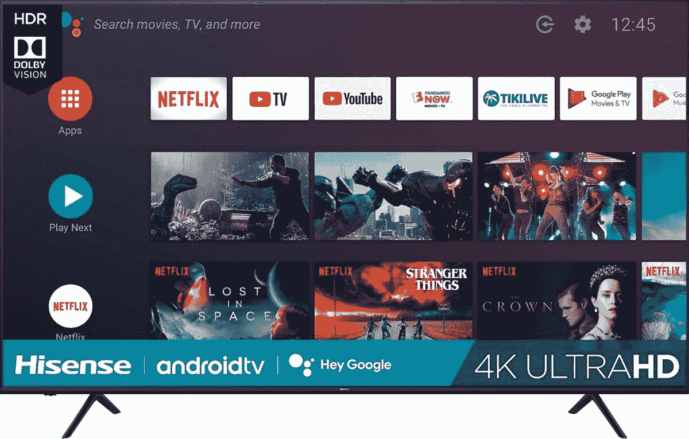
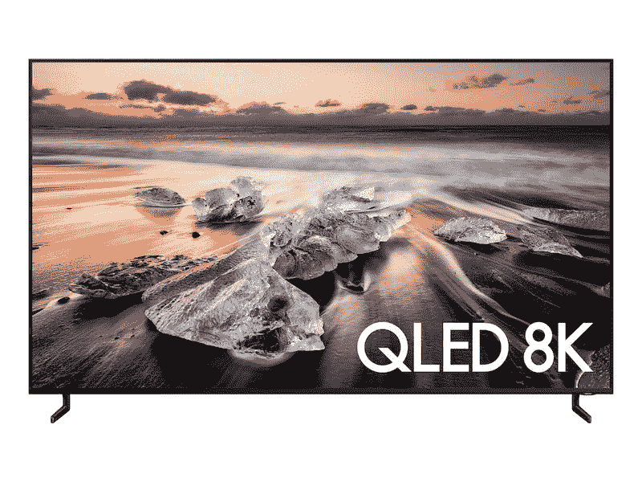
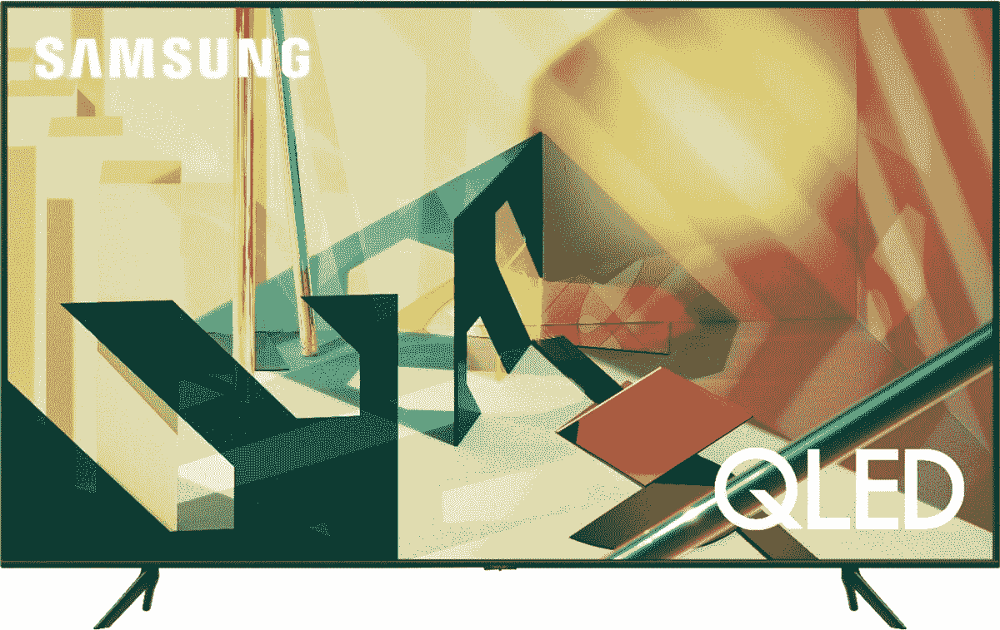
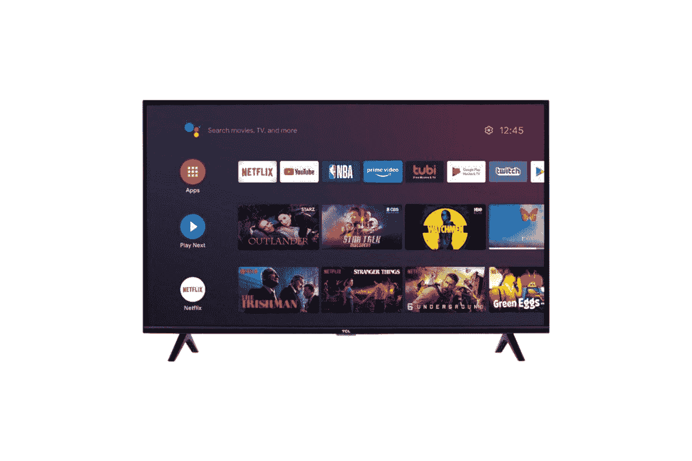
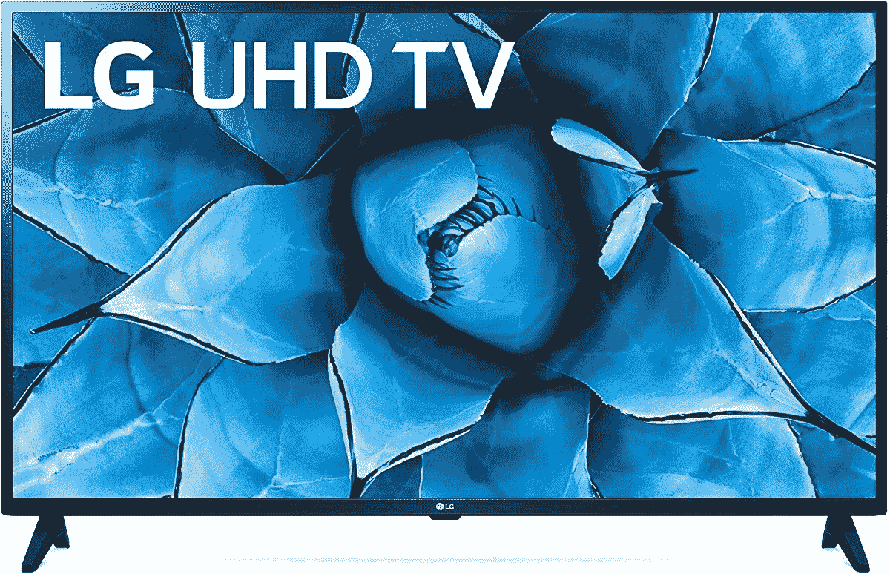
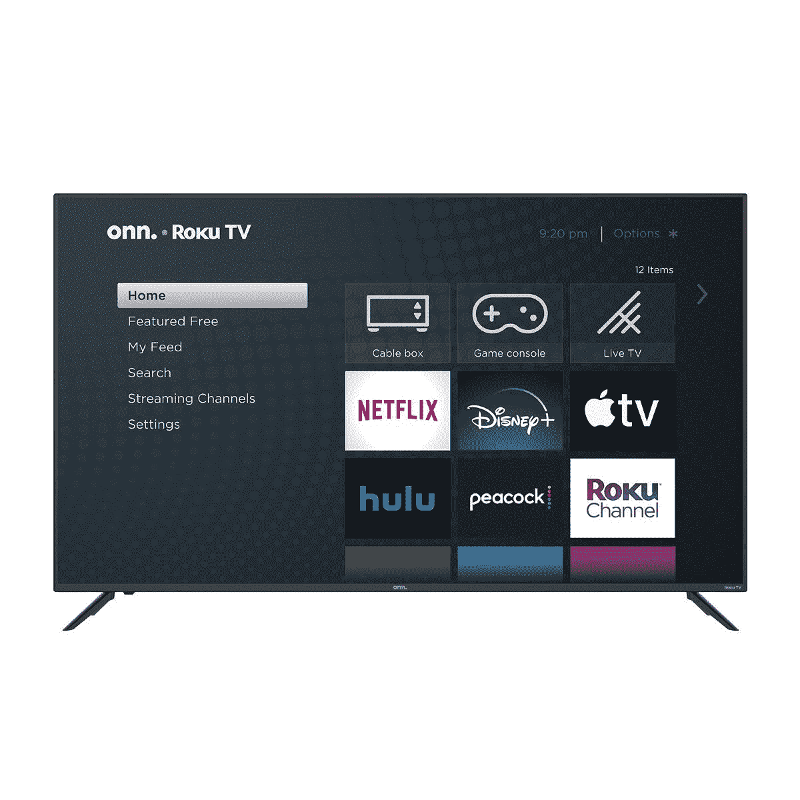
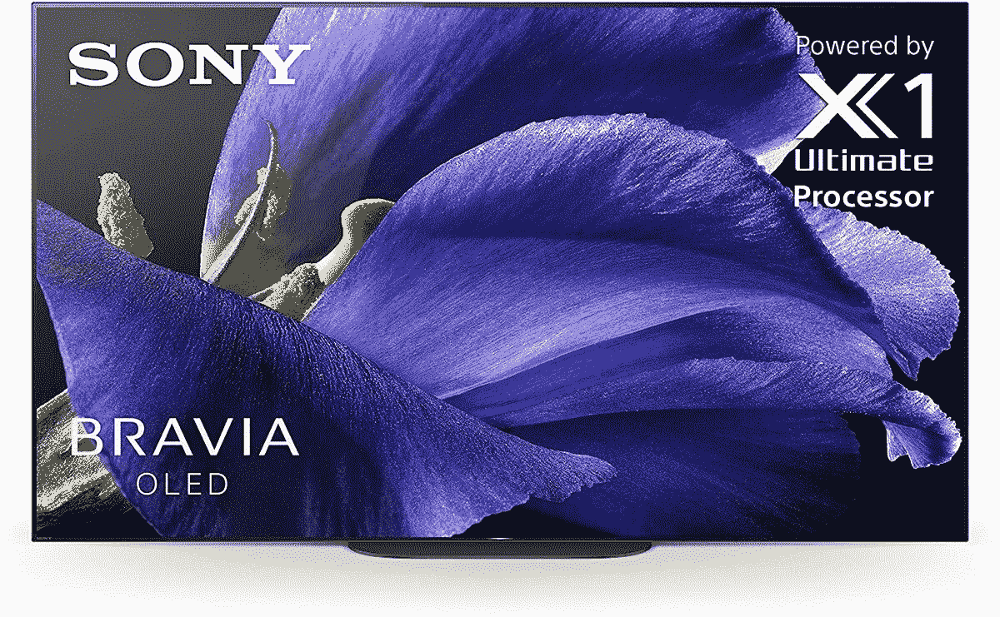

# 最佳超级碗电视交易:观看比赛和半场秀的风格！

> 原文：<https://www.xda-developers.com/super-bowl-tv-deals/>

超级碗是这个星期天，2 月 7 日！我知道，今年时间很奇怪，对吧？对我来说还是元旦的感觉。但是，时间在流逝，是时候享受足球了！当你准备开球时，你会想记住一些不能等到最后一分钟才买的东西-一台新的、最先进的电视！谁不想在大屏幕上看大赛呢？零售商知道你可能需要一台新的电视机，一些很棒的超级碗电视交易正在进行中！以下是我们发现的一些最好的例子:

## 做大

你想要一台真正大的超级碗电视，但你不想玩真正大的价格？你会喜欢这台海信 75 英寸 4K 智能电视的。这款 H6510G 机型拥有你享受游戏所需的一切，配有 4K UHD 屏幕，内置安卓电视，还有——哦对了，75 英寸。在百思买，你可以花 630 美元买到这款电视，在这个过程中节省了 370 美元。

 <picture></picture> 

Go Big with the Hisense 75-inch TV

##### 海信 H6510G 75 英寸 4K LED 电视

这台电视不仅仅是大！海信是一款 4K 电视，配有 UHD 和安卓电视。这是一个伟大的(和巨大的)除了你的家庭影院设置。

## 如果 4K 还不够

如果你认为 4K 还不够呢？那我们去 8K 吧！三星目前正在销售他们令人印象深刻的 [8K 电视](https://shop-links.co/1731184974720420413?u1=1070756c-aac4-4f78-865e-2e8d1c7171f7)，当然，正好赶上超级碗！55 英寸 Q900 QLED 智能电视售价为 2000 美元，比建议零售价低了 1500 美元！您将在一台尺寸合适的电视上获得 8K 体验。你也可以注册一个付款计划，让你在 48 个月内支付 41.87 美元，这对我们大多数人来说是一个很小的成本障碍！

 <picture></picture> 

8K Quality at Samsung

##### 三星 65 英寸 Q900TS 8K 智能电视

忘了 4K 吧！只需 2000 美元，就能在三星买到一台漂亮的 55 英寸 8K 电视。

## 难以置信的观看体验

4K 最好的电视之一可能是 LG 有机发光二极管智能电视。CX 55 英寸有机发光二极管像素会发出自己的光，提供更广泛和更生动的颜色，α9 处理器将保持一切顺利运行。凭借 120hZ 的刷新率和内置的 FreeSync，这非常适合观看电影和玩游戏。LG CX 不仅仅是最好的超级碗电视之一——它是最好的电视之一，仅此而已，你可以从亚马逊上只花 1400 美元买到它。

 <picture></picture> 

The Best Around

##### LG CX 55 英寸 4K OLED 电视

花 1400 美元，你就能拥有一台最好的电视机。LG CX 拥有出色的有机发光二极管像素，强大的处理器，以及更多让您体验最佳的功能。

## 预算，不便宜

不是每个人都有几百美元来买一台新电视。毕竟还有情人节礼物可以买！不过，不要担心，即使你的钱包有点紧，仍然有一台很棒的新电视等着你。Insignia 43 英寸 Fire 电视在亚马逊仅售 250 美元，对于任何想买新电视的人来说，这都是一个不错的选择。这款 2020 型号内置了 Fire TV、4K UHD 和 Alexa。你也可以多花 50 美元升级到 50 英寸的型号。

 <picture></picture> 

Save with Insignia's 43-inch 4K TV

##### Insignia 43 英寸 4K 电视

你不需要为了一台好的超级碗电视而倾家荡产！这款 2020 Insignia 型号仅售 250 美元，并提供 4K UHD 和消防电视功能。

## 亚军

上面的电视不是你想要的吗？看看下面的一些其他超级碗电视交易！

 <picture></picture> 

Samsung 75-inch Q70T 4K Smart TV

##### 三星 Q70T 75 英寸 QLED 电视

 <picture></picture> 

TCL 75-inch Class 4 Smart Android TV

 <picture></picture> 

LG 43-inch 4K UHD Smart TV with Alexa

 <picture></picture> 

oon. 70-inch 4K UHD Roku Smart TV

##### Onn 70 英寸 Roku 4K LED 电视

 <picture></picture> 

Samsung The Terrace 65-inch Full Sun ($2,002 off)

##### 三星 The Terrace 65 英寸户外 4K QLED 电视

 <picture></picture> 

Sony XBR 65-inch 4K UHD Smart TV

##### 索尼 A9G Bravia Master 65 英寸 4K OLED 电视