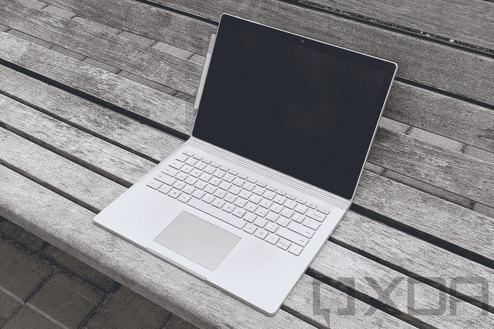
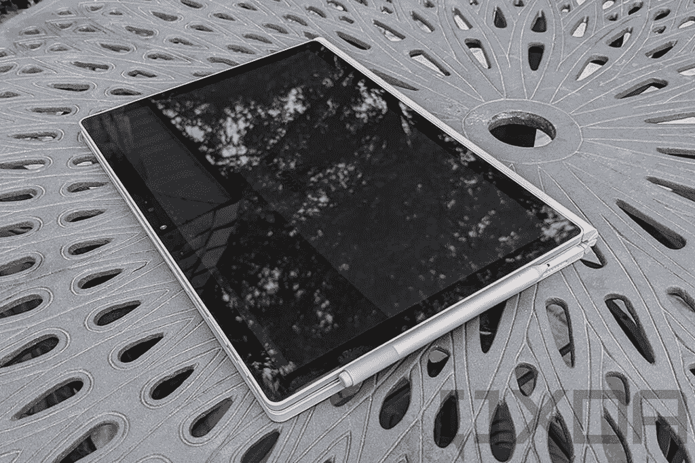
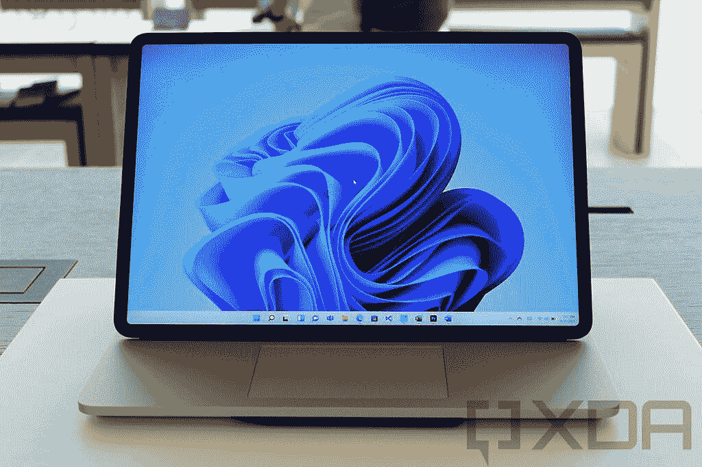
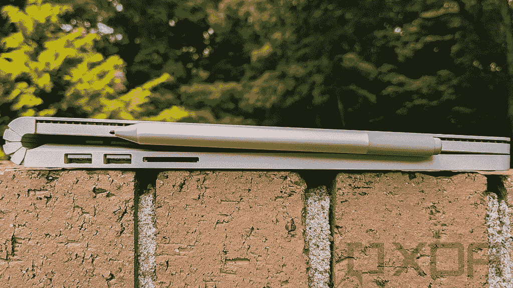
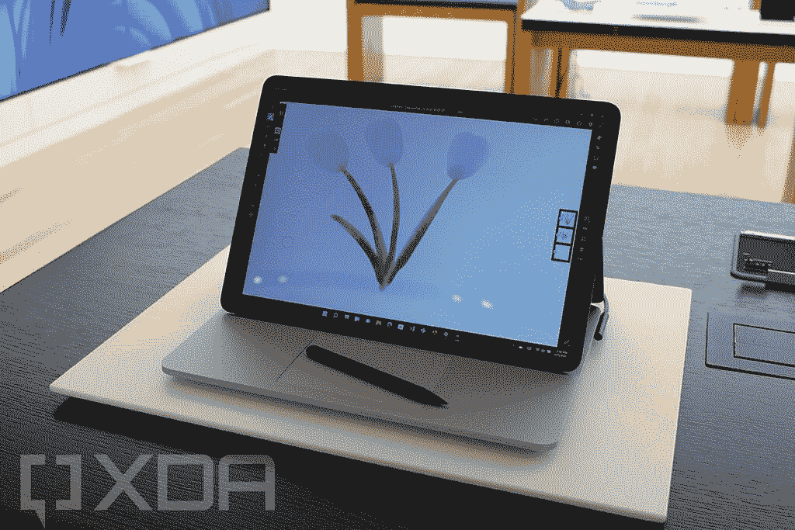

# Surface Laptop Studio vs Surface Book 3:巨大的飞跃

> 原文：<https://www.xda-developers.com/surface-book-4-vs-3/>

在这次比较中，我们将了解这些笔记本电脑的组合情况，并讨论哪一款最适合您的使用情形。这是 Surface Laptop Studio vs Surface Book 3。

| 规格 | Surface Laptop Studio | 表面书 3 |
| --- | --- | --- |
| **尺寸&重量** | 

*   12.7 英寸 x 9.0 英寸 x 0.7 英寸
*   英特尔酷睿 i5 型号 3.83 磅(1742.9 克)
*   英特尔酷睿 i7 型号 4.00 磅(1820.2 克)

 | 

*   13.5 英寸(酷睿 i5): 12.3 x 9.14 x 0.51-0.9 英寸(312 x 232 x 13–23 毫米)-3.38 磅
*   13.5 英寸(酷睿 i7): 12.3 x 9.14 x 0.59-0.9 英寸(312 x 232 x 15–23 毫米)-3.62 磅。
*   15 英寸:13.5 x 9.87 x 0.568–0.9 英寸(343 x 251 x 15–23 毫米)-4.2 磅

 |
| **显示** | 

*   屏幕:14.4 英寸
*   PixelSense 流动触摸显示器
*   高达 120Hz 的刷新率
*   分辨率:2400 x 1600 (201 PPI)
*   长宽比:3:2
*   对比度:1500:1
*   触控:10 点多点触控
*   杜比视觉支持

 | 

*   13.5 英寸 PixelSense (3000 x 2000)，触摸屏
*   15 英寸 PixelSense (3240 x 2160)，触摸屏

 |
| **处理器** | 

*   四核英特尔第 11 代英特尔酷睿 H35 i5-11300H
*   四核英特尔第 11 代英特尔酷睿 H35 i7-11370H

 | 

*   英特尔酷睿 i5-1035G7(最高 3.7GHz，四核) (仅 13.5 英寸)
*   英特尔酷睿 i7-1065G7(最高 3.9GHz，四核)

 |
| **风筒&储存** | 

*   16GB 或 32GB LPDDR4x 内存
*   256 GB、512 GB、1TB、2TB SSD 可移动 SSD。

 | 

*   8、16 或 32GB 内存
*   256GB 至 2TB 存储空间(仅 15 英寸机型 2TB)。

 |
| **图形** | 

*   英特尔第 11 代英特尔酷睿 H35 i5-11300H 型号:英特尔 Iris Xe 显卡
*   英特尔第 11 代英特尔酷睿 H35 i7-11370H 型号:NVIDIA GeForce RTX 3050 Ti 笔记本电脑 GPU，带 4GB GDDR6 GPU 内存
*   仅限商用:NVIDIA RTX A2000 笔记本电脑 GPU，带 4GB GDDR6 GPU 内存

 | 

*   英特尔虹膜增强显卡
*   NVIDIA GeForce GTX 1650 4GB gddr 5(Max-Q)(13.5 英寸)
*   NVIDIA GeForce GTX 1660 Ti 6GB gddr 6(Max-Q)(15 英寸)
*   NVIDIA Quadro RTX 3000 (Max-Q) (15 英寸，仅商用)

 |
| **电池和充电** | 

*   英特尔酷睿 i5:长达 19 小时的典型设备使用时间
*   英特尔酷睿 i7:长达 18 小时的典型设备使用时间

 | 

*   13.5 英寸:长达 15.5 小时的使用时间(容量未定)
*   15 英寸:长达 17.5 小时的使用时间(容量不明)

 |
| **网络摄像头** | 

*   Windows Hello face 认证摄像头(前置)
*   1080p 分辨率前置摄像头。

 | 

*   500 万像素 1080 像素前置网络摄像头(带红外)
*   800 万像素 1080 像素后置网络摄像头，支持自动对焦

 |
| **颜色** |  |  |
| **端口** | 

*   2 个 USB 4.0，支持 Thunderbolt 4 技术
*   3.5 毫米耳机插孔
*   1 个表面连接端口

 | 

*   2 个表面连接端口(一个在底座上，一个在平板电脑上)
*   两个 USB Type-A (3.2 第 2 代/ 10Gbps)
*   一个 USB Type-C (3.2 第 2 代/ 10Gbps)
*   SD 读卡器
*   3.5 毫米耳机插孔

 |
| **音频** | 

*   双通道远场录音室话筒
*   配有杜比全景声的四声道全方位扬声器

 | 

*   带杜比 Atmos 的立体声扬声器

 |
| **连通性** | 

*   Wi-Fi 6: 802.11ax 兼容
*   蓝牙无线 5.1 技术

 | 

*   Wi-Fi 6 +蓝牙 5.0
*   Xbox 无线内置(15 英寸)

 |
| **定价** | 起价 1599 美元 | 起价 1639 美元 |
| **其他特性** | 

*   动态编织铰链
*   精密触觉触摸板
*   Surface Slim Pen 2 支持工作室模式。

 | 

*   带面部识别的 Windows Hello。
*   可拆卸屏幕。
*   Surface pen 支持。

 |

## Surface Laptop Studio vs Surface Book 3:设计和制造

正如你所料，这两款笔记本电脑有很多共同点，因为 Surface Laptop Studio 是 Surface Book 的延续

[line of products](https://www.xda-developers.com/best-microsoft-surface-pcs/)

。有了 Surface Book 3，你可以把屏幕和键盘底座分开，把屏幕当成平板电脑使用。例如，如果你想用它来看电影，你也可以把屏幕向后重新安装。Surface Book 3 的大部分组件都在显示部分，尽管更大的电池和 NVIDIA GPU 都在键盘底座。微软在 Surface Laptop Studio 中改变了许多设计和实现元素，改善了 Surface Book 3 的许多痛点。

Surface Laptop Studio 是对同一个可拆卸显示器概念的不同诠释。微软的愿景是创造一个更接近微型 Surface 工作室的东西。你可以像普通笔记本电脑一样使用它，然后显示屏弹出，你可以把它折叠起来作为

[tablet](https://www.xda-developers.com/best-windows-tablets/)

。它仍然有一个优质的构建，但它比大多数笔记本电脑更便携和多功能。不幸的是，如果令人兴奋的颜色选择和不同的材料是你的障碍，你不会在 Surface Studio 笔记本电脑或 Surface Book 3 上找到这些。与以前的 Surface Book 型号一样，这些笔记本电脑只有白金版。

微软还采取措施确保 Surface Laptop Studio 在你的膝盖上更容易打字。Surface Book 之前的版本简直是头重脚轻。关于设计的另一个变化是新的超薄笔 2 的存储方式。Surface Laptop Studio 的底座下有一个切口，而不是像过去那样将 Surface Pen 磁性附着在侧面。当你把笔放在背包或公文包里时，这种方法应该更方便更容易地把笔和笔记本电脑放在一起。这两款笔记本电脑的价格应该非常昂贵，尤其是考虑到每台的起价都超过了 1500 美元。另一方面，Surface Laptop Studio 的设计更符合人体工程学，更易于使用。它还消除了 Surface Book 3 上奇怪的铰链带来的所有额外空间。如果你喜欢微软的 Surface Book 系列，但想要更实用的设计，Surface Laptop Studio 应该能满足你对笔记本电脑的所有需求。

## Surface Laptop Studio vs Surface Book 3:显示器

Surface Book 只为每种显示屏尺寸提供了一种分辨率选项。13.5 英寸机型的分辨率为 3000 x 2000，15 英寸机型的分辨率为 3240 x 2160。显示屏明亮，整体使用起来非常愉快。你也可以得到 3:2 的长宽比。

微软基本上采用了旧 Surface Book 3 屏幕尺寸的平均值，以便在新的 Surface Laptop Studio 上获得单个 14.4 英寸选项。好消息是，显示器已经从 Surface Book 系列大幅升级。您将获得分辨率为 2400 x 1600 的全新 14.4 英寸显示屏。对于那些保持跟踪的人来说，这是 3:2 的纵横比。如果您需要一台笔记本电脑来提高工作效率，我认为 3:2 的宽高比是最佳选择，尤其是在书写或处理电子表格时，这两款笔记本电脑都是最佳选择。

不过最大的升级是屏幕的刷新率达到了 120Hz。规格表实际上说“高达 120 赫兹”，但这是因为它实际上是在 60 赫兹。你必须打开 120 赫兹的刷新率。动态刷新率，就像你在许多智能手机上看到的那样，应该会在以后出现。微软并没有给出一个确切的时间表，但我们应该会在不久的将来听到更多的消息。总的来说，单是高刷新率就足以让我考虑 Surface Laptop Studio，而不是更老的 Surface Book 3。

## Surface Laptop Studio vs Surface Book 3:性能

老实说，Surface Book 3 并不是目前性能最好的超便携笔记本电脑，尤其是在 2021 年。微软 Surface Laptop Studio 配备了英特尔的 Tiger Lake H35 处理器，与 Surface Book 3 内部的第十代 15W 处理器相去甚远。它采用第十代英特尔处理器，RTX 30 系列 GPU 在 Surface Book 3 发布时也不可用。表面上较低功率的处理器使得性能不太好是不可避免的。

另一方面，Surface Laptop Studio 也大幅升级了显卡，在商务模式中高达 NVIDIA GeForce RTX 3050 Ti 或 RTX A2000。H35 处理器是英特尔第 11 代产品线的新成员。H35 处理器使功能强大的笔记本电脑变得更加轻薄。对于 Surface Laptop Studio 这样的超便携和适应性强的机器来说，拥有配备专用显卡的 H 系列芯片应该是一件大事。您可以在 Surface Laptop Studio 上配置高达 32GB 的 RAM。对于大多数日常任务来说，这应该是足够的内存，即使工作负载很大。Surface Laptop Studio 在技术上也有可移动的 SSD 存储。虽然微软或其他服务技术人员可以移除该存储，但自己移除它以进行快速更换并不容易。SSD 最高可配置 2TB，应该足够满足大部分用户。

Surface Book 3 声称平均电池续航时间为 15.5 小时，但在实际使用中，根据你的工作负载，你可以接近 10-12 小时。微软声称，Surface Laptop Studio 可以使用 18 到 19 个小时，这取决于你选择的处理器。根据以前的结果，这个估计听起来很高，所以我们必须看看它在我们的评论中如何发挥作用。

## Surface Laptop Studio vs Surface Book 3:相机和音频

Surface Book 3 有一个固体扬声器设置，配有双立体声扬声器和杜比 Atmos。这些是面向用户的扬声器，因此在观看媒体或游戏时声音足够大。不过，微软真的在 Surface Laptop Studio 上更进一步。你可以使用杜比全景声(Dolby Atmos)的四声道 Omnisonic 扬声器，这对于观看网飞、YouTube 或其他流媒体内容来说应该是非常棒的。有时扬声器可能是便携式笔记本电脑的弱点，但你不应该对这些选项有任何担心。

Surface 设备拥有一些 Windows 笔记本电脑上最好的网络摄像头，Surface Book 3 配备了两个 1080p 摄像头。图片方面，前置摄像头分辨率为 5MP，后置摄像头为 8MP，加上支持自动对焦。Surface Laptop Studio 正面的 Windows Hello 网络摄像头分辨率高达 1080p。这应该非常适合与家人和朋友进行视频通话，以及 Zoom、团队等方面的任何工作电话。由于疫情的原因，网络摄像头的质量在去年肯定变得更加重要，所以很高兴看到制造商在这方面有所进步。

## 结论

Surface Book 3 首次发布时是一个很好的选择，但即使在那时，它也有一个奇怪的设计和一些稍微过时的内部结构。微软通过新的 Surface Laptop Studio 改进了产品线的几乎每个方面，特别是在人体工程学方面。此外，您可以使用革命性的新款超薄笔 2，感觉就像在实际纸张上书写一样。除非你绝对需要节省一些钱，否则我们建议你选择 Surface Laptop Studio 的最佳配置。微软真的超越了他们自己

[most powerful laptop](https://www.xda-developers.com/best-laptops/)

还没有。

### 微软 Surface Book 3

Surface Book 3 采用高端第十代英特尔处理器和专用 NVIDIA 显卡，可以以可玩的帧速率处理大多数现代游戏以及创造性工作负载。你可以将屏幕从键盘上拆下来，当作平板电脑来使用，它拥有 Surface 系列所闻名的相同的高级设计。

**Affiliate Links**

Amazon

[View at Amazon](https://www.amazon.com/NEW-Microsoft-Surface-Book-Touch-Screen/dp/B086QRVL8P?tag=xda-5f9koet-20&ascsubtag=UUxdaUeUpU5372&asc_refurl=https%3A%2F%2Fwww.xda-developers.com%2Fsurface-book-4-vs-3%2F&asc_campaign=Short-Term)

### 微软 Surface Laptop Studio

Surface Laptop Studio 配备了全新的设计、更强大的内部功能等等。

**Affiliate Links**

Amazon

[View at Amazon](https://www.amazon.com/Microsoft-2736x1824-Touchscreen-i5-8250U-Fingerprint/dp/B07XF55D7Z?tag=xda-5f9koet-20&ascsubtag=UUxdaUeUpU5372&asc_refurl=https%3A%2F%2Fwww.xda-developers.com%2Fsurface-book-4-vs-3%2F&asc_campaign=Short-Term)

Store

[View at Store](https://shop-links.co/1752921626442218294?u1=25a0ef62-0dde-478c-aa76-ef1c3ff76fb2)