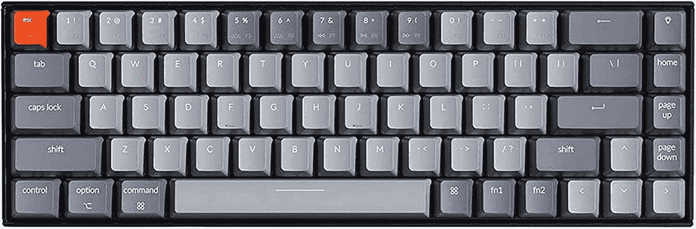

# 最佳 Surface Go 3 配件

> 原文：<https://www.xda-developers.com/surface-go-3-accessories/>

如果你在工作或学校使用微软 Surface Go 3，你可以将它与扩展坞和外接显示器配合使用。使用外接显示器可以提供更多的屏幕空间，坞站可以提供额外的端口用于多任务处理。专业创意用户可能还需要具有出色色彩校准和准确性的显示器。你可能还需要一个外接键盘或备用笔来记笔记。无论你是专业人士，还是只想在更大的屏幕上观看网飞，我们的 Surface Go 3 配件列表都有适合每个人的东西。

## 监视器

先说显示器。显示器有各种尺寸，价格范围从相当便宜到极其昂贵。当选择一个外接显示器与你的新笔记本电脑一起使用[时，你应该仔细考虑你的使用案例和你的预算。](https://www.xda-developers.com/best-laptops/)

如果您需要扩展端口选择，上述扩展坞和加密狗可以与您的新显示器协同工作。我们已经收集了 4K 性能的最佳显示器，创意专业人士，以及那些希望获得最佳整体效果的人。

*   <picture></picture>

    联想 ThinkVision M14

    ##### 联想 ThinkVision M14

    想找一个可以随身携带的外接显示器？联想为其客户提供 ThinkVision M14，它具有 14 英寸全高清面板和两个 USB-C 端口，可提供无缝连接体验。

*   <picture></picture>

    惠普 U28 4K

    ##### 惠普 U28 4K HDR 显示器

    惠普的 U28 配备了工厂校准的 4K HDR IPS 面板，非常适合工作室工作，还配备了大量 I/O 端口。如果你想要一个价格合理的 4K 模型，这是一个很好的选择。

*   ##### 华硕 ProArt PA279CV 27 英寸 4K UHD 显示器

    华硕 ProArt PA279CV 适合寻找外部显示器以进行照片或视频编辑的客户。它采用 27 英寸 4K 分辨率 IPS 面板，提供 100%的 sRGB 覆盖率，工厂校准为 Delta E < 2 颜色精度，并提供 USB-C 端口以实现无缝连接。

    T34
*   <picture></picture>

    明基 ew 3280 u

    ##### 明基 EW3280U 32 英寸 4K 显示器

    如果您想要一台不是超宽的超大外接显示器，请考虑该显示器非常漂亮，配有两个 USB-C 端口，可以将两台显示器以菊花链形式连接在一起，还有 HDMI 和 DisplayPort 输入。该显示器还包括一个遥控器，这样您就可以切换输入、更改图像质量和控制音量，而无需接触显示器本身。

*   <picture></picture>

    HP 24MH

    ##### HP 24MH FHD 显示器

    HP 24MH 虽然不是最炫的显示器，但就价格而言，你得到了很棒的体验。它有一个全高清分辨率的 24 英寸面板，75Hz 的刷新率有助于感觉更流畅。该支架支持高度、倾斜度和枢轴调节，甚至还有内置扬声器，这在这个价格上非常棒。

*   <picture></picture>

    节杖弯曲 30

    ##### 节杖弯曲 30

    如果你喜欢弯曲显示器的外观，节杖在这里有一个不错的选择。这款显示器的分辨率为 2560 x 1080，这对于大显示器来说不是最高的，但应该可以满足基本使用。您还可以使用 VESA 支架来优化桌面空间和工作流程。不到 250 美元，对于曲面屏爱好者来说，这是实实在在的价值。

*   <picture></picture>

    LG 34wk 650

    ##### LG 34wk 650

    如果你喜欢 LG 的 29WP60G-B 的外观，但想要更大的显示屏，可以看看这款 34 英寸的选择。如果你想要一个相对实惠的超宽显示器，LG 的 34 英寸超宽显示器是一个很好的选择。借助全高清显示屏和 AMD FreeSync，您应该能够充分利用 LG 令人印象深刻的显示屏。这款 34 英寸 LG 显示器支持 HDR10，底部挡板配有 Maxx 音频扬声器。

*   <picture></picture>

    LG 24UD58-B

    ##### LG 24ud 58-B

    想要 4K 和优秀游戏选项的人应该看看 LG 24ud 58-B，用你的 Surface Go 3 在 4K 看网飞，或者玩一些最新的球场游戏。这款显示器不如其他产品有吸引力，但它的性能和功能弥补了这一点。

## 键盘

虽然 Microsoft Go 3 最适合在旅途中使用可拆卸键盘，但您可能希望使用外接显示器。使用外接显示器可以提供更多的屏幕空间，坞站可以为多任务处理提供额外的端口。当然，你需要一个高质量的外接键盘来完善你的工作站。

选择日常使用的键盘时，你会希望既舒适又可靠。选购键盘时，需要考虑一系列人体工程学设计、按键布局和高级功能。在这个列表中，我们将看看各种价位的微软 Surface Go 3 的最佳键盘。

除了外部键盘，我们还包括一些替代的可拆卸键盘，以防你不想使用官方的微软键盘盖或想要一个额外的。

*   <picture></picture>

    微软蓝牙键盘黑色

    ##### 微软蓝牙键盘黑色

    超薄、现代设计，超值。当您在 Windows 和 Office 365 中工作时，享受这种精致键盘的坚固耐用感。它通过支持 Swift Pair 的蓝牙无线连接到您的 Windows 笔记本电脑。

*   <picture></picture>

    微软雕塑键盘

    ##### 微软雕塑键盘

    分离式按键设计有助于将手腕和前臂置于自然放松的位置。缓冲掌托提供支持，并促进一个中立的手腕位置。你还可以得到一个单独的数字键盘，非常适合电子表格工作。

*   <picture></picture>

    Brydge 10.5 Go+

    ##### Brydge 10.5 Go+

    Brydge 制造了一些最酷的表面键盘，能够将平板电脑变成更像笔记本电脑的东西它使用夹钳附件和蓝牙连接到 Surface Go 3，它给你一个键盘和触摸板，所以感觉更像一台真正的笔记本电脑。

*   <picture></picture>

    罗技 K380

    ##### 罗技 K380 键盘

    如果你希望你的键盘在桌面上占用更少的空间，可以考虑罗技 K380。这款小巧的无线键盘还提供了同时支持多达三个设备的轻松切换功能。这种键盘几乎可以在任何操作系统上使用，包括 Windows。

*   <picture></picture>

    Keychron K6 机械键盘

    ##### key chron K6

    对于熟练的打字员来说，机械键盘是无人能及的，而 key chron K6 对于 Surface Go 3 来说是一个绝佳的搭配。它有 65%的布局非常紧凑，您可以选择您喜欢的 gateron 交换机来获得最佳体验。

## 钢笔

虽然 Surface Go 3 是一款很棒的机器，但不幸的是，它没有与微软 Surface Go 3 pen 捆绑在一起。当然，你可以从微软或其他供应商那里单独购买官方 Surface pen，但也有很多其他选择可以考虑。在搜索替代 Surface pens 时，请确保它们支持 Microsoft Pen 协议或 MPP。在这篇文章中，我们挑选了一些在任何预算下都可以与 Microsoft Surface Go 3 配合使用的最佳笔。

选择新笔时，一些关键的考虑因素是倾斜度、压力敏感度和电池寿命。如果你用你的表面画了很多，你会想要一个有精确倾斜度和极好压力敏感度的笔。这些方面是用笔绘制草图或着色时实现高精度的关键。对于那些每天都要写很多东西的人来说，确保你的笔有足够的电池寿命。下面的几支笔是可充电的，但其中一些仍然使用普通的 AAA 电池。请记住，拥有一支充电笔可以增加旅行时的灵活性。如果是充电笔，你可以在包里扔一个便携式充电器，不用担心没电。

*   <picture></picture>

    Tesha Surface pen

    ##### Tesha Surface pen

    售价不到 30 美元，Tesha Surface pen 几乎拥有微软版本提供的一切。它有 1024 个压力点，用于书写、绘图和记笔记。即时响应，低延迟，真正准确的笔迹再现。alm 拒绝技术让你在写字的时候，手自然地搁在屏幕上，无需戴防摩擦手套。对孩子来说超级方便。

*   <picture></picture>

    Renaisser 520

    ##### Renaisser Raphael 520

    Renaisser 520 是一款价格适中的触控笔，仍然提供一些强大的功能。它有 4，096 级压力和倾斜支持，因此它可以很好地处理书写，涂鸦，甚至更高级的艺术。它还有一个可充电电池，所以你不必担心购买新电池，它甚至支持磁性附着。这绝对是一笔好交易。

*   <picture></picture>

    戴尔高级有源手写笔

    ##### 戴尔高级有源手写笔

    戴尔高级有源手写笔功能灵活，支持多种协议，可选择戴尔 2 合 1 设备，并配有兼容 Windows Ink 的显示屏。通过单击顶部按钮快速启动 OneNote，并写笔记(即使在锁定的屏幕上)，捕捉屏幕截图或激活 Cortana。使用侧边按钮有效地擦除或启动上下文菜单。安装 Windows Ink Workspace 以根据您的需要自定义按钮。

*   <picture></picture>

    Wacom Bamboo Ink

    ##### Wacom Bamboo Ink(第二代)

    Wacom Bamboo Ink 支持 Microsoft Pen 协议和 Wacom AES，使 ti 兼容大多数支持笔的 Windows 笔记本电脑和平板电脑。它也有 4.096 级的压力，所以这是一个非常全面的体验，价格也非常合理。

*   <picture></picture>

    iafer Surface Pro Pen

    ##### iafer Surface Pro Pen

    这款笔来自 iafer，相对来说比较基础，但它涵盖了您想要扎实的书写体验所需要的基本功能。它配有可更换的 AAAA 电池，可持续使用超过 1000 小时，因此您永远不必担心充电问题。它还有一个笔夹，所以你可以很容易地把它放在口袋里，而不会丢失。

这些是我们为您的[微软 Surface Go 3 平板电脑](https://www.xda-developers.com/best-windows-tablets/)挑选的最佳配件。对于那些想要完整的[微软 Surface 体验](https://www.xda-developers.com/best-microsoft-surface-pcs/)的人来说，官方 Surface pen 和[键盘盖](https://shop-links.co/1753191058337358481?u1=cee07cbc-495b-4303-bf93-bcb354c3d116)当然仍然是你最好的选择。在对接新的 Surface Go 3 时，LG UltraWide 32 显示器也是提高工作效率的绝佳选择。请在评论中告诉我们你的新 Surface 设备使用了哪些配件。

 <picture></picture> 

Surface Go 3

##### 微软 Surface Go 3

Surface Go 3 用新的第 10 代处理器刷新了其前身。