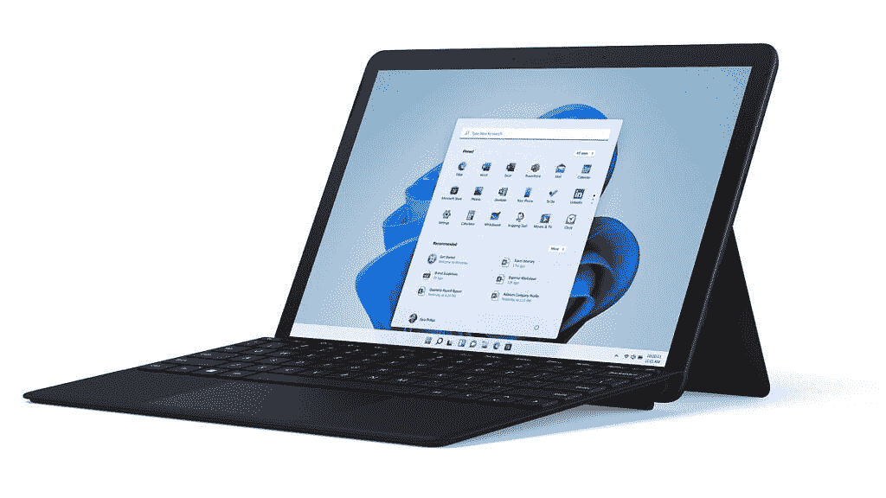

# Surface Go 3 可能很快就会推出哑光黑[更新]

> 原文：<https://www.xda-developers.com/surface-go-3-matte-black-leak/>

**更新 2022 年 10 月 1 日@美国东部时间上午 9:47)**:德国和意大利的亚马逊链接似乎表明这个变种将于明天推出。此外，微软商店现在也提到了新的颜色。

微软最新的廉价平板电脑 [Surface Go 3](https://www.xda-developers.com/surface-go-3/) ，可能很快会推出一种新的颜色，哑光黑。推特用户 [Aggiornamenti Lumia](https://twitter.com/ALumia_Italia) ，经常提前分享即将推出的产品的信息和图片，已经[从各个角度发布了该设备的图片](https://twitter.com/ALumia_Italia/status/1480473672209084419?s=20)。

Surface Go 3 于去年 10 月 5 日首次推出，是 Windows 11 的旗舰设备之一。最初，它只有标志性的铂金色，就像其他所有表面一样，包括它的前辈。但与此同时，微软确实推出了 [Surface Pro 8](https://www.xda-developers.com/surface-pro-8/) ，它也有一个名为 Graphite 的黑色版本。事实上，自 Surface Pro 6 以来，微软一直在发布 Surface Pro 的哑光黑色版本，因此这对该公司来说并不新鲜。

然而，Surface Go 系列只提供白金款，任何定制选项都来自 Type Cover 和 Surface Pen，它们有几种不同的颜色，包括黑色。

 <picture></picture> 

Image credit: Aggiornamenti Lumia (Twitter)

关于这些图像，除了显示了一个黑色油漆涂层的 Surface Go 3 之外，没有什么可以说的。我们看不到设备的背面，但很明显，机箱有不同的颜色，可以说，它看起来有点光滑，颜色与屏幕周围的边框相匹配。虽然这增加了一定程度的定制，但似乎微软希望 Type Covers 继续成为其平板电脑定制的主要来源。Surface Laptop 家族(不包括 Laptop Studio)有几种颜色可供选择，但在这里仍然不是这样。

这些图片没有告诉我们的是，我们什么时候可以期待这种新的变种上市。微软有时会在春季的某个时候举行硬件发布会，但如果与前几年保持一致，那仍然是一个遥远的事情。如果你不喜欢新的颜色，Surface Go 3 仍然可以买到铂金的。在写作时，你可以在亚马逊上以 30 美元的折扣找到它。此外，如果你有兴趣了解更多信息，请查看我们的 [Surface Go 3 评测](https://www.xda-developers.com/microsoft-surface-go-3-review/)。

* * *

## 更新 1:黑 Surface Go 3 可能明天上市

Aggiornamenti Lumia 已经[跟进](https://twitter.com/ALumia_Italia/status/1480532559029313539?s=20)的图片，并与德国和意大利的亚马逊链接，声称该设备将于明天上市。与此同时，美国的微软商店现在也在 Surface Go 3 的描述中提到了哑光黑色。

虽然该文本声称新的颜色现在可用，但在撰写本文时情况似乎并非如此。现在，一切都指向 1 月 11 日的发射。